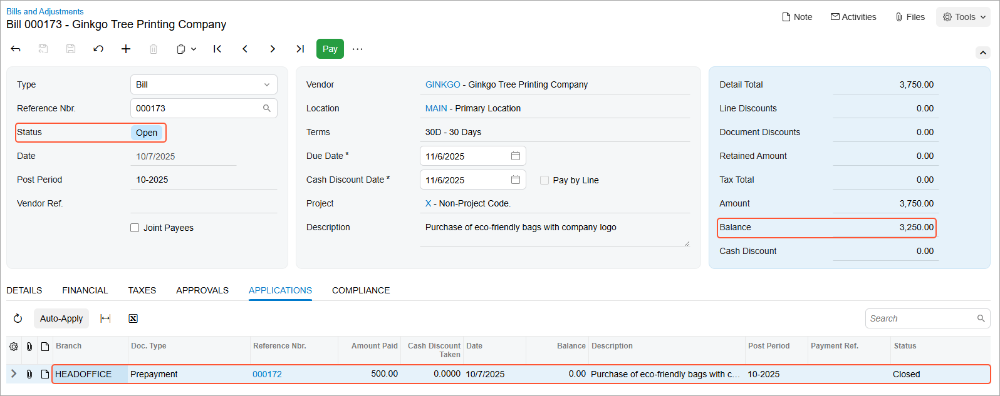

# Prepayments for Purchase Orders: To Process a Prepayment {#_908cf2be-6a69-4546-ba9f-2270496d84fa .task}

In the following activity, you will create a prepayment request for a purchase order, make a payment based on the prepayment request, and apply the prepayment to an AP bill.

**Attention:** This activity is based on the *U100* dataset. If you are using another dataset or if any system settings have been changed in *U100*, these changes can affect the workflow of the activity and the results of the processing. To avoid issues, restore the *U100* dataset to its initial state.

## Story { .section}

Suppose that the SweetLife Fruits &amp; Jams company has ordered a large quantity of eco-friendly reusable bags with the company's logo for SweetLife’s needs. The Ginkgo Tree Printing Company vendor has requested an advance payment in the amount of $500.

Acting as purchasing manager Regina Wiley, you have to enter the purchase order and record a request for a prepayment. You then need to make a payment for the prepayment request, process the purchase order to completion, and make sure that the prepayment was applied to the bill created for the purchase order.

## Configuration Overview { .section}

In the *U100* dataset, for the purposes of this activity, the following tasks have been performed:

-   On the [Enable/Disable Features](CS_10_00_00.md) \(CS100000\) form, the following features have been enabled:
    -   *Inventory and Order Management*, which provides the standard functionality of inventory and order management
    -   *Inventory*, which gives you the ability to maintain stock items by using forms related to the inventory functionality and to create and process sales and purchase documents that include stock items
-   On the [Vendors](AP_30_30_00.md) \(AP303000\) form, the *GINKGO \(Ginkgo Tree Printing Company\)* vendor has been created. The **Allow AP Bill Before Receipt** check box has been selected for the vendor on the **Purchase Settings** tab \(which means that for this vendor, accounts payable bills can be processed before purchase receipts\).
-   On the [Stock Items](IN_20_25_00.md) \(IN202500\) form, the *ECOBAG* stock item has been created.

## Process Overview { .section}

In this activity, you will start with creating a purchase order on the [Purchase Orders](PO_30_10_00.md) \(PO301000\) form and adding the purchased item to it. Then you will create a prepayment request by clicking **Create Prepayment Request** on the More menu; on the [Bills and Adjustments](AP_30_10_00.md) \(AP301000\) form, you will specify the prepayment amount for the line copied from the purchase order. To create a prepayment document from the prepayment request, you will pay the prepayment by clicking **Pay/Apply** on the More menu of the [Bills and Adjustments](AP_30_10_00.md) form; you will review the prepared payment on the [Checks and Payments](AP_30_20_00.md) \(AP302000\) form. Then you will print a check and release the payment.

To complete the processing of the purchase order, you will create a purchase receipt for the ordered items on the [Purchase Receipts](PO_30_20_00.md) \(PO302000\) form and an accounts payable bill to the vendor on the [Bills and Adjustments](AP_30_10_00.md) form. On release of the AP bill, the system automatically applies the prepayment to the bill and updates the vendor's balance.

## System Preparation { .section}

Before you start processing a prepayment, you should do the following:

1.  Make sure that you have completed the [Prepayments for Purchase Orders: Implementation Activity](OrderMgmt_Purchase_Order_Prepayments_Implem_Activity.md).
2.  Launch the Acumatica ERP website with the *U100* dataset preloaded, and sign in as purchasing manager Regina Wiley by using the *wiley* username and the *123* password.
3.  In the info area, in the upper-right corner of the top pane of the Acumatica ERP screen, make sure that the business date in your system is set to today’s date. For simplicity, in this activity, you will create and process all documents in the system on this business date.
4.  On the Company and Branch Selection menu, in the top pane of the Acumatica ERP screen, make sure the *SweetLife Head Office and Wholesale Center* branch is selected.

## Step 1: Creating the Purchase Order { .section}

To create the purchase order, do the following:

1.  On the [Purchase Orders](PO_30_10_00.md) \(PO301000\) form, add a new record.
2.  In the Summary area, specify the following settings:
    -   **Type**: *Normal*
    -   **Vendor**: *GINKGO*
    -   **Description**: `Purchase of eco-friendly bags with company logo`
3.  On the **Details** tab, click **Add Row**.
4.  Specify the following settings in this row:
    -   **Branch**: *HEADOFFICE*
    -   **Inventory ID**: *ECOBAG*
    -   **Warehouse**: *WHOLESALE*
    -   **Order Qty.**: `15`
    -   **Unit Cost**: `250`
5.  On the form toolbar, click **Remove Hold** to save the purchase order and prepare for further processing.

## Step 2: Creating a Prepayment Request { .section}

To prepare a prepayment request for the purchase order, do the following:

1.  While you are still viewing the purchase order on the [Purchase Orders](PO_30_10_00.md) \(PO301000\) form, on the More menu, click **Create Prepayment Request**.
2.  On the [Bills and Adjustments](AP_30_10_00.md) \(AP301000\) form, which opens, in the only line of the prepared prepayment request, specify the following settings:
    -   **Ext. Cost**: `2000`
    -   **Account**: *81000 - Other Expenses*
3.  Make sure that the calculated **Prepayment Amount** is *500* in the prepayment request line.
4.  On the form toolbar, click **Remove Hold**.
5.  Click **Release** on the form toolbar to release the prepayment request.

You have created a prepayment request to make the prepayment to the vendor.

## Step 3: Creating a Payment to Pay for the Prepayment Request { .section}

To prepare an AP payment to pay the vendor in the prepayment amount, do the following:

1.  While you are still viewing the prepayment request on the [Bills and Adjustments](AP_30_10_00.md) \(AP301000\) form, on the form toolbar, click **Pay/Apply**.
2.  On the [Checks and Payments](AP_30_20_00.md) \(AP302000\) form, which opens, review the payment and verify that it has the following settings in the Summary area:
    -   **Type**: *Payment*
    -   **Vendor**: *GINKGO*
    -   **Payment Method**: *CHECK*
    -   **Cash Account**: *10200WH - Wholesale Checking*
    -   **Payment Amount**: `500`
3.  Change **Description** to `Prepayment for eco-friendly bags with company logo`.
4.  On the **Documents to Apply** tab, make sure that the following settings are specified in the only row:
    -   **Document Type**: *Prepayment*
    -   **Reference Nbr.**: The reference number of the prepayment document you created in Step 2
    -   **Amount Paid \(USD\)**: `500`
5.  On the form toolbar, click **Remove Hold**.
6.  Click **Save**. The payment is assigned the *Pending Print* status, which means that it requires printing before it can be released.

## Step 4: Processing the Payment { .section}

To apply the payment to prepayment request, do the following:

1.  While you are still viewing the payment on the [Checks and Payments](AP_30_20_00.md) \(AP302000\) form, on the form toolbar, click **Print/Process**.
2.  On the [Process Payments / Print Checks](AP_50_50_00.md) \(AP505000\) form, which opens, notice that the system has added a row with the payment and selected the unlabeled check box for it. On the form toolbar, click **Process**.

    A new browser tab opens showing a printable check for the selected payment.

3.  Review the printable check for the payment. Notice that the check has *500* as the **Payment Amount**.

    **Tip:** In a production system, you would print out the payment.

    Close the browser tab.

4.  On the [Release Payments](AP_50_52_00.md) \(AP505200\) form, which opens, click **Process**. The **Processing** dialog box opens. Wait for the system to complete the operation.
5.  Click **Close** to close the dialog box.

You have created a payment and applied it to the prepayment request you created earlier. Now the prepayment is ready to be applied to the vendor's bill.

## Step 5: Processing the Accounts Payable Bill with the Prepayment { .section}

To create an accounts payable bill for the purchase order, do the following:

1.  On the [Purchase Orders](PO_30_10_00.md) \(PO301000\) form, open the purchase order that you created in Step 1.
2.  On the More menu, click **Enter AP Bill**. The system creates an accounts payable bill for the vendor of the goods and opens the created document on the [Bills and Adjustments](AP_30_10_00.md) \(AP301000\) form.
3.  Review the details of the prepared bill.

    **Tip:** In a production environment, you would make sure that the details of the bill created in the system correspond to the details of the document that was received from the vendor.

4.  On the **Applications** tab, make sure that the line with the prepayment has been automatically added to the table and that *500* has been specified in the **Amount Paid** column.
5.  On the form toolbar, click **Remove Hold**, and then click **Release** to release the bill. Make sure that the bill now has the *Open* status and that the bill's open balance has been decreased by the prepaid amount \(see the following screenshot\).

    

You have applied the prepayment that you made for the vendor to the vendor's bill and released the application.

## Step 6: Processing the Purchase Receipt { .section}

Now you need to complete the processing of the purchase order. To create the purchase receipt for the purchase order, do the following:

1.  Return to the purchase order to *GINKGO* on the [Purchase Orders](PO_30_10_00.md) \(PO301000\) form, which still has the *Open* status, and review the **Prepayments** tab. Notice that the prepayment is now closed and that the full amount of the prepayment was applied to the order and is shown in the **Applied to Order** column.
2.  On the form toolbar, click **Enter PO Receipt**. The system prepares the purchase receipt for the selected purchase order and opens it on the [Purchase Receipts](PO_30_20_00.md) \(PO302000\) form.
3.  In the Summary area, make sure the **Create Bill** check box is cleared because you have already prepared a bill for the entire quantity.
4.  On the form toolbar, click **Release**.
5.  On the **Orders** tab, make sure that the related purchase order now has the *Closed* status.

**Parent topic:**[Processing Prepayments for Purchase Orders](../UserGuide/OrderMgmt_Purchase_Order_Prepayments_Mapref.md)

