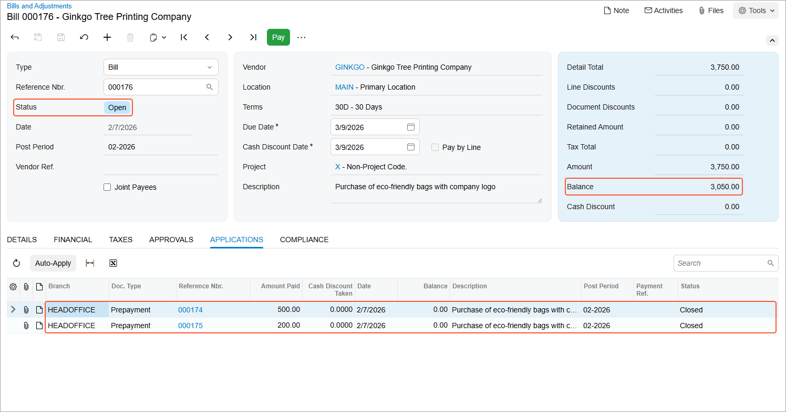

# Prepayments for Purchase Orders: To Process Multiple Prepayments for a Purchase Order {#_660378ea-5242-40ac-8ff0-f94a9bc47303 .task}

In the following activity, you will prepare multiple prepayments for a single purchase order, and apply these prepayments to an AP bill prepared for the vendor.

**Attention:** This activity is based on the *U100* dataset. If you are using another dataset or if any system settings have been changed in *U100*, these changes can affect the workflow of the activity and the results of the processing. To avoid issues, restore the *U100* dataset to its initial state.

## Story { .section}

Suppose that on January 30, 2026, the SweetLife Fruits &amp; Jams company has ordered a large quantity of eco-friendly reusable bags for SweetLife’s needs. The Ginkgo Tree Printing Company vendor has requested an advance payment in the amount of $500. Suppose that on February 7, 2026, the vendor notifies you that an additional prepayment in the amount of $200 is needed for the order. Also suppose that the first prepayment request has not been paid yet.

Acting as Regina Wiley, a purchasing manager in SweetLife, you have to enter the purchase order and record the prepayment request. Then you need to create the second prepayment for the same purchase order, and pay both prepayment requests with the same payment. Finally, you need to process the order to completion and make sure that both prepayments have been applied to the AP bill that you prepare for the purchase order.

## Configuration Overview { .section}

In the *U100* dataset, for the purposes of this activity, the following tasks have been performed:

-   On the [Enable/Disable Features](CS_10_00_00.md) \(CS100000\) form, the following features have been enabled:
    -   *Inventory and Order Management*, which provides the standard functionality of inventory and order management
    -   *Inventory*, which gives you the ability to maintain stock items by using forms related to the inventory functionality and to create and process sales and purchase documents that include stock items
-   On the [Vendors](AP_30_30_00.md) \(AP303000\) form, the *GINKGO \(Ginkgo Tree Printing Company\)* vendor has been created. The **Allow AP Bill Before Receipt** check box has been selected for the vendor on the **Purchase Settings** tab \(which means that for this vendor, accounts payable bills can be processed before purchase receipts\).
-   On the [Stock Items](IN_20_25_00.md) \(IN202500\) form, the *ECOBAG* stock item has been created.

## Process Overview { .section}

In this activity, to process a purchase order when multiple prepayments are required, you will start with creating a purchase order on the [Purchase Orders](PO_30_10_00.md) \(PO301000\) form and adding the purchased items to it. Then you will create the first prepayment request by clicking **Create Prepayment Request** on the More menu; on the [Bills and Adjustments](AP_30_10_00.md) \(AP301000\) form, you will specify the prepayment amount for each line copied from the purchase order. Then you will create a subsequent prepayment request, and release both prepayment requests on the [Release AP Documents](AP_50_10_00.md) \(AP501000\) form.

Then you will pay two prepayment requests with a single AP payment; you will do this by clicking **Pay/Apply** on the More menu of the [Bills and Adjustments](AP_30_10_00.md) form while viewing one of the prepayment requests, and adding the second prepayment request to the payment on the [Checks and Payments](AP_30_20_00.md) \(AP302000\) form. Then you will print a check, and release the payment and its application to two prepayment requests.

To complete the processing of the purchase order, you will create a purchase receipt for the ordered items on the [Purchase Receipts](PO_30_20_00.md) \(PO302000\) form, and an accounts payable bill to the vendor on the [Bills and Adjustments](AP_30_10_00.md) form. On release of the AP bill, the system will automatically apply the prepayments to the bill and update the vendor's balance.

## System Preparation { .section}

Before you start processing a purchase order when multiple prepayments are required, you should do the following:

1.  Make sure that you have completed the [Prepayments for Purchase Orders: Implementation Activity](OrderMgmt_Purchase_Order_Prepayments_Implem_Activity.md).
2.  Launch the Acumatica ERP website with the *U100* dataset preloaded, and sign in as purchasing manager Regina Wiley by using the *wiley* username and the *123* password.
3.  In the info area at the upper-right corner of the top pane of the Acumatica ERP screen, make sure that the business date is set to *1/30/2026*. If a different date is displayed, click the Business Date menu button and select *1/30/2026* from the calendar. For simplicity, you'll create and process all documents in this activity using this business date.
4.  On the Company and Branch Selection menu, in the top pane of the Acumatica ERP screen, make sure the *SweetLife Head Office and Wholesale Center* branch is selected.

## Step 1: Creating the Purchase Order { .section}

To create the purchase order to the *GINKGO* vendor, do the following:

1.  On the [Purchase Orders](PO_30_10_00.md) \(PO301000\) form, add a new record.
2.  In the Summary area, specify the following settings:
    -   **Type**: *Normal*
    -   **Vendor**: *GINKGO*
    -   **Date**: *1/30/2026*
    -   **Promised On**: *1/30/2026*
    -   **Description**: `Purchase of eco-friendly bags with company logo`
3.  On the **Details** tab, add a row with the following settings:
    -   **Branch**: *HEADOFFICE*
    -   **Inventory ID**: *ECOBAG*
    -   **Warehouse**: *WHOLESALE*
    -   **Order Qty.**: `15`
    -   **Unit Cost**: `250`
4.  On the form toolbar, click **Remove Hold** to save the purchase order and prepare for further processing.

## Step 2: Creating Prepayment Requests { .section}

To prepare the two prepayment requests for the purchase order, do the following:

1.  While you are still viewing the purchase order on the [Purchase Orders](PO_30_10_00.md) \(PO301000\) form, on the More menu, click **Create Prepayment Request**.
2.  On the [Bills and Adjustments](AP_30_10_00.md) \(AP301000\) form, which opens, in the only line of the prepared prepayment request, specify the following settings:
    -   **Ext. Cost**: `2000`
    -   **Account**: *81000 - Other Expenses*
3.  Make sure that the calculated **Prepayment Amount** is *500* in the prepayment request line.
4.  On the form toolbar, click **Remove Hold**.
5.  On the form toolbar, click **Release** to release the prepayment request.
6.  Close the prepayment request and return to the purchase order on the [Purchase Orders](PO_30_10_00.md) form.
7.  On this form, review the **Prepayments** tab. The line with the prepared prepayment request in the amount of $500 is shown in the table.
8.  In the info area, in the upper-right corner of the top pane of the Acumatica ERP screen, click the Business Date menu button, and select *2/7/2026* from the calendar to change the business date.
9.  On the More menu, click **Create Prepayment Request**.
10. On the [Bills and Adjustments](AP_30_10_00.md) form, which opens, in the only line of the prepared prepayment request, specify the following settings:
    -   **Ext. Cost**: `800`
    -   **Account**: *81000 - Other Expenses*
11. Make sure that the calculated **Prepayment Amount** is *200* in the prepayment request line.
12. On the form toolbar, click **Remove Hold**.
13. On the form toolbar, click **Release** to release the prepayment request.

## Step 3: Creating a Payment to Pay for the Prepayment Requests { .section}

To prepare an AP payment for both prepayment requests, do the following:

1.  On the [Bills and Adjustments](AP_30_10_00.md) \(AP301000\) form, open the $500 prepayment request that you have prepared for the purchase order.
2.  On the form toolbar, click **Pay/Apply**.
3.  On the [Checks and Payments](AP_30_20_00.md) \(AP302000\) form, which opens, review the payment and verify that it has the following settings in the Summary area:
    -   **Type**: *Payment*
    -   **Vendor**: *GINKGO*
    -   **Payment Method**: *CHECK*
    -   **Cash Account**: *10200WH - Wholesale Checking*
    -   **Application Date**: *2/7/2026*
    -   **Application Period**: *02-2026*
4.  Change **Description** to `Prepayments for eco-friendly bags with company logo`.
5.  Change the value of the **Payment Amount** box in the Summary area to `700`. Notice that in the **Unapplied Balance** box, the value changes to *200*.
6.  On the **Documents to Apply** tab, verify the details of the row with the following settings:
    -   **Document Type**: *Prepayment*
    -   **Reference Nbr.**: The reference number of the $500 prepayment that you created in Step 2
    -   **Amount Paid \(USD\)**: `500`
7.  On the table toolbar, click **Add Row**. In the new row, do the following:
    1.  In the **Document Type** column, select *Prepayment*.
    2.  In the **Reference Nbr.** column, select the reference number of the $200 prepayment you created in Step 2.
8.  On the form toolbar, click **Remove Hold**. The payment is assigned the *Pending Print* status, which means that a check needs to be printed before the payment can be released.

## Step 4: Processing the Payment { .section}

To apply the payment to the prepayment requests, do the following:

1.  While you are still viewing the payment on the [Checks and Payments](AP_30_20_00.md) \(AP302000\) form, on the form toolbar, click **Print/Process**.
2.  On the [Process Payments / Print Checks](AP_50_50_00.md) \(AP505000\) form, which opens, notice that the system has added a line with the payment and selected the unlabeled check box for it.
3.  On the form toolbar, click **Process**.

    A new browser tab opens showing a printable check for the selected payment.

4.  Review the printable check for the printed payment. Notice that the check has *700* as **Check Amount**.

    **Tip:** In a production system, you would print out the check.

    Close the browser tab.

5.  On the [Release Payments](AP_50_52_00.md) \(AP505200\) form, which opens, click **Process** to process the line for which the unlabeled check box was selected automatically. The **Processing** dialog box opens. Wait for the system to complete the operation.
6.  Click **Close** to close the dialog box. Notice that the line with the payment is no longer displayed in the table.

You have created a payment and applied it to the prepayment requests that you created earlier. Now the prepayment is ready to be applied to the vendor's bill.

## Step 5: Processing the Accounts Payable Bill with the Prepayments { .section}

To create an accounts payable bill for the purchase order, do the following:

1.  On the [Purchase Orders](PO_30_10_00.md) \(PO301000\) form, open the purchase order that you have created earlier in this activity.
2.  On the **Other** tab, review the amount in the **Unpaid Amount** box: It is the order total in the Summary area minus the prepaid amount in the only line on the **Details** tab.
3.  On the More menu, click **Enter AP Bill**. The system generates an accounts payable bill for the vendor of the goods and opens the bill on the [Bills and Adjustments](AP_30_10_00.md) \(AP301000\) form.
4.  On the **Applications** tab, make sure that two lines with the prepayments have been automatically added to the table. Make sure that in each line, the **Amount Paid** equal to prepayment balance is specified \($500 and $200, respectively\).
5.  On the form toolbar, click **Remove Hold**.
6.  Click **Release** to release the bill. Make sure that the bill now has the *Open* status, and that the bill's open balance has been decreased by the prepaid amount \(see the following screenshot\).

    

You have applied the prepayments you made for the vendor to the vendor's bill and released the application.

## Step 6: Processing the Purchase Receipt { .section}

Now you need to complete the processing of the purchase order. To create the purchase receipt for the purchase order, do the following:

1.  Return to the purchase order to *GINKGO* on the [Purchase Orders](PO_30_10_00.md) \(PO301000\) form, which still has the *Open* status, and open the **Prepayments** tab. Notice that the prepayments are now closed and that the full amount of the prepayments has been applied to the order \(as the **Applied to Order** column displays\).
2.  On the form toolbar, click **Enter PO Receipt**. The system prepares the purchase receipt for the selected purchase order and opens it on the [Purchase Receipts](PO_30_20_00.md) \(PO302000\) form. In the Summary area, make sure the **Create Bill** check box is cleared \(because you have already prepared a bill for the entire quantity\).
3.  On the form toolbar, click **Save**.
4.  Click **Release**.
5.  On the **Orders** tab, make sure that the related purchase order now has the *Closed* status.

**Parent topic:**[Processing Prepayments for Purchase Orders](../UserGuide/OrderMgmt_Purchase_Order_Prepayments_Mapref.md)

