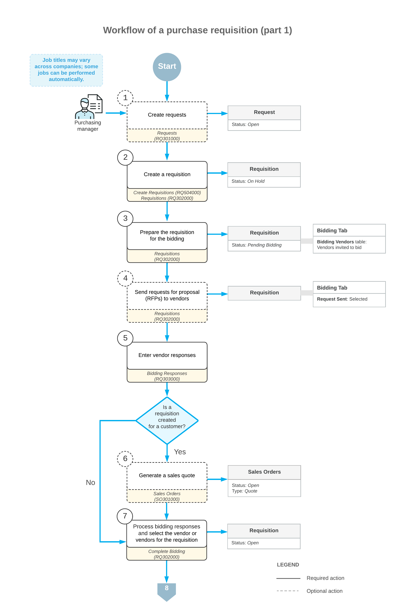
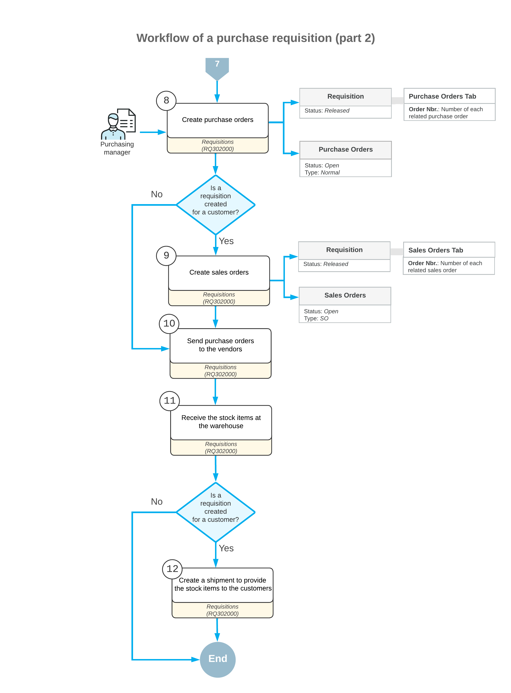

# Purchase Requests and Requisitions: General Information {#_c0e20bb0-0d77-43c8-b883-026d8e55dbfc .concept}

In Acumatica ERP, you can create purchase requisitions directly on the [Requisitions](RQ_30_20_00.md) \(RQ302000\) form or first create purchase requests on the [Requests](RQ_30_10_00.md) \(RQ301000\) form. Each request is associated with the specific customer or employee that wants the item, so requests are described as *customer requests* or *employee requests*.

You can create customer purchase requests, create purchase requisitions based on these requests, and solicit bids from multiple vendors so that you can select the best bid. You can also create employee purchase requests, validate requests against the budget, create purchase requisitions based on these requests, and solicit bids from multiple vendors so that you can select the best bid.

## Learning Objectives { .section}

In this chapter, you will do the following:

-   Become familiar with the general workflow of the purchase requisition functionality based on customer requests and employee requests
-   Learn about budget validation
-   Learn about the selection and acceptance of vendor bids
-   Process a purchase requisition based on customer requests
-   Process a purchase requisition based on employee requests
-   Process a purchase requisition that is not based on requests

## Applicable Scenarios { .section}

You process a purchase requisition in the following cases:

-   You are reselling hard-to-find products, such as exotic products or products that are not produced in your country.
-   You offer products directly from manufacturers.
-   You purchase products by using invitations to bid.

## Creation of Purchase Requests { .section}

A purchase request on the [Requests](RQ_30_10_00.md) \(RQ301000\) form has the list of stock items to be purchased on the **Details** tab. After you have created the requests, you can create a requisition document based on them.

If you want to purchase stock items from a vendor and then sell to a customer, you create a customer request. In the **Request Class** box, you select a customer request class. For such a request class, the **Customer Request** check box is selected on the [Request Classes](RQ_20_10_00.md) \(RQ201000\) form. You create a purchase requisition based on any number of customer requests. You can manually select the vendor to purchase items from, or you can request vendor bids and then select the best offers for the items. For details, see [Purchase Requests and Requisitions: To Process Customer Requests](OrderMgmt_Purchase_Requests_To_Process_Customer_Request.md).

If you want to purchase stock items from a vendor for employee needs, you create an employee request. In the **Request Class** box, you select a request class that defines requests as used for employee needs. For such a class, the **Customer Request** check box is cleared on the [Request Classes](RQ_20_10_00.md) form. For details, see [Purchase Requests and Requisitions: To Process Employee Requests](OrderMgmt_Purchase_Requests_To_Process_Employee_Request.md).

If employees of your company order low-cost items, such as office supplies, you can create any number of employee requests and create a purchase requisition based on these requests. You can configure employee requests to require approval or budget verification—or use both of these controls to keep costs in check.

If you already work with a vendor that gives your company the best prices and discounts for these items \(that is, if no bidding should occur for the items\), you can manually specify the vendor from which you want to purchase items. If you know that all items will be purchased from the same vendor, you can specify that vendor on the **Vendor Info** tab of the [Requests](RQ_30_10_00.md) form. The system will populate the selected vendor for each item in the **Vendor** column \(hidden by default\) of the **Details** tab.

**Tip:** If a default vendor is selected on the [Stock Items](IN_20_25_00.md) \(IN202500\) form for a stock item added to a request, the system populates the **Vendor** and **Alternate ID** \(hidden by default\) columns on the **Details** tab of the [Requests](RQ_30_10_00.md) form.

## Budget Validation { .section}

If your organization allocates budgets for internal purchases, you can use budget validation for employee requests to prevent cost overruns of requested goods and services. Before you can use budget validation, you should make sure that the budgets have been created and released in the system on the [Budgets](GL_30_20_10.md) \(GL302010\) form.

On the **Budget** tab of the [Requests](RQ_30_10_00.md) \(RQ301000\) form, you can see if the cost of the stock items included in a request complies with the budget. If the cost exceeds the budget, you can edit the list of items in the request, reject the request, or process it in the next financial period.

## Creation of a Purchase Requisition { .section}

On the [Requisitions](RQ_30_20_00.md) \(RQ302000\) form, you add items for purchase and select the vendors from which the items will be purchased. The process of creating a requisition can begin differently depending on whether you have already created purchase requests on the [Requests](RQ_30_10_00.md) \(RQ301000\) form for the items to be included in the requisition:

-   If you have not first entered requests for the items, you use the [Requisitions](RQ_30_20_00.md) form as a starting point. You add the items directly on the **Details** tab by clicking **Add Items** on the table toolbar for each item to be added. For details, see [Purchase Requests and Requisitions: To Process a Requisition Without Requests](OrderMgmt_Purchase_Requests_To_Process_Requisition.md).
-   If you have already entered the requests to be included in the requisition, you start the creation of the requisition on one of the following forms:
    -   [Create Requisitions](RQ_50_40_00.md) \(RQ504000\): You can use this form as a starting point to create a requisition based on requests that have been created in the system. You can enter any needed selection criteria and view the list of requests that meet this criteria. You can then process—that is, include in the purchase requisition the system will create—all listed requests or only those you select. You can include multiple requests in one requisition if the stock items in these requests will be ordered from the same vendor or set of vendors. After you process requests on this form, you use the [Requisitions](RQ_30_20_00.md) form for all future processing of the created requisition. You can create multiple requisitions by repeating the steps of including the needed requests and clicking **Process** on the form toolbar.
    -   [Requisitions](RQ_30_20_00.md): On the **Details** tab of this form, you can click **Add Requested Items** on the table toolbar to add items in purchase requests. You can include additional stock items in a requisition by clicking **Add Items** on the table toolbar.

You use the [Requisitions](RQ_30_20_00.md) form to fully process a requisition from creation to release. The form also lists the purchase orders and sales orders created for the requisition, with links you can use to quickly open these orders.

On the [Requisitions](RQ_30_20_00.md) form, you can merge lines on the **Details** tab with the same stock item into one line. These lines can be merged if the stock item was requested by the same requester \(a customer or an employee\), has the same estimated unit cost specified in the **Est. Unit Cost** column, and the same expense account in the **Account** column.

If you create a requisition from requests by using the [Create Requisitions](RQ_50_40_00.md) form, you can select the **Merge Lines** check box in the Selection area of the form to merge the lines of all the requests included in the requisition that contain the same stock item with the same **Line Source**, **Inventory ID**, **UOM**, and **Account** \(expense account\) settings. The state of the **Merge Lines by Default** check box on the [Purchase Requisitions Preferences](RQ_10_10_00.md) \(RQ101000\) form also determines the default state of the **Merge Lines** check box on the [Create Requisitions](RQ_50_40_00.md) form.

In an existing requisition, you can merge lines manually on the **Details** tab of the [Requisitions](RQ_30_20_00.md) form by selecting the Included check box for the lines in the list and clicking **Merge Lines** on the table toolbar.

## Requesting of Bids { .section}

If you will be obtaining bids from vendors and choosing the best offers, you send requests for proposal to vendors once the requisition contains all the needed information. On the form toolbar of the [Requisitions](RQ_30_20_00.md) \(RQ302000\) form, you click **Send Requests for Proposal**. The system creates a PDF file that contains a request for proposal, generates an email to each vendor listed on the **Bidding** tab of the form, attaches the file to the email, and adds the email to the outgoing mail. If a schedule has been configured in the system, the email will be sent automatically the next time this schedule is executed. Alternatively, you can send a request to a particular vendor. On the **Bidding** tab, you select a vendor in the **Bidding Vendors** table and click **Send Request** on the table toolbar.

## Selection and Acceptance of Bids { .section}

If you have requested bids from multiple vendors for a requisition, you can process these bids from multiple vendors to select the best offers with the lowest prices. You start the selection process by entering these responses into the system on the [Bidding Responses](RQ_30_30_00.md) \(RQ303000\) form.

You process the bids for a particular requisition by using the [Complete Bidding](RQ_50_30_00.md) \(RQ503000\) form, where you select the reference number of the requisition in the Summary area. To run automatic bidding, you click **Update Result** on the form toolbar. The system selects a vendor or multiple vendors for each stock item automatically based on the offered price and any quantity limitations from vendor responses. In the **Bidding Details** table of the **Bidding Results** tab, the price is shown in the **Bid Unit Cost** column and the quantity is shown in the **Bid Qty.** column. You can view the bidding results and manually correct them if you want to change the automatically selected vendors.

If any vendor response has been changed or withdrawn after the system selected vendors for a requisition, you enter new responses on the [Bidding Responses](RQ_30_30_00.md) form by editing the existing responses. Then if you want to again begin vendor selection, you go back to the [Complete Bidding](RQ_50_30_00.md) form, click **Clear Result** on the form toolbar to clear the selected vendors for all lines of the requisition, and click **Update Result** again.

When you analyze the bidding responses, you can select the bids manually. You may want to take into account the lowest price, the number of days needed to deliver the order, the vendor shipping terms, and any special offers from a vendor. You can select a vendor with a better bid by using the [Requisitions](RQ_30_20_00.md) \(RQ302000\) form as follows: You click the vendor line in the **Bidding Vendors** table on the **Bidding** tab and click **Select Vendor** on the table toolbar. You can select only one vendor per requisition on the [Requisitions](RQ_30_20_00.md) form.

After you have analyzed and corrected the bidding results, you accept the results by clicking **Complete Bidding** on the form toolbar. You can view the selected vendors as follows:

-   If one vendor is selected for a requisition, you can view the vendor's settings on the **Vendor Info** tab of the [Requisitions](RQ_30_20_00.md) form.
-   If more than one vendor is selected for a requisition, you can click **View Bidding** on the More menu \(which opens the [Complete Bidding](RQ_50_30_00.md) form\) and view the selected vendors on the **Bidding Results** tab.

## Processing of Purchase Requisitions { .section}

To process a purchase requisition, you perform the following general steps:

1.  Optional: Create a purchase request or multiple requests on the [Requests](RQ_30_10_00.md) \(RQ301000\) form. For an employee purchase request, you can use validation against the budget before you add the request to the purchase requisition. For details, see [Purchase Requisition Configuration: Setup of Budget Validation](../ImplementationGuide/config_OrderMgmt_Purchase_Requisitions_Budget_Validation.md).
2.  Create a requisition as follows: You create a requisition that is not based on requests on the [Requisitions](RQ_30_20_00.md) \(RQ302000\) form. If a requisition is based on requests, you can use the [Create Requisitions](RQ_50_40_00.md) \(RQ504000\) form as a starting point.
3.  Prepare a purchase requisition for the bidding. On the [Requisitions](RQ_30_20_00.md) form, you can edit a requisition that was created by using the [Create Requisitions](RQ_50_40_00.md) form or created from scratch. You can use buttons on the **Details** tab to add stock items for purchase and to add customer or employee requests that have been entered.

    If you will be requesting bids from vendors, you add the vendors to the **Bidding Vendors** table on the **Bidding** tab to specify which vendors will be considered for this requisition. \(The next step describes the continuation of requesting and processing bids.\) To manually select a vendor for the requisition, you specify it in the unlabeled area of the tab \(above the **Bidding Vendors** table\) and leave the table blank.

4.  Optional: Send requests for proposal \(RFPs\) to vendors. On the [Requisitions](RQ_30_20_00.md) form, you can send requests for proposal as follows:

    -   To a specific vendor listed in the **Bidding Vendors** table by clicking the vendor and then clicking **Send Request** on the table toolbar
    -   To all the vendors listed on the **Bidding** tab by clicking **Send Requests for Proposal** on the form toolbar
    **Tip:** When a request for proposal has been sent, the system selects the check box in the **Request Sent** column in the **Bidding Vendors** table of the **Bidding** tab.

5.  Enter bids from vendors into the system on the [Bidding Responses](RQ_30_30_00.md) \(RQ303000\) form.
6.  Optional: For a requisition that has stock items that have been requested by customers, you may need to generate a sales quote for the customer and reach agreement on the requisition with the customer. On the [Requisitions](RQ_30_20_00.md) form, you create a sales quote by clicking **Create Quote** on the More menu. This creates an order with the *Quote* behavior of the type specified on the [Purchase Requisitions Preferences](RQ_10_10_00.md) \(RQ101000\) form. When the quote has been approved by the customer, you can proceed with the sale of the stock items, as described in Step 9.
7.  Process bidding responses and select a vendor for the requisition. If you have run automatic bidding, you analyze and correct the automatic bidding results by using the [Complete Bidding](RQ_50_30_00.md) \(RQ503000\) form. Also, you can use this form to select multiple vendors.

    **Tip:** When you know which vendor you wanted to select for the requisition and do not initiate the bidding process, you manually select the vendor on the **Bidding** tab of the [Requisitions](RQ_30_20_00.md) form.

8.  Create purchase orders \(and sales orders for customer requests, see the following step\). On the [Requisitions](RQ_30_20_00.md) form, you click **Create Orders**, which creates a purchase order or multiple purchase orders for the vendor or vendors on the [Purchase Orders](PO_30_10_00.md) \(PO301000\) form.
9.  Create sales orders for customer requests. On the [Requisitions](RQ_30_20_00.md) form, you click **Create Orders**, which creates a sales order or multiple sales orders for the customer or customers on the [Sales Orders](SO_30_10_00.md) \(SO301000\) form. A sales order has the *Sales Order* automation behavior and the type specified on the [Purchase Requisitions Preferences](RQ_10_10_00.md) form.

    The lines of the created sales order on the [Sales Orders](SO_30_10_00.md) form have the **Mark for PO** check box selected and are linked to the corresponding lines of the created purchase orders.

10. Send the purchase order or orders to each vendor. On the [Purchase Orders](PO_30_10_00.md) form, you click **Email Purchase Order** on the More menu to send the created purchase order to the vendor or vendors selected to fulfill the requisition.
11. Receive the stock items in a warehouse: You create and process the documents related to the stock items being received in a warehouse by using the [Purchase Receipts](PO_30_20_00.md) \(PO302000\) and [Receipts](IN_30_10_00.md) \(IN301000\) forms.
12. Provide items to the customers. You use the [Sales Orders](SO_30_10_00.md) form to create the shipment and the [Shipments](SO_30_20_00.md) \(SO302000\) form to create and process the documents for shipping stock items to customers.

    **Tip:** If you are instead providing the stock items to employees, you create and process inventory transactions for issuing the items to the employees of your organization by using the [Issues](IN_30_20_00.md) \(IN302000\) form.

## Workflow of a Purchase Requisition {#section_vv2_1y4_y4b .section}

The following diagrams illustrate the workflow of a purchase requisition, which may or may not be based on requests.

**Parent topic:**[Processing Purchase Requests and Requisitions](../UserGuide/OrderMgmt_Purchase_Requests_Mapref.md)

