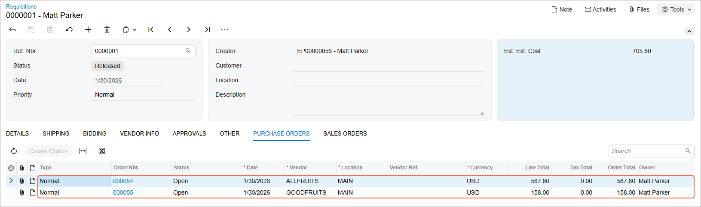
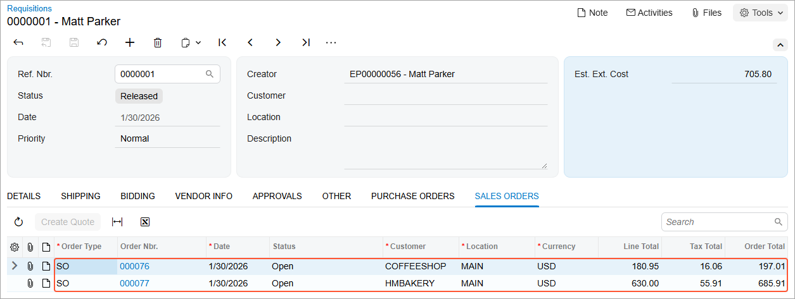

# Purchase Requests and Requisitions: To Process Customer Requests {#_80341db4-23ca-45e8-9c3f-94eb43f062c5 .task}

The following activity demonstrates how to process a purchase requisition that is based on customer requests.

**Attention:** This activity is based on the *U100* dataset. If you are using another dataset or if any system settings have been changed in *U100*, these changes can affect the workflow of the activity and the results of the processing. To avoid issues, restore the *U100* dataset to its initial state.

## Story { .section}

Suppose that you are Matt Parker, a purchasing manager in the *SweetLife Head Office and Wholesale Center* branch, and you are responsible for processing requests from customers who order fruit in your company. The company works with two fruit vendors: All Fruits Mall and Good Fruits. SweetLife's sales managers have received the following requests for fruit from the FourStar Coffee &amp; Sweets Shop and HM's Bakery &amp; Cafe customers:

-   30 pounds of tangerines and 43 pounds of lemons for a cocktail party from FourStar Coffee &amp; Sweets Shop
-   200 pounds of oranges and 80 pounds of apples for a big birthday party from HM's Bakery &amp; Cafe

You need to enter these requests into the system, create a purchase requisition, and request bids from the vendors. You will select the best vendors to fulfill the requests. The selected vendors will ship fruits to your company's warehouse. You will then process the needed documents to receive the fruits and ship them to the customers.

## Configuration Overview {#section_tz4_djx_cnb .section}

In the *U100* dataset, the following tasks have been performed to support this activity:

-   On the [Enable/Disable Features](CS_10_00_00.md) \(CS100000\) form, the following features have been enabled:
    -   *Inventory*
    -   *Purchase Requisitions*
-   On the [Warehouses](IN_20_40_00.md) \(IN204000\) form, the *WHOLESALE* warehouse has been created.
-   On the [Request Classes](RQ_20_10_00.md) \(RQ201000\) form, the *CUSTOMER* request class has been created with the following settings:
    -   **Customer Request**: Selected, which indicates that this class is used for requests received from customers
    -   **Allow Multiple Vendors per Request**: Selected, which indicates that purchase orders can be split by multiple vendors
-   On the [Stock Items](IN_20_25_00.md) \(IN202500\) form, the following stock items have been created: *APPLES*, *LEMONS*, *ORANGES*, and *TANGERINES*.
-   On the [Customers](AR_30_30_00.md) \(AR303000\) form, the following customers have been created:
    -   *HMBAKERY* \(HM's Bakery &amp; Cafe\)
    -   *COFFEESHOP* \(FourStar Coffee &amp; Sweets Shop\)
-   On the [Vendors](AP_30_30_00.md) \(AP303000\) form, the following vendors have been created: *ALLFRUITS* and *GOODFRUITS*.
-   On the [Purchase Requisitions Preferences](RQ_10_10_00.md) \(RQ101000\) form, the **Create Purchase Order on Hold** check box is cleared, which means that purchase orders are created in the *Open* status.

## Process Overview { .section}

In this activity, you will do the following:

1.  On the [Requests](RQ_30_10_00.md) \(RQ301000\) form, enter the customer requests into the system.
2.  On the [Create Requisitions](RQ_50_40_00.md) \(RQ504000\) form, initiate the creation of a purchase requisition based on the customer requests. Then on the [Requisitions](RQ_30_20_00.md) \(RQ302000\) form, send the requisition to the vendors that may participate in bidding.
3.  On the [Bidding Responses](RQ_30_30_00.md) \(RQ303000\) form, enter bids from vendors into the system.
4.  On the [Complete Bidding](RQ_50_30_00.md) \(RQ503000\) form, initiate automatic bidding among the vendors and manually select a vendor.
5.  On the [Requisitions](RQ_30_20_00.md) form, initiate the creation of the purchase orders for the selected vendors.
6.  On the [Purchase Orders](PO_30_10_00.md) \(PO301000\) and [Purchase Receipts](PO_30_20_00.md) \(PO302000\) forms, prepare and process the purchase receipts for the ordered stock items.
7.  On the [Sales Orders](SO_30_10_00.md) \(SO301000\) form, prepare the sales order and the related shipment of the stock items to the customer.

## System Preparation { .section}

Before you start performing the steps of this activity, do the following:

1.  Launch the Acumatica ERP website, and sign in to a company with the *U100* dataset preloaded. You should sign in as purchasing manager Matt Parker with the *parker* username and the *123* password.
2.  In the info area at the upper-right corner of the top pane of the Acumatica ERP screen, make sure that the business date is set to *1/30/2026*. If a different date is displayed, click the Business Date menu button and select *1/30/2026* from the calendar. For simplicity, you'll create and process all documents in this activity using this business date.
3.  On the Company and Branch Selection menu, in the top pane of the Acumatica ERP screen, make sure the *SweetLife Head Office and Wholesale Center* branch is selected.

## Step 1: Creating the Customer Requests in the System { .section}

To create the customer requests from the *COFFEESHOP* and *HMBAKERY* customers, do the following:

1.  On the [Requests](RQ_30_10_00.md) \(RQ301000\) form, add a new record.
2.  In the Summary area, do the following:
    1.  In the **Request Class** box, make sure that *CUSTOMER* is selected.
    2.  In the **Requested By** box, select *COFFEESHOP*.
    3.  In the **Description** box, type `Order for tangerines and lemons`.
3.  On the **Details** tab, do the following:
    1.  On the table toolbar, click **Add Row**.
    2.  In the row, specify the following settings:
        -   **Inventory**: *TANGERINES*
        -   **Order Qty.**: `30`
    3.  On the table toolbar, click **Add Row**.
    4.  In the row, specify the following settings:
        -   **Inventory**: *LEMONS*
        -   **Order Qty.**: `43`
4.  On the form toolbar, click **Remove Hold**. The system saves the request and assigns the request the *Open* status.
5.  While you are still on the [Requests](RQ_30_10_00.md) form, add another new record.
6.  In the Summary area, do the following:
    1.  In the **Request Class** box, make sure that *CUSTOMER* is selected.
    2.  In the **Requested By** box, select *HMBAKERY*.
    3.  In the **Description** box, type `Order for oranges and apples`.
7.  On the **Details** tab, do the following:
    1.  On the table toolbar, click **Add Row**.
    2.  In the row, specify the following settings:
        -   **Inventory**: *ORANGES*
        -   **Order Qty.**: `200`
    3.  On the table toolbar, click **Add Row**.
    4.  In the row, specify the following settings:
        -   **Inventory**: *APPLES*
        -   **Order Qty.**: `80`
8.  On the form toolbar, click **Remove Hold**. The system saves the request and assigns it the *Open* status.

## Step 2: Creating a Purchase Requisition { .section}

To create a combined requisition for the customers' requests that you have created in the previous step, do the following:

1.  On the [Create Requisitions](RQ_50_40_00.md) \(RQ504000\) form, make sure that all four request lines are displayed in the table.
2.  On the form toolbar, click **Process All**.
3.  In the **Confirmation** dialog box, which opens, click **Yes**. On the [Requisitions](RQ_30_20_00.md) \(RQ302000\) form, the system opens the requisition that it has created based on the requests.
4.  On the **Bidding** tab, in the **Bidding Vendors** table, make sure that *ALLFRUITS* is specified.
5.  Add the *GOODFRUITS* vendor as follows:

    1.  On the table toolbar, click **Add Row**.
    2.  In the **Vendor** column, select *GOODFRUITS*.
    The *ALLFRUITS* and *GOODFRUITS* vendors will be invited to take part in bidding.

6.  On the form toolbar, click **Remove Hold**. The system saves the requisition and assigns it the *Pending Bidding* status.

Suppose that you have sent the requisition to these vendors by email. In a system where email functionality has been configured, you would click **Send Requests for Proposal** on the table toolbar of the [Requisitions](RQ_30_20_00.md) form to send all the requests to the vendors or send each request by clicking the vendor on the **Bidding** tab and clicking **Send Request** on the table toolbar.

## Step 3: Entering the Vendor Responses into the System { .section}

Suppose that you have received bids from both vendors. The *ALLFRUITS* vendor can deliver only 150 pounds of oranges, and a minimum of 50 pounds must be purchased from this vendor. This vendor does not have tangerines in stock but can provide the requested quantity of lemons and apples. Also, this vendor provides you a discount if you purchase more than two items in one order.

The *GOODFRUITS* vendor can deliver the requested quantity of oranges but at a higher price than the one offered by *ALLFRUITS*. The *GOODFRUITS* vendor has tangerines in stock and can deliver the requested quantity of lemons and apples.

To add the responses from the vendors to the system, do the following:

1.  Open the [Bidding Responses](RQ_30_30_00.md) \(RQ303000\) form.
2.  In the Summary area, do the following:
    1.  In the **Requisition** box, select the identifier of the only requisition with the *Pending Bidding* status.
    2.  In the **Vendor** box, select *ALLFRUITS*.
3.  On the **Bidding Details** tab, specify the listed settings in the following table rows:
    -   The row with *TANGERINES* in the **Inventory ID** column:
        -   **Min. Qty.**: `0.00`

            This is the minimum quantity of the item that the vendor can supply.

        -   **Bid Qty.**: `0.00`

            This is the total quantity of items that the vendor can supply, according to the bidding response.

        -   **Bid Unit Cost**: `0.00`

            This is the total cost of items that the vendor can supply, according to the bidding response.

    -   The row with *LEMONS* in the **Inventory ID** column:
        -   **Min. Qty.**: `0.00`
        -   **Bid Qty.**: `43.00`
        -   **Bid Unit Cost**: `2.60`
    -   The row with *ORANGES* in the **Inventory ID** column:
        -   **Min. Qty.**: `50.00`
        -   **Bid Qty.**: `150.00`
        -   **Bid Unit Cost**: `2.00`
    -   The row with *APPLES* in the **Inventory ID** column:
        -   **Min. Qty.**: `0.00`
        -   **Bid Qty.**: `80.00`
        -   **Bid Unit Cost**: `2.20`
4.  On the form toolbar, click **Save**.
5.  In the **Vendor** box of the Summary area, select *GOODFRUITS*.
6.  On the **Bidding Details** tab, specify the listed settings in the following table rows:
    -   The row with *TANGERINES* in the **Inventory ID** column:
        -   **Min. Qty.**: `0.00`
        -   **Bid Qty.**: `30.00`
        -   **Bid Unit Cost**: `1.60`
    -   The row with *LEMONS* in the **Inventory ID** column:
        -   **Min. Qty.**: `0.00`
        -   **Bid Qty.**: `43.00`
        -   **Bid Unit Cost**: `2.55`
    -   The row with *ORANGES* in the **Inventory ID** column:
        -   **Min. Qty.**: `0.00`
        -   **Bid Qty.**: `200.00`
        -   **Bid Unit Cost**: `2.20`
    -   The row with *APPLES* in the **Inventory ID** column:
        -   **Min. Qty.**: `0.00`
        -   **Bid Qty.**: `80.00`
        -   **Bid Unit Cost**: `2.30`
7.  On the form toolbar, click **Save**.

## Step 4: Selecting the Best Bids from Vendors { .section}

To perform automatic bidding and then correct the bidding results manually, do the following:

1.  On the [Complete Bidding](RQ_50_30_00.md) \(RQ503000\) form, in the **Ref. Nbr.** box, select the reference number of the only requisition with the *Pending Bidding* status.
2.  On the form toolbar, click **Update Result**. The system selects vendors automatically and updates the information on the **Bidding Results** tab.

    Notice that in the Selection area, the **Splittable** check box is selected because the **Allow Multiple Vendors per Request** check box has been selected on the [Request Classes](RQ_20_10_00.md) \(RQ201000\) form for the class of the request based on which the requisition has been created. This setting means that the system can split the order between multiple vendors.

3.  On the form toolbar, click **Save**.
4.  On the **Bidding Results** tab, analyze the results of the automatic bidding as follows:
    1.  In the **Requisition Details** table, click the *TANGERINES* row.

        In the **Bidding Details** table, the *GOODFRUITS* vendor is selected because only this vendor can supply tangerines.

    2.  In the **Requisition Details** table, click the *LEMONS* row.

        In the **Bidding Details** table, in the unlabeled column, the row with the *GOODFRUITS* vendor is selected because this vendor offered a lower price. However, the *ALLFRUITS* vendor provides you a discount if you purchase more than two items in one order.

    3.  In the **Requisition Details** table, click the *ORANGES* row.

        In the **Bidding Details** table, in the unlabeled column, the check boxes for both vendors are selected. This means that the quantity of the oranges is split between these two vendors. The *ALLFRUITS* vendor offered the best price for the oranges, but the vendor can provide only 150 pounds of oranges, whereas the needed quantity is 200 pounds. Thus, you will order another 50 pounds of oranges from the *GOODFRUIT* vendor at a higher cost.

    4.  In the **Requisition Details** table, click **Go to Next Page**.
    5.  Click the *APPLES* row.

        In the **Bidding Details** table, in the unlabeled column, the check box for the row with the *ALLFRUITS* vendor is selected because this vendor offered a lower price and can provide the required amount of apples.

5.  In the **Bidding Details** table, select the *ALLFRUITS* vendor for the *LEMONS* stock item as follows:
    1.  Clear the unlabeled check box for the *GOODFRUITS* vendor.
    2.  On the form toolbar, click **Save**.
    3.  Select the unlabeled check box for the *ALLFRUITS* vendor.
    4.  On the form toolbar, click **Save**.
6.  On the form toolbar, click **Complete Bidding**. The status of the requisition is changed to *Open*.

Now that you have selected the vendors, you can create the needed purchase orders to be sent to the vendors.

## Step 5: Creating the Purchase Orders { .section}

To create the purchase orders for the vendors, do the following:

1.  On the [Requisitions](RQ_30_20_00.md) \(RQ302000\) form, open the requisition with the *Open* status that you have earlier created in this activity.
2.  On the More menu, click **Create Orders**. The system creates purchase orders for the *ALLFRUITS* and *GOODFRUITS* vendors. Because the requisition is based on customer requests of these items, the system also creates sales orders for the *HMBAKERY* and *COFFESHOP* customers. Also, the requisition is assigned the *Released* status.
3.  On the **Purchase Orders** tab, make sure that purchase orders with the *Open* status are listed for the *ALLFRUITS* and *GOODFRUITS* vendors, as shown in the following screenshot.

    **Attention:** If your system has a different set of purchase and sales documents than those in the initial *U100* dataset, you may see different values in the screenshots.

    

4.  On the **Sales Orders** tab, make sure that sales orders with the *Open* status are listed for the *COFFEESHOP* and *HMBAKERY* customers, as shown in the following screenshot.

    

You have created purchase orders for both vendors. Suppose that you have emailed the purchase orders to the vendors.

## Step 6: Receiving the Items from the Vendors { .section}

Suppose that the vendors have delivered the ordered fruits to the *WHOLESALE* warehouse. To create the documents that reflect the receipt of the items in the warehouse, do the following:

1.  On the [Purchase Orders](PO_30_10_00.md) \(PO301000\) form, open the purchase order for the *ALLFRUITS* vendor that you have prepared earlier. \(The purchase order contains the *ORANGES*, *APPLES*, and *LEMONS* stock items.\)
2.  On the form toolbar, click **Enter PO Receipt**. The system opens the [Purchase Receipts](PO_30_20_00.md) \(PO302000\) form with the new receipt. Notice that the receipt has the *Balanced* status and the data copied from the linked purchase order.
3.  On the form toolbar, click **Release**. The system releases the purchase receipt; it also creates the corresponding inventory receipt and releases it. On the **Other** tab, in the **IN Ref. Nbr.** box, you can view the reference number of the inventory receipt. \(The reference number is also a link that you can click to view the inventory receipt on the [Receipts](IN_30_10_00.md) \(IN301000\) form.\) On the **Orders** tab, notice that the listed purchase order now has the *Completed* status.
4.  On the [Inventory Allocation Details](IN_40_20_00.md) \(IN402000\) form, do the following:
    1.  In the **Inventory ID** box of the Selection area, select *ORANGES*.
    2.  In the **Warehouse** box, select *WHOLESALE*.
    3.  On the **Qty by Plan Type** tab, on the toolbar of the **Deduction** table, select *All Records* in the filter box.
    4.  Make sure that the quantity in the **SO Allocated** row is *150* \(the quantity on unconfirmed shipments\) and the quantity in the **SO to Purchase** row is *50* \(the quantity included in open purchase orders created for sales orders, this quantity will come from the other vendor\).
    5.  In the **Inventory ID** box, select *APPLES*.
    6.  In the **Deduction** table, make sure that the quantity in the **SO Allocated** row is *80*.
    7.  In the **Inventory ID** box, select *LEMONS*.
    8.  Make sure that the quantity in the **SO Allocated** row is *43*.
5.  On the [Purchase Orders](PO_30_10_00.md) form, open the purchase order for the *GOODFRUITS* vendor that you have prepared earlier. The purchase order has the *Open* status and contains the *ORANGES* and *TANGERINES* stock items.
6.  On the form toolbar, click **Enter PO Receipt**. The system opens the [Purchase Receipts](PO_30_20_00.md) form with the new receipt, which has the *Balanced* status and the data copied from the linked purchase order.
7.  On the form toolbar, click **Release**. The system releases the purchase receipt; it also creates the corresponding inventory receipt and releases it. On the **Other** tab, in the **IN Ref. Nbr.** box, you can view the reference number of the inventory receipt. \(The reference number is also a link that you can click to view the inventory receipt on the [Receipts](IN_30_10_00.md) form\). On the **Orders** tab, notice that the listed purchase order now has the *Completed* status.
8.  On the [Inventory Allocation Details](IN_40_20_00.md) form, do the following:
    1.  In the **Inventory ID** box of the Selection area, select *ORANGES*.
    2.  In the **Warehouse** box, select *WHOLESALE*.
    3.  In the **Deduction** table of the **Qty by Plan Type** tab, make sure that the quantity in the **SO Allocated** row is *200* \(which is now the full amount to fulfill the customer's order\).
    4.  In the **Inventory ID** box, select *TANGERINES*.
    5.  In the **Deduction** table, make sure that the quantity in the **SO Allocated** row is *30*.

All fruits are allocated for sales orders, which means that these fruits are not available for other orders. Now you can prepare and process the documents for shipping the fruits to the customers, which you will do in the next step.

## Step 7: Shipping the Fruits to the Customers { .section}

In this step, you will perform the needed actions to ship the fruits to the customers. You will process the sales orders, create and confirm shipments for them, create and release the related invoices, and generate the needed inventory transactions. Do the following:

1.  On the [Sales Orders](SO_30_10_00.md) \(SO301000\) form, open the sales order with the *Open* status for the *HMBAKERY* customer that the system prepared earlier in this activity. \(The sales order contains the *ORANGES* and *APPLES* stock items.\)
2.  On the form toolbar, click **Quick Process**.
3.  In the **Process Order** dialog box, which opens, do the following:
    1.  In the **Warehouse ID** box, make sure that *WHOLESALE* is selected.
    2.  In the **Shipment Date** section, make sure that *Custom* is selected and the date is *1/30/2026*.
    3.  In the **Shipping** section, make sure that the following check boxes are selected:
        -   **Create Shipment**
        -   **Confirm Shipment**
        -   **Update IN**

            With this check box selected, the system will generate the inventory transactions for confirmed shipments.

    4.  In the **Invoicing** section, make sure that the **Prepare Invoice** check box is selected.
    5.  Select the **Release Invoice** check box.
    6.  Click **Process**. The system completes the sales order and creates and processes the documents related to the sales order. You can see the links to the documents in the processing box in the upper right corner.
    7.  Close the processing box. Notice that the sales order now has the *Completed* status.
4.  On the [Inventory Allocation Details](IN_40_20_00.md) \(IN402000\) form, do the following:
    1.  In the **Inventory ID** box of the Selection area, select *APPLES*.
    2.  In the **Warehouse** box, select *WHOLESALE*.
    3.  On the **Qty by Plan Type** tab, on the toolbar of the **Deduction** table, select *All Records* in the filter box.
    4.  Make sure that the quantity in the **SO Allocated** row is *0*.
    5.  In the **Inventory ID** box, select *ORANGES*.
    6.  Make sure that the quantity in the **SO Allocated** row is *0*.
5.  On the [Sales Orders](SO_30_10_00.md) form, open the sales order with the *Open* status for the *COFFESHOP* customer that the system created earlier in this activity. \(The sales order contains the *TANGERINES* and *LEMONS* stock items.\)
6.  On the form toolbar, click **Quick Process**.
7.  In the **Process Order** dialog box, which opens, do the following:
    1.  In the **Warehouse ID** box, make sure that *WHOLESALE* is selected.
    2.  In the **Shipment Date** section, make sure that *Custom* is selected and the date is *1/30/2026*.
    3.  In the **Shipping** section, make sure that the following check boxes are selected:
        -   **Create Shipment**
        -   **Confirm Shipment**
        -   **Update IN**
    4.  In the **Invoicing** section, make sure that the **Prepare Invoice** check box is selected.
    5.  Select the **Release Invoice** check box.
    6.  Click **Process**. The system completes the sales order and creates and processes the documents related to the sales order. You can see the links to the documents in the processing box in the upper right corner.
    7.  Close the processing box. Notice that the sales order now has the *Completed* status.
8.  On the [Inventory Allocation Details](IN_40_20_00.md) form, do the following:
    1.  In the **Inventory ID** box of the Selection area, select *TANGERINES*.
    2.  In the **Warehouse** box, select *WHOLESALE*.
    3.  On the **Qty by Plan Type** tab, on the toolbar of the **Deduction** table, select *All Records* in the filter box.
    4.  Make sure that the quantity in the **SO Allocated** row is *0*.
    5.  In the **Inventory ID** box, select *LEMONS*.
    6.  Make sure that the quantity in the **SO Allocated** row is *0*.

You have performed the needed processing for shipping the ordered fruits to the customers.

**Parent topic:**[Processing Purchase Requests and Requisitions](../UserGuide/OrderMgmt_Purchase_Requests_Mapref.md)

