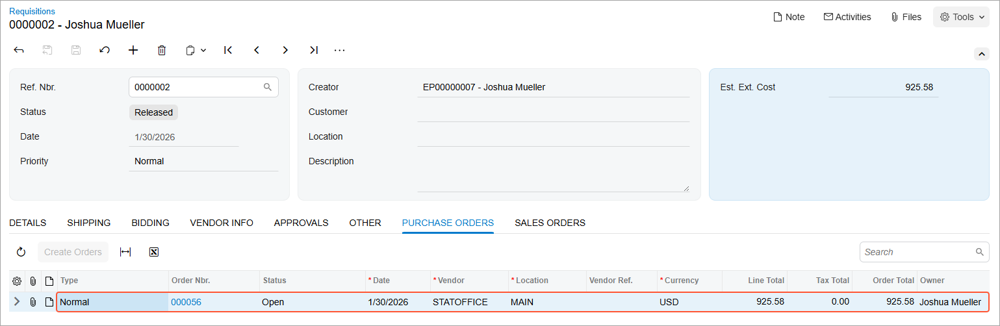

# Purchase Requests and Requisitions: To Process Employee Requests {#_385f78d5-6b7d-48fd-801e-c681fa2dac23 .task}

The following activity demonstrates how to process a purchase requisition initiated by employee requests within the company. These requests do not require approval.

**Attention:** This activity is based on the *U100* dataset. If you are using another dataset or if any system settings have been changed in *U100*, these changes can affect the workflow of the activity and the results of the processing. To avoid issues, restore the *U100* dataset to its initial state.

## Story { .section}

Suppose that you are an office manager in the SweetLife Fruits &amp; Jams company who orders office supplies for all departments of the company. These supplies are ordered from a single preferred vendor, the Spectra Stationery Office vendor, and bidding is not involved in the requisition process. The company orders these items based on requests that employees enter into the system. Employees can select only items from a predefined list. Office supplies do not require approval from department leads due to their relatively low value.

You need to add the requests that employees have submitted over the past week into one purchase requisition and send the related purchase order to the vendor. You will then process the receipt and issuing of these items.

## Configuration Overview {#section_tz4_djx_cnb .section}

In the *U100* dataset, the following tasks have been performed to support this activity:

-   On the [Enable/Disable Features](CS_10_00_00.md) \(CS100000\) form, the following features have been enabled:
    -   *Inventory and Order Management*
    -   *Inventory*
    -   *Purchase Requisitions*
-   On the [Warehouses](IN_20_40_00.md) \(IN204000\) form, the *WHOLESALE* warehouse has been created.
-   On the [Stock Items](IN_20_25_00.md) \(IN202500\) form, the following stock items have been created: *PEN*, *PENCIL*, and *PAPER*.
-   On the [Request Classes](RQ_20_10_00.md) \(RQ201000\) form, the *INTSUPPLY* request class has been created as follows:
    -   The **Restrict Requested Items to the Specified List** check box has been selected, and the *PEN*, *PENCIL*, and *PAPER* items have been added to the **Item List** tab. Restricting the list of items in a request class reduces the probability of mistakes made during the data entry of requests of the class.
    -   The **Allow Multiple Vendors per Request** check box has been cleared. Per the company's business practices, all of the items in requests of the class are purchased from one vendor.
-   On the [Vendors](AP_30_30_00.md) \(AP303000\) form, the *STATOFFICE* vendor has been created.

## Process Overview { .section}

In this activity, you will do the following:

1.  On the [Requests](RQ_30_10_00.md) \(RQ301000\) form, enter all employee requests into the system.
2.  On the [Create Requisitions](RQ_50_40_00.md) \(RQ504000\) form, initiate the creation of a purchase requisition based on the employees' requests.
3.  On the [Requisitions](RQ_30_20_00.md) \(RQ302000\) form, initiate the creation of a purchase order and send it to the selected vendor.
4.  On the [Purchase Orders](PO_30_10_00.md) \(PO301000\) and [Purchase Receipts](PO_30_20_00.md) \(PO302000\) forms, prepare and process the purchase receipt for the ordered stock items.
5.  On the [Issues](IN_30_20_00.md) \(IN302000\) form, create the inventory issue to reflect the items being issued to the employees who requested the items.

## System Preparation { .section}

Before you start processing a purchase requisition based on requests from employees, do the following:

1.  Launch the Acumatica ERP website, and sign in to a company with the *U100* dataset preloaded. You should sign in as office manager Joshua Mueller with the *mueller* username and the *123* password.
2.  In the info area at the upper-right corner of the top pane of the Acumatica ERP screen, make sure that the business date is set to *1/30/2026*. If a different date is displayed, click the Business Date menu button and select *1/30/2026* from the calendar. For simplicity, you'll create and process all documents in this activity using this business date.
3.  On the Company and Branch Selection menu, in the top pane of the Acumatica ERP screen, make sure the *SweetLife Head Office and Wholesale Center* branch is selected.

## Step 1: Creating the Employee Requests { .section}

Suppose that you have received requests for pens, paper, and pencils from the Sales department and the Operations department of the company. To enter these requests, do the following:

1.  On the [Requests](RQ_30_10_00.md) \(RQ301000\) form, add a new record.
2.  In the Summary area, do the following:
    1.  In the **Request Class** box, select *INTSUPPLY*.
    2.  In the **Requested By** box, notice that the employee ID and name that corresponds to your user account is automatically inserted.
    3.  In the **Description** box, type `The Sales department's order for office supplies`.
3.  On the **Details** tab, do the following:
    1.  On the table toolbar, click **Add Row**.
    2.  In the row, specify the following settings:
        -   **Inventory**: *PEN*
        -   **Order Qty.**: `15`
    3.  On the table toolbar, click **Add Row**.
    4.  In the row, specify the following settings:
        -   **Inventory**: *PAPER*
        -   **Order Qty.**: `12`
    5.  On the table toolbar, click **Add Row**.
    6.  In the row, specify the following settings:
        -   **Inventory**: *PENCIL*
        -   **Order Qty.**: `10`
4.  On the form toolbar, click **Remove Hold**. The system saves the request and changes the status of the request to *Open*.
5.  While you are still on the [Requests](RQ_30_10_00.md) \(RQ301000\) form, add another new record.
6.  In the Summary area, do the following:
    1.  In the **Request Class** box of the Summary area, select *INTSUPPLY*.
    2.  In the **Description** box, type `The Operations department's order for office supplies`.
7.  On the **Details** tab, do the following:
    1.  On the table toolbar, click **Add Row**.
    2.  In the row, specify the following settings:
        -   **Inventory**: *PEN*
        -   **Order Qty.**: `25`
    3.  On the table toolbar, click **Add Row**.
    4.  In the row, specify the following settings:
        -   **Inventory**: *PAPER*
        -   **Order Qty.**: `15`
    5.  On the table toolbar, click **Add Row**.
    6.  In the row, specify the following settings:
        -   **Inventory**: *PENCIL*
        -   **Order Qty.**: `5`
8.  On the form toolbar, click **Remove Hold**. The system saves the request and changes the status of the request to *Open*.

## Step 2: Creating a Purchase Requisition { .section}

To create a requisition for the requests that you entered in the previous step, do the following:

1.  On the [Create Requisitions](RQ_50_40_00.md) \(RQ504000\) form, make sure that all six lines with the requested items are listed.
2.  On the form toolbar, click **Process All**. On the [Requisitions](RQ_30_20_00.md) \(RQ302000\) form, the system opens the requisition that it has created based on the requests.
3.  On the **Details** tab, do the following:

    1.  For the two rows with the *PEN* inventory ID, select the check boxes in the unlabeled column.
    2.  On the table toolbar, click **Merge Lines** to reduce the number of lines in the purchase documents.
    3.  For the two rows with the *PAPER* inventory ID, select the check boxes in the unlabeled column.
    4.  On the table toolbar, click **Merge Lines**.
    5.  For the two rows with the *PENCIL* inventory ID, select the check boxes in the unlabeled column.
    6.  On the table toolbar, click **Merge Lines**.
    Now the requisition contains three lines.

4.  On the form toolbar, click **Remove Hold**. The system saves the requisition and changes its status to *Open*.

## Step 3: Creating the Purchase Order { .section}

To create the purchase order for the *STATOFFICE* vendor, do the following:

1.  While you are still viewing the open requisition that you have created on the [Requisitions](RQ_30_20_00.md) \(RQ302000\) form, click **Create Orders** on the More menu. The system creates a purchase order for the requisition and assigns the requisition the *Released* status.
2.  On the **Purchase Orders** tab, notice that the system has listed a purchase order with the *Open* status for the *STATOFFICE* vendor, as shown in the following screenshot.

    **Attention:** If your system has a different set of purchase and sales documents than those in the initial *U100* dataset, you may see different values in the screenshots.

    

You have created the purchase order for the vendor. Suppose that you have sent the purchase order to the vendor.

## Step 4: Receiving the Items from the Vendor { .section}

Suppose that the Spectra Stationery Office vendor has delivered the ordered items to the *WHOLESALE* warehouse. To create the documents that reflect the receipt of the items in the warehouse, do the following:

1.  While you are still viewing the **Purchase Orders** tab of the [Requisitions](RQ_30_20_00.md) \(RQ302000\) form for the requisition, click the link in the **Order Nbr.** column. The system opens the purchase order on the [Purchase Orders](PO_30_10_00.md) \(PO301000\) form.
2.  On the form toolbar, click **Enter PO Receipt**. The system opens the [Purchase Receipts](PO_30_20_00.md) \(PO302000\) form with the new receipt. The receipt has the *Balanced* status and the data copied from the linked purchase order.
3.  On the form toolbar, click **Release**. The system releases the purchase receipt; it also creates the corresponding inventory receipt and releases it. On the **Other** tab, you can view the reference number of the created inventory receipt. The reference number is also a link you can click to view the inventory receipt on the [Receipts](IN_30_10_00.md) \(IN301000\) form.
4.  On the [Inventory Allocation Details](IN_40_20_00.md) \(IN402000\) form, do the following in the Selection area:
    1.  In the **Inventory ID** box, select *PEN*.
    2.  In the **Warehouse** box, select *WHOLESALE*.
    3.  Make sure that the quantity in the **Available for Issue** box is *50*.
    4.  In the **Inventory ID** box, select *PENCIL*.
    5.  Make sure that the quantity in the **Available for Issue** box is *22*.
    6.  In the **Inventory ID** box, select *PAPER*.
    7.  Make sure that the quantity in the **Available for Issue** box is *62*.

You have received the office supplies in the warehouse, and now you can issue the items to the departments that ordered them.

## Step 5: Issuing Inventory Items from a Warehouse { .section}

Suppose that you have provided the office supplies that you ordered to the applicable departments. To create and process the needed documents for issuing the items from the *WHOLESALE* warehouse, do the following:

1.  On the [Issues](IN_30_20_00.md) \(IN302000\) form, add a new record.
2.  In the **Description** box of the Summary area, type `Issue of office supplies to the Sales and Operations departments`.
3.  On the **Details** tab, click **Add Items** on the table toolbar.
4.  In the Summary area of the **Inventory Lookup** dialog box, which opens, select *WHOLESALE* in the **Warehouse** box.
5.  Make sure that the **Show Available Items Only** check box is selected.
6.  To select the required items, do the following:
    1.  In the **Inventory** box, type `pen` to filter the list of items.
    2.  In the unlabeled column, select the check box for the row with the *PEN* item.
    3.  In the **Qty. Selected** column of the same row, type `40`.
    4.  In the unlabeled column, select the check box for the row with the *PENCIL* item.
    5.  In the **Qty. Selected** column of the same row, type `15`.
    6.  In the **Inventory** box, type `paper`.
    7.  In the unlabeled column, select the check box for the row with the *PAPER* item.
    8.  In the **Qty. Selected** column of the same row, type `27`.
7.  Click **Add &amp; Close** to add the selected items to the issue and close the dialog box.
8.  On the form toolbar, click **Release**. The system changes the status of the issue to *Released*.
9.  Open the [Inventory Allocation Details](IN_40_20_00.md) \(IN402000\) form.
10. In the Selection area, do the following:
    1.  In the **Inventory ID** box, select *PEN*.
    2.  In the **Warehouse** box, select *WHOLESALE*.
    3.  Make sure that the value of the **Available for Issue** box is *10*.
    4.  In the **Inventory ID** box, select *PENCIL*.
    5.  Make sure that the value of the **Available for Issue** box is *7*.
    6.  In the **Inventory ID** box, select *PAPER*.
    7.  Make sure that the value of the **Available for Issue** box is *35*.

You have issued the items from the *WHOLESALE* warehouse to the company's departments.

**Parent topic:**[Processing Purchase Requests and Requisitions](../UserGuide/OrderMgmt_Purchase_Requests_Mapref.md)

