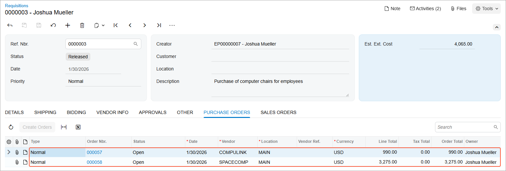

# Purchase Requests and Requisitions: To Process a Requisition Without Requests {#_99fc9bac-419d-4cd5-82d2-8ee8d9499fb7 .task}

The following activity demonstrates how to process a purchase requisition that is not based on purchase requests.

**Attention:** This activity is based on the *U100* dataset. If you are using another dataset or if any system settings have been changed in *U100*, these changes can affect the workflow of the activity and the results of the processing. To avoid issues, restore the *U100* dataset to its initial state.

## Story { .section}

Suppose that you are Joshua Mueller, an office manager in the SweetLife Fruits &amp; Jams company who orders office supplies and furniture. You need to order new computer chairs for your company's employees: 15 high-back computer chairs, and 20 high-back mesh computer chairs. You need to send the related requests for proposals to the Compulink and Co and Space Computers Ltd. vendors. When you have the vendor bids, you need to select the vendor or vendors the company will buy from. You also need to purchase the new computer chairs and process them through their issuing.

## Configuration Overview {#section_tz4_djx_cnb .section}

In the *U100* dataset, the following tasks have been performed to support this activity:

-   On the [Enable/Disable Features](CS_10_00_00.md) \(CS100000\) form, the following features have been enabled:
    -   *Inventory and Order Management*
    -   *Inventory*
    -   *Purchase Requisitions*
-   On the **Mailing &amp; Printing** tab of the [Purchase Requisitions Preferences](RQ_10_10_00.md) \(RQ101000\) form, the *RQPROPOSAL* predefined mailing has been listed and will be used for sending proposal requests to vendors by email.
-   On the [Stock Items](IN_20_25_00.md) \(IN202500\) form, the following stock items have been created: *COMPCHAIR* \(high-back computer chair\) and *COMPCHAIRM* \(high-back mesh computer chair\).
-   On the [Vendors](AP_30_30_00.md) \(AP303000\) form, the *COMPULINK* and *SPACECOMP* vendors have been created.
-   On the [Warehouses](IN_20_40_00.md) \(IN204000\) form, the *WHOLESALE* warehouse has been created.

## Process Overview { .section}

In this activity, you will do the following:

1.  On the [Requisitions](RQ_30_20_00.md) \(RQ302000\) form, create a purchase requisition and send it to the vendors that will participate in bidding.
2.  On the [Bidding Responses](RQ_30_30_00.md) \(RQ303000\) form, enter bids from vendors into the system.
3.  On the [Complete Bidding](RQ_50_30_00.md) \(RQ503000\) form, initiate automatic bidding among the vendors and review the bidding results.
4.  On the [Requisitions](RQ_30_20_00.md) form, initiate the creation of the purchase orders for the selected vendor.
5.  On the [Purchase Orders](PO_30_10_00.md) \(PO301000\) and the [Purchase Receipts](PO_30_20_00.md) \(PO302000\) form, prepare and process the purchase receipt for the ordered stock items.
6.  On the [Issues](IN_30_20_00.md) \(IN302000\) form, create the inventory issue to reflect the items being issued to the employees who requested the items.

## System Preparation { .section}

Before you start processing a purchase requisition without requests, do the following:

1.  Launch the Acumatica ERP website, and sign in to a company with the *U100* dataset preloaded. You should sign in as office manager Joshua Mueller with the *mueller* username and the *123* password.
2.  In the info area at the upper-right corner of the top pane of the Acumatica ERP screen, make sure that the business date is set to *1/30/2026*. If a different date is displayed, click the Business Date menu button and select *1/30/2026* from the calendar. For simplicity, you'll create and process all documents in this activity using this business date.
3.  On the Company and Branch Selection menu, in the top pane of the Acumatica ERP screen, make sure the *SweetLife Head Office and Wholesale Center* branch is selected.

## Step 1: Creating a Purchase Requisition { .section}

To create a requisition, do the following:

1.  On the [Requisitions](RQ_30_20_00.md) \(RQ302000\) form, add a new record.
2.  In the **Description** box of the Summary area, type `Purchase of computer chairs for employees`.
3.  On the **Details** tab, do the following:
    1.  On the table toolbar, click **Add Row**.
    2.  Specify the following settings for this row:
        1.  **Inventory ID**: *COMPCHAIR*
        2.  **Order Qty.**: `15`
        3.  **Est. Unit Cost**: `139`
    3.  On the table toolbar, click **Add Row**.
    4.  Specify the following settings for this row:
        1.  **Inventory ID**: *COMPCHAIRM*
        2.  **Order Qty.**: `20`
        3.  **Est. Unit Cost**: `99`
4.  On the form toolbar, click **Save**.
5.  On the **Bidding** tab, add the bidding vendors as follows:
    1.  On the table toolbar, click **Add Row**.
    2.  In the **Vendor** column, select *SPACECOMP*
    3.  On the table toolbar, click **Add Row**.
    4.  In the **Vendor** column, select *COMPULINK*
6.  On the form toolbar, click **Remove Hold**. The system saves the requisition and assigns the requisition the *Pending Bidding* status.
7.  On the table toolbar, click **Send Requests for Proposal**. The system creates a PDF file that contains a request for proposal for each vendor, generates an email to each vendor, attaches the files to the emails, and adds the emails to the outgoing mail. If a schedule has been configured in the system, the emails will be sent automatically the next time this schedule is executed.

    **Tip:** You could refresh the webpage and click **Activities** on the title bar of the [Requisitions](RQ_30_20_00.md) form. The system opens the **Tasks &amp; Activities** dialog box, from which you can open the emails to the vendors.

You have created a purchase requisition and sent the requests for proposal to the vendors.

## Step 2: Entering the Vendor Responses into the System { .section}

Suppose that you have received bids from both vendors. The *COMPULINK* vendor can provide the 15 computer chairs that you need, but at a higher price than that of the *SPACECOMP* vendor, and 10 mesh computer chairs \(you need 20\) at a lower price than that of *SPACECOMP*. The *SPACECOMP* vendor can provide the requested quantities of both kinds of chairs \(15 computer chairs and 20 mesh computer chairs\), but its price for mesh computer chairs is higher than that of *COMPULINK*.

To add the responses from the vendors to the system, do the following:

1.  Open the [Bidding Responses](RQ_30_30_00.md) \(RQ303000\) form.
2.  In the Summary area, do the following:
    1.  In the **Requisition** box, select the identifier of the only requisition with the *Pending Bidding* status.
    2.  In the **Vendor** box, select *COMPULINK*.
3.  On the **Bidding Details** tab, specify the listed settings in the following table rows:
    -   The row with *COMPCHAIR* in the **Inventory ID** column:
        -   **Min. Qty.**: `0.00`

            This is the minimum quantity of the item that the vendor can supply.

        -   **Bid Qty.**: `15.00`

            This is the total quantity of items that the vendor can supply, according to the bidding response.

        -   **Bid Unit Cost**: `149.00`

            This is the unit cost of the item from this vendor, according to the bidding response.

    -   The row with *COMPCHAIRM* in the **Inventory ID** column:
        -   **Min. Qty.**: `0.00`
        -   **Bid Qty.**: `10.00`
        -   **Bid Unit Cost**: `99.00`
4.  On the form toolbar, click **Save**.
5.  In the **Vendor** box of the Summary area, select *SPACECOMP*.
6.  On the **Bidding Details** tab, specify the listed settings in the following table rows:
    -   The row with *COMPCHAIR* in the **Inventory ID** column:
        -   **Min. Qty.**: `0.00`
        -   **Bid Qty.**: `15.00`
        -   **Bid Unit Cost**: `139.00`
    -   The row with *COMPCHAIRM* in the **Inventory ID** column:
        -   **Min. Qty.**: `0.00`
        -   **Bid Qty.**: `20.00`
        -   **Bid Unit Cost**: `119.00`
7.  On the form toolbar, click **Save**.

## Step 3: Selecting the Best Bids from Vendors { .section}

To perform automatic bidding and review the bidding results, do the following:

1.  On the [Complete Bidding](RQ_50_30_00.md) \(RQ503000\) form, in the **Ref. Nbr.** box, select the reference number of the only requisition with the *Pending Bidding* status.
2.  On the form toolbar, click **Update Result**. The system selects vendors automatically and updates the information on the **Bidding Results** tab.

    Notice that in the Selection area, the **Splittable** check box is selected, which means that the system can split the order between multiple vendors.

3.  On the form toolbar, click **Save**.
4.  On the **Bidding Results** tab, analyze the results of the automatic bidding as follows:
    1.  In the **Requisition Details** table, click the *COMPCHAIR* row.

        In the **Bidding Details** table, in the unlabeled column, the check box for the *SPACECOMP* vendor is selected. The *SPACECOMP* vendor offered the best price for the *COMPCHAIR* item and can provide the entire needed quantity of this item. Thus, you will order these chairs from this vendor.

    2.  In the **Requisition Details** table, click the *COMPCHAIRM* row.

        In the **Bidding Details** table, notice the following:

        -   In the unlabeled column, the check boxes are selected for both vendors.
        -   In the **Order Qty.** column, *10* is specified for both vendors.
        The *COMPULINK* vendor offered a lower price but can provide only 10 chairs. Thus, you will have to purchase the other 10 chairs from the *SPACECOMP* vendor.

5.  On the form toolbar, click **Complete Bidding**. The status of the requisition is changed to *Open*.

## Step 4: Creating the Purchase Orders { .section}

To create the purchase orders for the vendors, do the following:

1.  On the [Requisitions](RQ_30_20_00.md) \(RQ302000\) form, open the requisition with the *Open* status that you have earlier created in this activity.
2.  On the More menu, click **Create Orders**. The system creates purchase orders for the *COMPULINK* and *SPACECOMP* vendors and assigns the requisition the *Released* status.
3.  On the **Purchase Orders** tab, make sure that purchase orders with the *Open* status are listed for the *COMPULINK* and *SPACECOMP* vendors, as shown in the following screenshot.

**Attention:** If your system has a different set of purchase and sales documents than those in the initial *U100* dataset, you may see different values in the screenshots.

Suppose that you have emailed the purchase orders to the vendors.

## Step 5: Receiving the Items from the Vendors { .section}

Suppose that the vendors have delivered the ordered chairs to the *WHOLESALE* warehouse. To create the documents that reflect the receipt of the items in the warehouse, do the following:

1.  While you are still viewing the **Purchase Orders** tab of the [Requisitions](RQ_30_20_00.md) \(RQ302000\) form for the requisition, click the link in the **Order Nbr.** column in the row with the *COMPULINK* vendor. The system opens the purchase order on the [Purchase Orders](PO_30_10_00.md) \(PO301000\) form in a new browser window.
2.  On the form toolbar, click **Enter PO Receipt**. The system navigates to the [Purchase Receipts](PO_30_20_00.md) \(PO302000\) form with the new receipt. Notice that the receipt has the *Balanced* status and the data copied from the linked purchase order.
3.  On the form toolbar, click **Release**. The system releases the purchase receipt as well as creating the corresponding inventory receipt and releasing it. On the **Other** tab, you can view the reference number of the created inventory receipt. The reference number is also a link that you can click to view the inventory receipt on the [Receipts](IN_30_10_00.md) \(IN301000\) form.
4.  Close the browser window with the [Purchase Receipts](PO_30_20_00.md) form.
5.  On the **Purchase Orders** tab of the [Requisitions](RQ_30_20_00.md) form, in the row that has *SPACECOMP* in the **Vendor** column, click the link in the **Order Nbr.** column. The system opens a purchase order on the [Purchase Orders](PO_30_10_00.md) form in a new browser window.
6.  On the form toolbar, click **Enter PO Receipt**. The system opens the [Purchase Receipts](PO_30_20_00.md) form with the new receipt. The receipt has the *Balanced* status and the data copied from the linked purchase order.
7.  On the form toolbar, click **Release**. The system releases the purchase receipt; it also creates the inventory receipt and releases it. On the **Other** tab, you can view the reference number of the created inventory receipt. The reference number is also a link that you can click to view the inventory receipt on the [Receipts](IN_30_10_00.md) form.
8.  Close the browser window with the [Purchase Receipts](PO_30_20_00.md) form.
9.  On the [Inventory Allocation Details](IN_40_20_00.md) \(IN402000\) form, do the following in the Selection area:
    1.  In the **Inventory ID** box, select *COMPCHAIR*.
    2.  In the **Warehouse** box, select *WHOLESALE*.
    3.  Make sure that the quantity in the **Available for Issue** box is *15*.
    4.  In the **Inventory ID** box, select *COMPCHAIRM*.
    5.  Make sure that the quantity in the **Available for Issue** box is *20*.

You have received the computer chairs in the warehouse, and now you can issue the items to the employees that ordered them.

## Step 6: Issuing Inventory Items from the Warehouse { .section}

Suppose that you have provided the chairs that you ordered to the employees. To create and process the needed documents for issuing the items from the *WHOLESALE* warehouse, do the following:

1.  On the [Issues](IN_30_20_00.md) \(IN302000\) form, add a new record.
2.  In the **Description** box of the Summary area, type `Issue of computer chairs to employees`.
3.  On the **Details** tab, click **Add Items** on the table toolbar.
4.  In the Summary area of the **Inventory Lookup** dialog box, which opens, select *WHOLESALE* in the **Warehouse** box.
5.  Make sure that the **Show Available Items Only** check box is selected.
6.  To select the required items, do the following:
    1.  In the **Inventory** box, type `chair` to filter the list of stock items.
    2.  In the unlabeled column, select the check box in the row with the *COMPCHAIR* item.
    3.  Copy the value in the **Qty. Available** column of the same row to the **Qty. Selected** column.
    4.  In the unlabeled column, select the check box in the row with the *COMPCHAIRM* item.
    5.  Copy the value in the **Qty. Available** column of the same row to the **Qty. Selected** column.
    6.  Click **Add &amp; Close** to add the selected items to the issue and close the dialog box.
7.  On the form toolbar, click **Release**. The system changes the status of the issue to *Released*.
8.  Open the [Inventory Allocation Details](IN_40_20_00.md) \(IN402000\) form.
9.  In the Selection area, do the following:
    1.  In the **Inventory ID** box, select *COMPCHAIR*.
    2.  In the **Warehouse** box, select *WHOLESALE*.
    3.  Make sure that the value of the **Available for Issue** box is *0*.
    4.  In the **Inventory ID** box, select *COMPCHAIRM*.
    5.  Make sure that the value of the **Available for Issue** box is *0*.

You have issued the items from the *WHOLESALE* warehouse to the company's employees.

**Parent topic:**[Processing Purchase Requests and Requisitions](../UserGuide/OrderMgmt_Purchase_Requests_Mapref.md)

