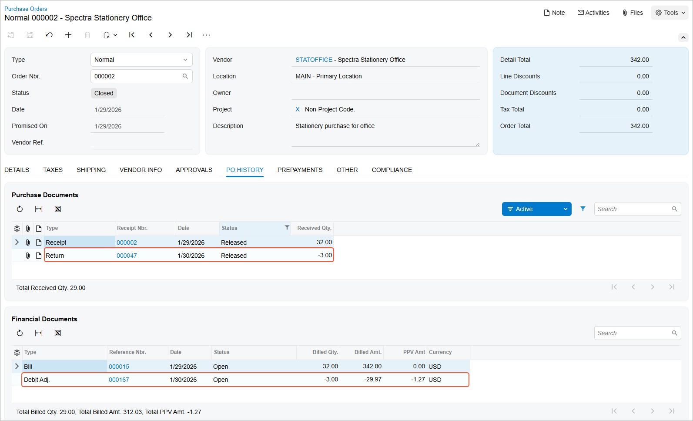

# Purchase Returns at the Calculated Cost: Process Activity {#_1af27d6c-9221-4804-9fcb-2bb25b847b53 .task}

In this activity, you will learn how to process a return of stock items from your company's inventory to the vendor, with the system calculating the items' cost.

**Attention:** This activity is based on the *U100* dataset. If you are using another dataset or if any system settings have been changed in *U100*, these changes can affect the workflow of the activity and the results of the processing. To avoid issues, restore the *U100* dataset to its initial state.

## Story { .section}

Suppose that on January 30, 2026 you, acting as purchasing manager at the SweetLife Fruits &amp; Jams company Regina Wiley, notice that three packs of paper that were purchased and delivered on January 29, 2026 have been damaged during shipping. You have decided to return these packs to the Spectra Stationery Office vendor without requesting a replacement. You need to create and process a purchase return of the damaged items at the cost calculated by the system.

## Configuration Overview {#section_rcz_kqm_dlb .section}

In the *U100* dataset, for the purposes of this activity, the following tasks have been performed:

-   On the [Enable/Disable Features](CS_10_00_00.md) \(CS100000\) form, the following features have been enabled:
    -   *Inventory and Order Management*, which provides the standard functionality of inventory and order management
    -   *Inventory*, which gives you the ability to maintain stock items by using forms related to the inventory functionality and to create and process sales and purchase documents that include stock items
-   On the [Vendors](AP_30_30_00.md) \(AP303000\) form, the *STATOFFICE* vendor has been created.
-   On the [Stock Items](IN_20_25_00.md) \(IN202500\) form, the *PAPER* stock item has been created.
-   On the [Purchase Orders](PO_30_10_00.md) \(PO301000\) form, the purchase order has been created with stationary items ordered from the *STATOFFICE* vendor and, on the [Purchase Receipts](PO_30_20_00.md) \(PO302000\) form, the related purchase receipt has been created and released.

## Process Overview { .section}

A purchase return document, which represents a vendor return in the system, is prepared based on the applicable purchase receipt. In this activity, to create a purchase return, you will open the purchase receipt on the [Purchase Receipts](PO_30_20_00.md) \(PO302000\) form, and on the **Details** tab, you will select \(by selecting the unlabeled check boxes\) the lines of all items to be returned. Then on the form toolbar, you will click **Return**; on the same form, the system will copy the relevant information to a new document of the *Return* type that includes the lines selected for return.

Before you process the prepared purchase return further, on the **Details** tab of the [Purchase Receipts](PO_30_20_00.md) form, you will correct the quantities to be returned. In the Summary area, you will specify that the items should be issued from inventory at the cost calculated by the system by selecting the *Cost by Issue Strategy* option in the **Cost of Inventory Return From** box. You will then release the purchase return and review the related documents to make sure that the return has been processed fully in the system.

## System Preparation { .section}

Before you start preparing a purchase return, you should do the following:

1.  Launch the Acumatica ERP website with the *U100* dataset preloaded, and sign in as purchasing manager Regina Wiley by using the *wiley* username and the *123* password.
2.  In the info area at the upper-right corner of the top pane of the Acumatica ERP screen, make sure that the business date is set to *1/30/2026*. If a different date is displayed, click the Business Date menu button and select *1/30/2026* from the calendar. For simplicity, you'll create and process all documents in this activity using this business date.
3.  On the Company and Branch Selection menu, in the top pane of the Acumatica ERP screen, make sure the *SweetLife Head Office and Wholesale Center* branch is selected.

## Step 1: Creating a Purchase Return from the Related Purchase Receipt { .section}

The easiest way to create a purchase return is to start from the purchase receipt in which you received the items to be returned. To create the purchase return from the purchase receipt, do the following:

1.  On the [Purchase Receipts](PO_30_20_00.md) \(PO302000\) form, open the purchase receipt to *STATOFFICE* dated *1/29/2026*.
2.  On the **Details** tab, select the unlabeled check box in the line of the purchase receipt with the *PAPER* item.
3.  On the form toolbar, click **Return** to create a document in which you will process the return of the item. The system opens the document on the same form. It has the *Return* type and includes the selected line. In this line, notice that the system has inserted the number of the initial purchase receipt into the **PO Receipt Nbr.** column on the **Details** tab.

## Step 2: Specifying the Settings of the Return { .section}

To define the specific settings of the return document, do the following:

1.  While you are still viewing the purchase return that you have created on the [Purchase Receipts](PO_30_20_00.md) \(PO302000\) form, in the Summary area, make sure that 1/30/2026 is specified as the **Date**.
2.  In the **Cost of Inventory Return From** box, select the *Cost by Issue Strategy* option. With this option selected, the items will be issued from inventory at the cost calculated by the system.
3.  Select the **Create Bill** check box to make the system generate a debit adjustment automatically on release of the purchase return.
4.  In the only return line on the **Details** tab, change the **Receipt Qty.** to `3` \(which is the quantity of items to be returned\).
5.  In the line, clear the **Open PO Line** check box to indicate that no replacement is needed for returned items.
6.  On the form toolbar, click **Save** to save the purchase return, which has the *Balanced* status and can thus be released.

## Step 3: Releasing the Purchase Return { .section}

To release the purchase return and to review how the return of items is processed in the system, do the following:

1.  While you are still viewing the purchase return on the [Purchase Receipts](PO_30_20_00.md) \(PO302000\) form, click **Release** on the form toolbar.
2.  On the **Billing** tab, review the information about the debit adjustment that was prepared, and make sure that it now has the *Open* status \(reflecting that it was released\).
3.  On the **Other** tab, click the **IN Ref. Nbr.** link, and review the inventory issue, which is opened on the [Issues](IN_30_20_00.md) \(IN302000\) form. Make sure the issue has the *Released* status. Close the [Issues](IN_30_20_00.md) form.
4.  On the **Orders** tab, click the link in the **Order Nbr.** column. The system opens the purchase order for which the return was processed on the [Purchase Orders](PO_30_10_00.md) \(PO301000\) form in a pop-up window.
5.  On the **PO History** tab, review the documents related to the purchase order, as shown in the following screenshot. The left table shows the purchase receipt and purchase return; the right table shows the bill and the debit adjustment. In the line with the debit adjustment, notice the nonzero purchase price variance amount in the **PPV Amount** column, which shows the difference between the amounts at which the items were purchased and at which the items were returned.

    

**Parent topic:**[Processing Purchase Returns at the Calculated Cost](../UserGuide/OrderMgmt_Purchase_Return_Calc_Cost_Mapref.md)

