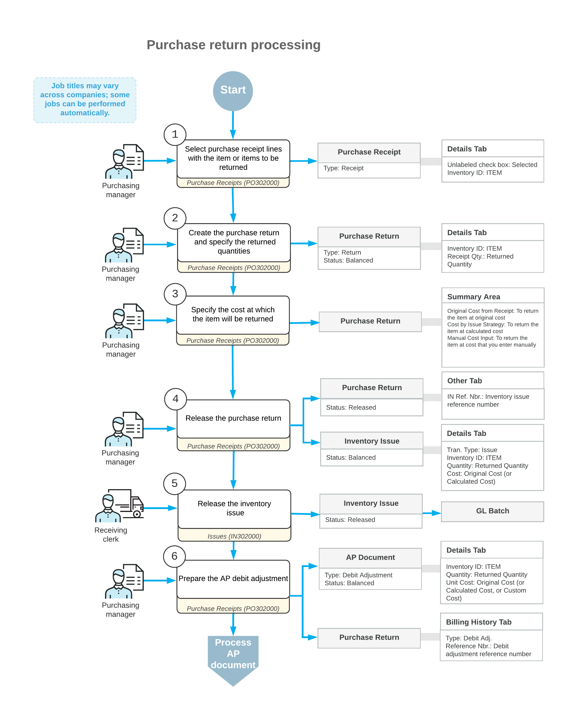

# Purchase Returns at the Original Cost: General Information {#_ae9b5bf9-4e84-4d5e-87c1-63a59a7c603c .concept}

In Acumatica ERP, you can create and process purchase returns if any purchased items need to be returned to the vendor for some reason.

## Learning Objectives { .section}

In this chapter, you will do the following:

-   Create a purchase return document
-   Specify the items to be returned and define at which cost the items will be issued from inventory
-   Process the purchase return and the related inventory and accounts payable documents

## Applicable Scenarios { .section}

In most cases, the purchasing process is completed when your company receives the goods and the corresponding accounts payable bill is released to adjust your outstanding balance with the vendor. In some cases, however, items are delivered in an unsatisfactory condition or shipped by mistake and should be returned to the vendor for replacement or reimbursement. A purchase return can also occur when services were not rendered or were provided partially, and your company should be reimbursed.

A purchase return process includes the creation of a purchase return document, the specification of the returned items and their quantities, the issuing of the returned item from inventory, and the adjustment to the outstanding vendor balance in the system in the returned amount.

## Creation of a Purchase Return {#section_qst_jx3_ctb .section}

A purchase return is a purchase receipt of the *Return* type created on the [Purchase Receipts](../Shared/../UserGuide/PO_30_20_00.md) \(PO302000\) form that includes a line for each stock or non-stock item being returned. You can create a purchase return from scratch on this form or by first opening the corresponding purchase receipt on this form.

To create a purchase return manually on the [Purchase Receipts](../Shared/../UserGuide/PO_30_20_00.md) form, you specify the needed settings in the Summary area of the form. Then on the **Details** tab, you add any number of purchase receipts or purchase receipt lines to it by clicking **Add PR** or **Add PR Line**, respectively, on the table toolbar.

To create a purchase return by using the purchase receipt as a starting point, you open the purchase receipt on the [Purchase Receipts](../Shared/../UserGuide/PO_30_20_00.md) form, select the unlabeled check boxes on the **Details** tab in the lines of the purchase receipt with the items to be returned, and click **Return** on the form toolbar. The system copies the relevant information, including the lines you selected, from the purchase receipt to a new purchase return on the same form.

Regardless of how you have created the purchase return, in each copied line on the **Details** tab, you specify the quantity of items to be returned in the **Receipt Qty.** column and a reason code of the *Vendor Return* usage type in the **Reason Code** column. By default, the system inserts the reason code that is specified in the **PO Return Reason Code** box on the [Purchase Orders Preferences](../Shared/../UserGuide/PO_10_10_00.md) \(PO101000\) form.

For each item on the **Details** tab of the [Purchase Receipts](../Shared/../UserGuide/PO_30_20_00.md) form, you must specify the warehouse \(and warehouse location, if applicable\) from which the items will be issued to be sent back to the vendor. For stock items with lot or serial numbers, you have to click **Line Details** on the table toolbar of the **Details** tab. In the **Line Details** dialog box that opens, you specify the particular lot or serial numbers for the units being returned.

On the **Details** tab of the [Purchase Receipts](../Shared/../UserGuide/PO_30_20_00.md) form, lines of the purchase return are linked to lines of a purchase order if the **PO Order Type** and **PO Order Nbr.** columns are filled in. These settings are copied from the associated purchase receipt. For purchase receipt lines that are linked to a purchase order, you can select the **Open PO Line** check box on the **Details** tab to specify that the system should change the status of the related purchase order to *Open* when the purchase return is released. You do this if you expect to receive replacement items for the order from the vendor and thus want to open the purchase order again. If the **Open PO Line** check box is cleared, the related purchase order remains closed.

After you have specified the settings of the returned items on the **Details** tab of the [Purchase Receipts](../Shared/../UserGuide/PO_30_20_00.md) form, you define the cost at which the items will be issued from inventory by selecting one of the following options in the **Cost of Inventory Return From** box of the Summary area:

-   *Original Cost from Receipt*: The items are issued from inventory at exactly the cost at which the items were purchased.
-   *Cost by Issue Strategy*: The items are issued at the cost calculated by the system according to the items' valuation methods.
-   *Manual Cost Input*: You can enter the cost manually.

## Processing of a Purchase Return {#section_rst_jx3_ctb .section}

After you have created a purchase return on the **Details** tab of the [Purchase Receipts](../Shared/../UserGuide/PO_30_20_00.md) \(PO302000\) form, you need to process the issuing of items from inventory and adjust the vendor's balance in the system for the amount of the returned items.

On release of the purchase return, the corresponding inventory issue is generated automatically and can be viewed on the [Issues](../Shared/../UserGuide/IN_30_20_00.md) \(IN302000\) form. On release of this issue, the quantities of each of the returned items are deducted from the item quantities available at the warehouse specified in the **Warehouse** column of the **Details** tab of the [Purchase Receipts](../Shared/../UserGuide/PO_30_20_00.md) form.

Also, on release of the purchase return, an accounts payable debit adjustment is generated automatically if the **Create Bill** check box is selected in the Summary area of the purchase return on the [Purchase Receipts](../Shared/../UserGuide/PO_30_20_00.md) form. You can view the generated debit adjustment on the [Bills and Adjustments](../Shared/../UserGuide/AP_30_10_00.md) \(AP301000\) form.

If the purchase receipt for which the return was created is linked to a line of a purchase order, then on the **Details** tab of the [Purchase Orders](../Shared/../UserGuide/PO_30_10_00.md) \(PO301000\) form for the purchase order, the applicable values in the **Qty. On Receipts** column are decreased by the quantity of the listed item that is returned.

The further processing of a purchase return depends on the agreement between your company and the vendor. You can complete the processing of the return by processing a vendor refund or by receiving replacement items for the original purchase order.

## Workflow of a Purchase Return { .section}

For purchase return documents, the typical processing involves the actions and generated documents shown in the following diagram.

**Parent topic:**[Processing Purchase Returns at the Original Cost](../UserGuide/OrderMgmt_Purchase_Return_Original_Cost_Mapref.md)

