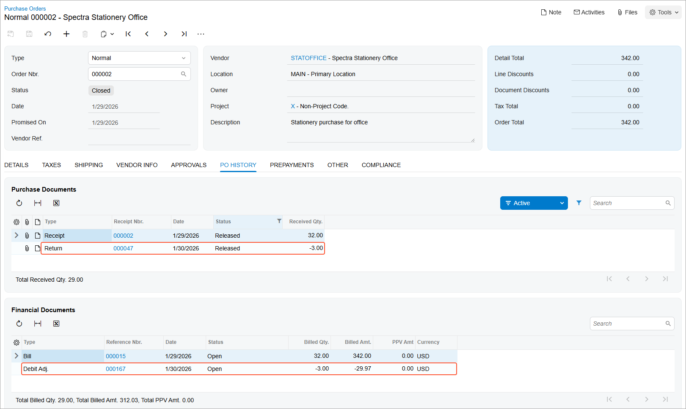

# Purchase Returns at the Original Cost: Process Activity {#_f36799e0-830d-4584-b516-581d06e16985 .task}

The following activity demonstrates how to process the return of stock items from your company's inventory to the vendor at the items' original cost.

**Attention:** This activity is based on the *U100* dataset. If you are using another dataset or if any system settings have been changed in *U100*, these changes can affect the workflow of the activity and the results of the processing. To avoid issues, restore the *U100* dataset to its initial state.

## Story { .section}

Suppose that you are Regina Wiley, a purchasing manager in the SweetLife Fruits &amp; Jams company. On January 30, 2026, you have noticed that three packs of paper that were purchased and delivered on January 29, 2026 have been damaged during shipping. You have decided to return these packs to the Spectra Stationery Office vendor without requesting a replacement. You, acting as the purchasing manager, need to create and process a purchase return of the damaged items at the items' original cost.

## Configuration Overview { .section}

In the *U100* dataset, for the purposes of this activity, the following tasks have been performed:

-   On the [Enable/Disable Features](CS_10_00_00.md) \(CS100000\) form, the following features have been enabled:
    -   *Inventory and Order Management*, which provides the standard functionality of inventory and order management
    -   *Inventory*, which gives you the ability to maintain stock items by using forms related to the inventory functionality and to create and process sales and purchase documents that include stock items
-   On the [Vendors](AP_30_30_00.md) \(AP303000\) form, the *STATOFFICE \(Spectra Stationery Office\)* vendor has been defined.
-   On the [Stock Items](IN_20_25_00.md) \(IN202500\) form, the *PAPER*, *PEN*, and *PENCIL* stock items have been created.
-   On the [Purchase Orders Preferences](PO_10_10_00.md) \(PO101000\) form, the **Process Return with Original Cost** check box has been selected. The state of this check box is copied to each purchase return that is created as the default state; when the check box is selected, the system processes the return of items at the cost specified in the original receipt.
-   On the [Purchase Receipts](PO_30_20_00.md) \(PO302000\) form, a purchase receipt for the *STATOFFICE* vendor has been created.

## Process Overview { .section}

A purchase return document, which represents a vendor return in the system, is prepared based on the applicable purchase receipt. In this activity, to create a purchase return, you will open the purchase receipt on the [Purchase Receipts](PO_30_20_00.md) \(PO302000\) form, and on the **Details** tab, you will select the lines of all items that need to be returned. Then on the form toolbar, you will click **Return**; on the same form, the system will copy the relevant information to a new document of the *Return* type that includes the lines selected for return.

Before you process the prepared purchase return further, on the **Details** tab of the [Purchase Receipts](PO_30_20_00.md) form, you can correct the quantities to be returned \(if you need to return only part of the purchased items\) and the reason code for the line \(if it is different than the default reason code inserted by the system\). In the Summary area, you will specify that the items should be issued from inventory at the cost at which they were purchased by selecting the *Original Cost from Receipt* option in the **Cost of Inventory Return From** box. You will then release the purchase return and review the related documents to make sure the return has been processed fully in the system.

## System Preparation { .section}

Before you start processing a purchase return document, you should do the following:

1.  Launch the Acumatica ERP website with the *U100* dataset preloaded, and sign in to the system as purchasing manager Regina Wiley by using the *wiley* username and the *123* password.
2.  In the info area at the upper-right corner of the top pane of the Acumatica ERP screen, make sure that the business date is set to *1/30/2026*. If a different date is displayed, click the Business Date menu button and select *1/30/2026* from the calendar. For simplicity, you'll create and process all documents in this activity using this business date.
3.  On the Company and Branch Selection menu, in the top pane of the Acumatica ERP screen, make sure the *SweetLife Head Office and Wholesale Center* branch is selected.

## Step 1: Creating a Purchase Return from the Related Purchase Receipt { .section}

To create a purchase return from the purchase receipt, do the following:

1.  On the [Purchase Receipts](PO_30_20_00.md) \(PO302000\) form, open the purchase receipt from the *STATOFFICE* vendor and dated *1/29/2026*.
2.  On the **Details** tab, select the unlabeled check box in the line of the purchase receipt with the *PAPER* item.
3.  On the form toolbar, click **Return** to create a document in which you will process the return of the item. The system opens the document on the same form. It has the *Return* type and includes the selected line. In this line, notice that the system has inserted the number of the initial purchase receipt into the **PO Receipt Nbr.** column on the **Details** tab.
4.  On the form toolbar, click **Save**.

## Step 2: Specifying the Settings of the Purchase Return { .section}

To specify settings of the purchase return, do the following:

1.  While you are still viewing the purchase return on the [Purchase Receipts](PO_30_20_00.md) \(PO302000\) form, in the Summary area, make sure that *1/30/2026* is specified as the **Date**.
2.  In the **Cost of Inventory Return From** box, make sure that the *Original Cost from Receipt* option is selected. With this option selected, the items will be issued from inventory at exactly the same cost at which they were purchased.
3.  Select the **Create Bill** check box so that the system generates a debit adjustment automatically on release of the purchase return.
4.  In the only return line on the **Details** tab, change the **Receipt Qty.** to `3` \(which is the quantity of items to be returned\).
5.  In the line, clear the **Open PO Line** check box to indicate that no replacement is needed for the returned items.
6.  On the form toolbar, click **Save**.

The purchase return has the *Balanced* status and can thus be released.

## Step 3: Releasing the Purchase Return { .section}

To release the purchase return and to review how the return of items is processed in the system, do the following:

1.  While you are still viewing the purchase return on the [Purchase Receipts](PO_30_20_00.md) \(PO302000\) form, click **Release** on the form toolbar. Wait for the system to complete the operation.
2.  On the **Billing** tab, review the information about the debit adjustment that was prepared, and make sure that it now has a status of *Open* \(indicating that it was released\).
3.  On the **Other** tab, click the **IN Ref. Nbr.** link, and review the inventory issue, which opens on the [Issues](IN_30_20_00.md) \(IN302000\) form in a pop-up window. Make sure that the issue has the *Released* status.
4.  Close the [Issues](IN_30_20_00.md) form.
5.  On the [Purchase Orders](PO_30_10_00.md) \(PO301000\) form, open the purchase order to *STATOFFICE* for which the return was processed.
6.  On the **Details** tab, in the **Qty. on Receipts** column, notice that the received quantity in the *PAPER* line has been decreased by the returned quantity and is now *17*.
7.  On the **PO History** tab, review the documents related to the purchase order, as shown in the following screenshot. The left table shows the purchase receipt and purchase return; the right table shows the bill and the debit adjustment. In the line with the debit adjustment, notice the zero purchase price variance amount in the **PPV Amt.** column, which means that the items were returned at the cost at which they were purchased.

    

You have processed the return to the vendor without requesting a replacement.

## Activity Recap { .section}

In this activity, we have illustrated how the purchasing manager has done the following:

1.  Created a purchase return from the purchase receipt that was created on receipt of the items to be returned
2.  Specified the settings of the purchase return
3.  Released the purchase return and reviewed the changes in the original purchase order

**Parent topic:**[Processing Purchase Returns at the Original Cost](../UserGuide/OrderMgmt_Purchase_Return_Original_Cost_Mapref.md)

