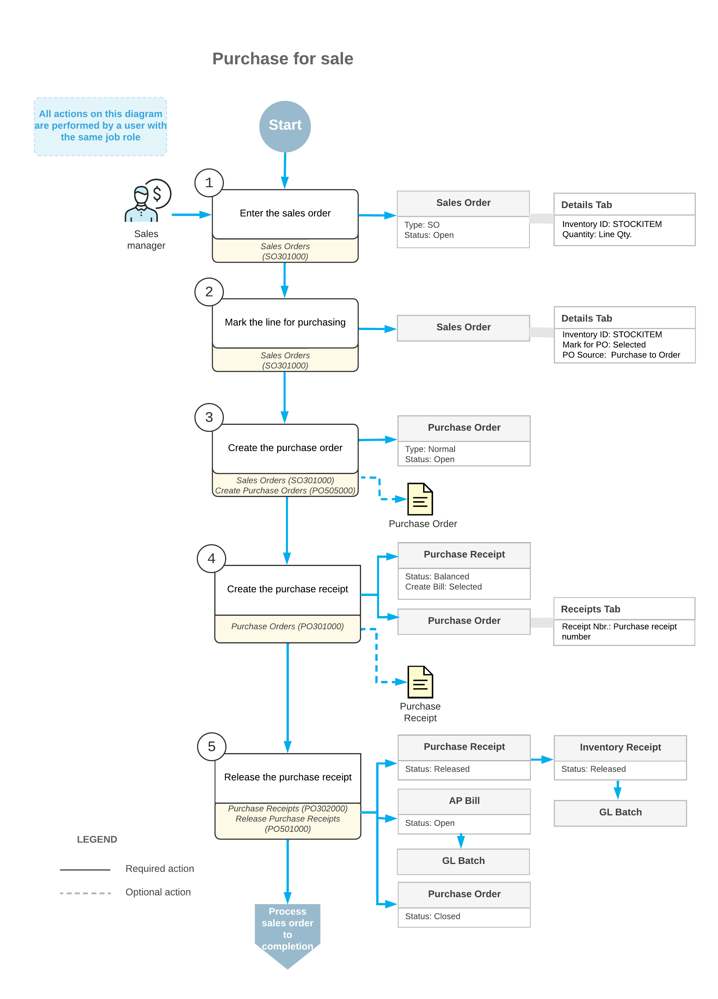

# Purchases for Sale: General Information {#_c4b88fef-626e-4ba5-b975-811ab31230ac .concept}

If your company sells certain items that are purchased only when sales orders for these items exist, a sales order may result in multiple purchase orders for different vendors, and a purchase order may include items from multiple sales orders. These factors could make it difficult to track the fulfillment of sales orders. In Acumatica ERP, you can link sales orders to existing purchase orders and receipts, so that the system will allocate the items listed on purchase receipts to specific sales orders.

## Learning Objectives { .section}

In this chapter, you will do the following:

-   Become familiar with the processing of purchases for sale in Acumatica ERP
-   Create a sales order, and mark the items to be purchased for the sale
-   Create a purchase order linked to a sales order
-   Mass-create purchase orders
-   Process the sales order and related purchase documents, inventory documents, and accounts payable documents
-   Find information about documents related to a purchase for sale

## Applicable Scenarios { .section}

You may need to process purchases for sale in the following cases:

-   You need to process a sales order that includes items that your company does not have in stock; such items are purchased only for specific sales orders.
-   You have multiple warehouses and perform purchasing only to particular larger warehouses \(distribution centers\). During the processing of a purchase for sale, the system will generate the required transfers between warehouses, so you can easily track where the particular sales order is in the fulfillment process.
-   You need to promptly fulfill a sales order line for which the quantity of the item is insufficient. After you have shipped the available quantity of the item \(if any units are available\), you need to order the quantity that was unavailable at the time of shipping.

## Creation of Sales Orders with Items Requested for Purchase { .section}

If the quantity of an item added to a sales order is fully or partially out of stock, you can purchase the remaining quantity. You specify that the remaining quantity should be purchased for the order by selecting the **Mark for PO** check box for the line on the **Details** tab of the [Sales Orders](SO_30_10_00.md) \(SO301000\) form. The quantity initially allocated for the sales order remains allocated, while the quantity that must be purchased remains unallocated.

If you click **Remove Hold** on the form toolbar, the system creates a purchase request for this sales order on the [Create Purchase Orders](PO_50_50_00.md) \(PO505000\) form. By default, for each line, the system specifies the vendor, which is set as default for a stock item specified in this line. You can change the vendor, if needed. From the purchase requests, you generate purchase orders that will be linked to the original sales order. Once you prepare and release the purchase receipt for the purchase order, the items become available for shipping, so you can complete the processing of the sales order.

## Workflow of a Purchase for Sale { .section}

For a sales order that includes stock items intended for purchasing, the typical processing involves the actions and generated documents shown in the following diagram.

**Parent topic:**[Processing Purchases for Sale](../UserGuide/OrderMgmt_Purchase_for_Sale_Mapref.md)

