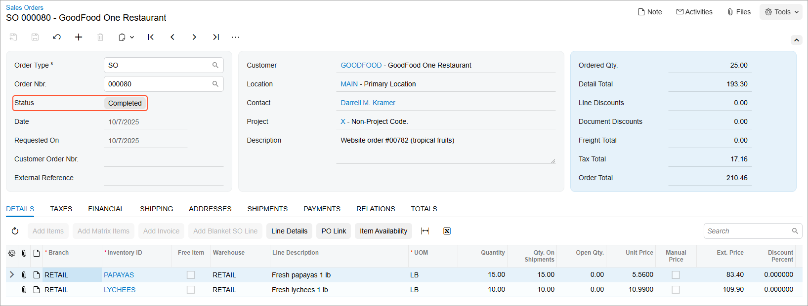

# Purchases for Sale: Process Activity {#_fc5ba486-ca86-407b-bab6-095eee72878d .task}

In this activity, you will learn how to process a purchase of items that are not in stock for a particular sales order, and how to process the sales order to completion after receipt of the items that were purchased for sale.

**Attention:** This activity is based on the *U100* dataset. If you are using another dataset or if any system settings have been changed in *U100*, these changes can affect the workflow of the activity and the results of the processing. To avoid issues, restore the *U100* dataset to its initial state.

## Story { .section}

Suppose that the GoodFood One Restaurant customer has ordered tropical fruits \(15 pounds of papayas and 10 pounds of lychees\) on SweetLife's website. SweetLife's warehouses do not have the appropriate conditions for keeping delicate tropical fruits; also, these fruits are ordered rarely and in small quantities. To provide fresh and high-quality fruits to the customers, the sales manager purchases these tropical fruits on demand from the All Fruits Mall company, and once the fruits are delivered to the retail warehouse of the SweetLife store, they are immediately shipped to the customer that ordered them.

Acting as sales manager Regina Wiley, you need to process the sales order and the related purchase order in the system.

## Configuration Overview { .section}

In the *U100* dataset, for the purposes of this activity, the following tasks have been performed:

-   On the [Enable/Disable Features](CS_10_00_00.md) \(CS100000\) form, the following features have been enabled:
    -   *Inventory and Order Management*, which provides the standard functionality of inventory and order management
    -   *Inventory*, which gives you the ability to maintain stock items by using forms related to the inventory functionality and to create and process sales and purchase documents that include stock items
    -   *Sales Order to Purchase Order Link*, which provides the ability to link sales orders to existing purchase orders and receipts, and to create new purchase orders for existing sales orders
-   On the [Customers](AR_30_30_00.md) \(AR303000\) form, the *GOODFOOD \(GoodFood One Restaurant\)* customer has been created.
-   On the [Vendors](AP_30_30_00.md) \(AP303000\) form, the *ALLFRUITS \(All Fruits Mall\)* vendor has been created.
-   On the [Stock Items](IN_20_25_00.md) \(IN202500\) form, the *PAPAYAS \(Fresh papayas 1 lb\)* and *LYCHEES \(Fresh lychees 1 lb\)* stock items have been created. For each item, the *ALLFRUITS* vendor has been added on the **Vendors** tab.

## Process Overview { .section}

In this activity, to process a sales order that includes stock items that must be purchased for sale, you will first create a sales order on the [Sales Orders](SO_30_10_00.md) \(SO301000\) form and add all of the stock items that were ordered by the customer. Because the items are not in stock, you will mark them for purchasing in the sales order; to ship these lines, you have to receive the purchased items at the warehouse specified in the sales order lines.

When you mark items for purchasing, the system creates purchase requests of the *SO to Purchase* type. You will create purchase orders by mass-processing purchase requests of this type on the [Create Purchase Orders](PO_50_50_00.md) \(PO505000\) form. Each purchase order generated from a purchase request or from multiple requests will be linked to the related sales order. When you receive the items of each linked purchase order to inventory, the items will be allocated directly to the related sales orders.

After all purchased items have been received to inventory, you will process the sales order to completion. That is, you will ship the items to the customer and prepare the invoice for the customer.

## System Preparation { .section}

Before you start processing a sales order that includes stock items that must be purchased for sale, you should do the following:

1.  Launch the Acumatica ERP website with the *U100* dataset preloaded, and sign in as purchasing manager Regina Wiley by using the *wiley* username and the *123* password.
2.  In the info area, in the upper-right corner of the top pane of the Acumatica ERP screen, make sure that the business date in your system is set to today’s date. For simplicity, in this activity, you will create and process all documents in the system on this business date.
3.  On the Company and Branch Selection menu in the top pane of the Acumatica ERP screen, select the *SweetLife Store* branch.

## Step 1: Creating a Sales Order { .section}

To create the sales order for GoodFood One Restaurant, do the following:

1.  On the [Sales Orders](SO_30_10_00.md) \(SO301000\) form, create an order with the following settings:
    -   **Order Type**: *SO*
    -   **Customer**: *GOODFOOD*
    -   **Description**: `Website order #00782 (tropical fruits)`
2.  On the **Details** tab, add rows with the settings shown in the following table.

    |Branch|Inventory ID|Warehouse|Quantity|Unit Price|
    |------|------------|---------|--------|----------|
    |*RETAIL*|*PAPAYAS*|*RETAIL*|`15`|`5.56`|
    |*RETAIL*|*LYCHEES*|*RETAIL*|`10`|`10.99`|

    Notice that the system displays warnings on the **Details** tab and in the **Quantity** column of both lines indicating that the specified quantity is not available in the selected warehouse.

3.  On the form toolbar, click **Save**. The sales order is saved with the *Open* status.

## Step 2: Marking the Stock Items to Be Purchased for Sale { .section}

To mark the stock items for purchase in the sales order, do the following:

1.  While you are still viewing the order on the [Sales Orders](SO_30_10_00.md) \(SO301000\) form, in the *PAPAYAS* line of the **Details** tab, select the **Mark for PO** check box, and make sure that *Purchase to Order* is selected in the **PO Source** column.
2.  In the *LYCHEES* line, select the **Mark for PO** check box, and make sure that *Purchase to Order* is selected in the **PO Source** column.
3.  On the form toolbar, click **Save**.

## Step 3: Creating a Purchase Order That Is Linked to the Sales Order { .section}

To create a purchase order for the stock items that are marked for purchase, do the following:

1.  While you are still viewing the sales order on the [Sales Orders](SO_30_10_00.md) \(SO301000\) form, on the More menu, click **Create Purchase Order**.
2.  On the [Create Purchase Orders](PO_50_50_00.md) \(PO505000\) form, which opens, select the unlabeled check boxes in the two lines with *SO to Purchase* specified as the **Plan Type**. \(The *SO to Purchase* plan type indicates that this line is a purchase request.\)
3.  In both of these lines, make sure that the stock items have the following settings:
    1.  **Vendor**: *ALLFRUITS*
    2.  **Warehouse**: *RETAIL*
4.  On the form toolbar, click **Process** to process the purchase requests that you have selected.

    The system creates a purchase order for the *ALLFRUITS* vendor, and opens it on the [Purchase Orders](PO_30_10_00.md) \(PO301000\) form.

5.  In the **Description** box of the Summary area, type `Purchase for website order #00782`.
6.  On the **Details** tab, click the *PAPAYAS* line, and on the table toolbar, click **View Demand**. The **Demand** dialog box, which opens, shows the sales order to which this purchase order line is linked.
7.  Click **Close** to close the dialog box.
8.  On the **Details** tab, do the following:
    -   In the **Unit Cost** column of the *PAPAYAS* line, specify `5`.
    -   In the **Unit Cost** column of the *LYCHEES* line, specify `9`.
9.  On the form toolbar, click **Remove Hold**.

## Step 4: Processing the Purchase Order { .section}

To process the purchase order to completion, do the following:

1.  While you are still viewing the purchase order on the [Purchase Orders](PO_30_10_00.md) \(PO301000\) form, click **Enter PO Receipt** on the form toolbar.
2.  On the [Purchase Receipts](PO_30_20_00.md) \(PO302000\) form, which opens, review the details of the prepared purchase receipt, and make sure that both purchase order lines have been added with the appropriate quantities.
3.  In the Summary area, select the **Create Bill** check box to make the system generate the bill automatically on release of the purchase receipt.
4.  On the form toolbar, click **Release** to release the purchase receipt.

    The system releases the purchase receipt, which is assigned the *Released* status.

5.  On the **Billing** tab, review the only line in the table, which shows the generated bill, and make sure that the bill has the *Open* status, reflecting that it has been released.
6.  On the **Other** tab, click the **IN Ref. Nbr.** link.
7.  On the [Receipts](IN_30_10_00.md) \(IN301000\) form, which opens in a pop-up window, review the generated inventory receipt. Make sure that the inventory receipt has the *Released* status.
8.  Close the [Receipts](IN_30_10_00.md) form.

Now the items are in stock in the *RETAIL* warehouse and can be shipped to the GoodFood One Restaurant customer.

## Step 5: Processing the Sales Order to Completion { .section}

To process to completion the sales order that you have created in this activity, do the following:

1.  On the [Inventory Allocation Details](IN_40_20_00.md) \(IN402000\) form, select *PAPAYAS* as the **Inventory ID** and *RETAIL* as the **Warehouse**.
2.  On the **Item Plans** tab, review the only line in the table, which has *15* in the **Qty.** column. This indicates that 15 *PAPAYAS* units are allocated directly for the sales order for which you have processed the purchase.
3.  Select *LYCHEES* as the **Inventory ID**. In the only table line, make sure that *10* is specified in the **Qty.** column. This indicates that 10 *LYCHEES* units are also allocated for the sales order for which you purchased them.
4.  In the table, double-click the line to open the sales order on the [Sales Orders](SO_30_10_00.md) \(SO301000\) form.
5.  On the **Details** tab, click the *PAPAYAS* line, and on the table toolbar, click **PO Link**.
6.  In the **Purchasing Settings** dialog box, which opens, review the purchase order to which this sales order line is linked.
7.  Close the dialog box.
8.  On the **Details** tab, click the *LYCHEES* line, and on the table toolbar, click **Line Details**.
9.  In the **Line Details** dialog box, which opens, review the allocation line, which shows that the ordered items are allocated in the *RETAIL* warehouse.
10. Click **OK** to close the dialog box.
11. On the form toolbar of the [Sales Orders](SO_30_10_00.md) form, click **Create Shipment**.
12. In the **Specify Shipment Parameters** dialog box, which opens, make sure that today's date is specified in the **Shipment Date** box and the *RETAIL* warehouse is specified in the **Warehouse ID** box, and click **OK**. The dialog box is closed. The system creates a shipment and opens it on the [Shipments](SO_30_20_00.md) \(SO302000\) form.
13. On this form, review the details of the shipment, and make sure that both lines have been added with the appropriate quantities.
14. On the form toolbar, click **Confirm Shipment** to confirm the shipment, and then click **Prepare Invoice** to prepare the invoice for the customer.
15. On the [Invoices](SO_30_30_00.md) \(SO303000\) form, which opens, review the details of the prepared invoice.
16. On the form toolbar, click **Release** to release the invoice.
17. Return to the [Sales Orders](SO_30_10_00.md) form with the *Website order \#00782 \(tropical fruits\)* sales order for the *GOODFOOD* customer open, and notice that it has the *Completed* status, as shown in the following screenshot.

    

**Parent topic:**[Processing Purchases for Sale](../UserGuide/OrderMgmt_Purchase_for_Sale_Mapref.md)

