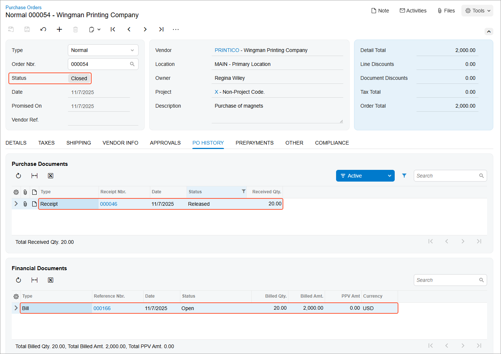

# Purchases of Non-Stock Items and Services with Receipts: To Process a Purchase of Non-Stock Items {#_b6a47b01-2dc1-47c3-8bd6-66e8dfb30795 .task}

In this activity, you will prepare and process a purchase order for non-stock items that must be included in a purchase receipt. This activity involves non-stock items that are not services.

**Attention:** This activity is based on the *U100* dataset. If you are using another dataset or if any system settings have been changed in *U100*, these changes can affect the workflow of the activity and the results of the processing. To avoid issues, restore the *U100* dataset to its initial state.

## Story { .section}

Suppose that the SweetLife Store gives a free magnet with a SweetLife Fruits &amp; Jams advertisement to every customer who buys goods in the retail shop. Further suppose that today one of the managers has reported that the supply of magnets is extremely low.

As a purchasing manager, you need to enter and process a purchase order for the Wingman Printing Company, from which SweetLife buys these magnets. You also need to process the corresponding purchase receipt and AP bill.

## Configuration Overview { .section}

In the *U100* dataset, the following tasks have been performed to support this activity:

-   On the [Enable/Disable Features](CS_10_00_00.md) \(CS100000\) form, the *Inventory* feature has been enabled.
-   On the [Vendors](AP_30_30_00.md) \(AP303000\) form, the *PRINTICO \(Wingman Printing Company\)* vendor has been defined.
-   On the [Non-Stock Items](IN_20_20_00.md) \(IN202000\) form, the *MAGNETS \(A box of magnets with company advertisement, 50pcs\)* non-stock item has been defined, and the **Require Receipt** check box has been selected for this item on the **General** tab. This indicates that when this item is purchased, it needs to be included in a purchase receipt.

## Process Overview { .section}

In this activity, you will create a purchase order on the [Purchase Orders](PO_30_10_00.md) \(PO301000\) form and add the *MAGNETS* non-stock item to it. When the magnets have been received, on the [Purchase Receipts](PO_30_20_00.md) \(PO302000\) form, you will then create a purchase receipt for them. On release of the purchase receipt, the system automatically generates an inventory receipt, which creates a GL batch. Then on the [Bills and Adjustments](AP_30_10_00.md) \(AP301000\) form, you will create an AP bill to pay the vendor.

## System Preparation { .section}

Before you start processing the purchase order, you should do the following:

1.  Launch the Acumatica ERP website with the *U100* dataset preloaded and sign in to the system as a sales and purchasing manager by using the *wiley* username and *123* password.
2.  In the info area, in the upper-right corner of the top pane of the Acumatica ERP screen, make sure that the business date in your system is set to today’s date. For simplicity, in this activity, you will create and process all documents in the system on this business date.
3.  On the Company and Branch Selection menu in the top pane of the Acumatica ERP screen, select the *SweetLife Store* branch.

## Step 1: Creating a Purchase Order { .section}

To create a purchase order for the magnets, do the following:

1.  On the [Purchase Orders](PO_30_10_00.md) \(PO301000\) form, add a new record.
2.  In the Summary area, specify the following settings:
    -   **Type**: *Normal*
    -   **Vendor**: *PRINTICO*
    -   **Description**: `Purchase of magnets`
3.  On the table toolbar of the **Details** tab, click **Add Row**.
4.  Specify the following settings in the added row:
    -   **Branch**: *RETAIL*
    -   **Inventory ID**: *MAGNETS*
    -   **Warehouse**: *RETAIL*
    -   **Order Qty.**: *20*
    -   **Unit Cost**: *100*
5.  On the form toolbar, click **Remove Hold**. Notice that the purchase order is assigned the *Open* status.

## Step 2: Processing the Purchase Receipt { .section}

To create the purchase receipt for the purchase order, do the following:

1.  While you are still viewing the purchase order on the [Purchase Orders](PO_30_10_00.md) \(PO301000\) form, on the form toolbar, click **Enter PO Receipt**. The system prepares the purchase receipt for the selected purchase order and opens it on the [Purchase Receipts](PO_30_20_00.md) \(PO302000\) form.
2.  On the form toolbar, click **Save**.
3.  Review the details of the prepared purchase receipt. Make sure that the **Create Bill** check box is cleared in the Summary area. \(In the next step, you will prepare the bill manually.\)
4.  On the form toolbar, click **Release**.
5.  On the **Other** tab, click the **IN Ref. Nbr.** link, and review the details of the generated inventory receipt, which the system opens on the [Receipts](IN_30_10_00.md) \(IN301000\) form. Make sure that the inventory receipt has the *Released* status.
6.  Close the [Receipts](IN_30_10_00.md) form.

## Step 3: Processing the AP Bill {#section_kzy_nsr_hlb .section}

To process the AP bill associated with the purchase order and purchase receipt, do the following:

1.  While you are still viewing the purchase receipt on the [Purchase Receipts](PO_30_20_00.md) \(PO302000\) form, on the form toolbar, click **Enter AP Bill**. The system generates an AP bill for the vendor of the goods and opens the created document on the [Bills and Adjustments](AP_30_10_00.md) \(AP301000\) form.
2.  On the form toolbar, click **Remove Hold**, and then click **Release** to release the bill.
3.  In the only row on the **Details** tab, click the link in the **PO Number** column to view the associated purchase order.
4.  On the [Purchase Orders](PO_30_10_00.md) \(PO301000\) form, which opens, review the details of the purchase order. Notice that the order now has a status of *Closed*, as shown in the following screenshot.

    On the **PO History** tab \(also shown in the screenshot\), notice that the left pane lists the corresponding purchase receipt, and the right pane lists the AP bill that was prepared for the order. The inclusion of these documents on the tab indicates that the purchased magnets have been received and billed in full, so the purchasing process is completed.

    

**Parent topic:**[Processing Purchases of Non-Stock Items and Services with Receipts](../UserGuide/OrderMgmt_Purchase_of_Non_Stock_Items_and_Services_with_Receipt_Mapref.md)

