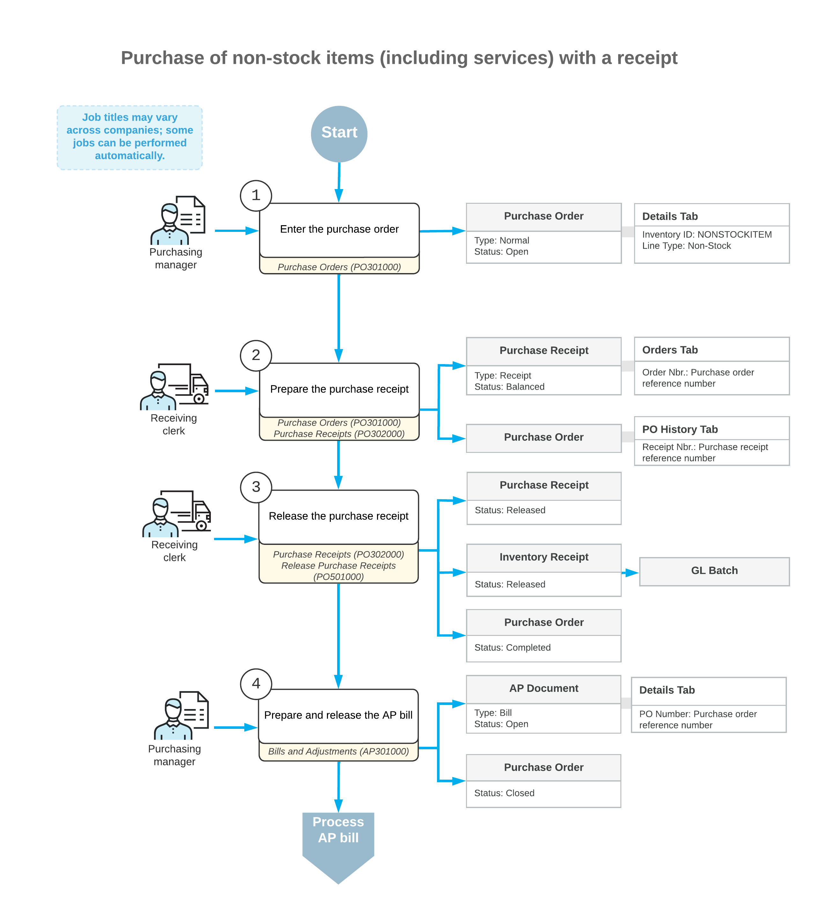

# Purchases of Non-Stock Items and Services with Receipts: General Information {#_7ef494ff-2162-498d-8155-9c6f56864520 .concept}

Non-stock items in Acumatica ERP, which are defined on the [Non-Stock Items](IN_20_20_00.md) \(IN202000\) form during implementation, are used to represent products that cannot be stocked in warehouses \(such as services or charges\) or physical entities whose quantities you do not need to track. In Acumatica ERP, you can process purchases of non-stock items and services with purchase receipts.

The following sections explain how to process a purchase of non-stock items and services with receipts, and which documents are prepared during the processing of the purchase.

## Learning Objectives { .section}

In this chapter, you will do the following:

-   Enter a purchase order for a purchase of non-stock items including services
-   Prepare a purchase receipt for the purchase order
-   Prepare an AP bill that corresponds to the purchase order

## Applicable Scenario { .section}

You process a purchase order for non-stock items \(potentially including services\) and process the corresponding purchase receipt if you need to prepare a bill to pay the vendor for the purchased non-stock items. The standard purchase process of non-stock items includes entering a purchase order, processing the purchase receipt when the purchased non-stock items are received, and preparing a bill to the vendor.

**Tip:** Purchases of services are usually processed without purchase receipts also being processed in the system. You might want to process a purchase of a service with a corresponding purchase receipt if you want the receipt to serve as proof that the work was finished. If the service is paid by the hour, the receipt is also needed to track the actual number of hours, which may differ from the expected number of hours in the purchase order.

## Purchase of Non-Stock Items \(Including Services\) with a Corresponding Receipt { .section}

In Acumatica ERP, you create a purchase order by using the [Purchase Orders](PO_30_10_00.md) \(PO301000\) form. You use a purchase order of the *Normal* type for processing a standard purchase of non-stock items \(including services\).

When you create a new purchase order, you first select the vendor and the *Normal* type in the Summary area. Then on the **Details** tab, you add lines with the non-stock items, including services, to be purchased from the vendor.

For this scenario, once the purchased items have been received, you need to create a purchase receipt on the [Purchase Receipts](PO_30_20_00.md) \(PO302000\) form.

Then you need to create an AP bill to increase the vendor's balance in the system with the amount to be paid for the received items. You can review the AP bill on the [Bills and Adjustments](AP_30_10_00.md) \(AP301000\) form. If all the lines in the purchase order have been billed in full, the system assigns the purchase order the *Closed* status. For more information on the rules that affect line closing and completion, see [Non-Stock Lines in Purchase Orders](PO__con_Purchase_of_NStock_w_Receipt.md).

## Workflow of a Purchase of Non-Stock Items with a Receipt { .section}

When you process a purchase of non-stock items \(including services\) with a purchase receipt, the typical processing of a purchase order involves the actions and generated documents shown in the following diagram.

**Parent topic:**[Processing Purchases of Non-Stock Items and Services with Receipts](../UserGuide/OrderMgmt_Purchase_of_Non_Stock_Items_and_Services_with_Receipt_Mapref.md)

