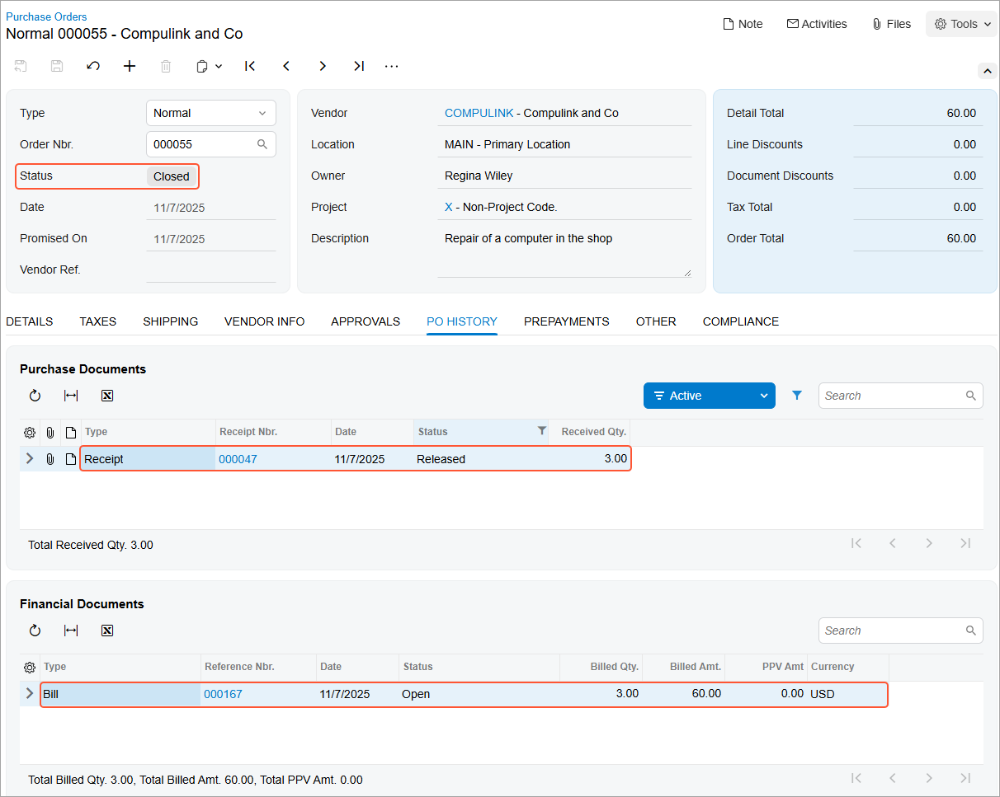

# Purchases of Non-Stock Items and Services with Receipts: To Process a Purchase of Services {#_81438ba6-46ff-4af8-8870-94c195758e7b .task}

In this activity, you will prepare and process a purchase order for non-stock items that must be included in a purchase receipt. This activity involves non-stock items that are services.

**Attention:** This activity is based on the *U100* dataset. If you are using another dataset or if any system settings have been changed in *U100*, these changes can affect the workflow of the activity and the results of the processing. To avoid issues, restore the *U100* dataset to its initial state.

## Story { .section}

Suppose that a manager has reported that a computer in the SweetLife Store does not work. Your system administrator has contacted the company that provides computer services, Compulink and Co., and the company has sent a service technician to repair the computer.

Acting as a purchasing manager, you will process the relevant documents in the system. Because Compulink and Co. charges for repair services by the hour, you will prepare the purchase order after the technician finishes the job. You will also process a purchase receipt for this job to verify that the job was completed and the computer works now. You will then process the corresponding AP bill.

## Configuration Overview { .section}

In the *U100* dataset, the following tasks have been performed to support this activity:

-   On the [Enable/Disable Features](CS_10_00_00.md) \(CS100000\) form, the *Inventory* feature has been enabled.
-   On the [Vendors](AP_30_30_00.md) \(AP303000\) form, the *COMPULINK \(Compulink and Co.\)* vendor has been created.
-   On the [Non-Stock Items](IN_20_20_00.md) \(IN202000\) form, the *MAINTENANCE \(Repair of hardware\)* non-stock item has been created.

## Process Overview { .section}

In this activity, you will create a purchase order on the [Purchase Orders](PO_30_10_00.md) \(PO301000\) form and add the purchased service to it. On the [Purchase Receipts](PO_30_20_00.md) \(PO302000\) form, you will then create a purchase receipt for the ordered items. On release of the purchase receipt, the system automatically generates an inventory receipt to create a GL batch. Then on the [Bills and Adjustments](AP_30_10_00.md) \(AP301000\) form, you create an AP bill to pay the vendor.

## System Preparation { .section}

Before you start processing a purchase order that includes non-stock items that must be included in a purchase receipt, you should do the following:

1.  Launch the Acumatica ERP website with the *U100* dataset preloaded and sign in to the system. You should sign in as a sales and purchasing manager by using the *wiley* username and *123* password.
2.  In the info area, in the upper-right corner of the top pane of the Acumatica ERP screen, make sure that the business date in your system is set to today’s date. For simplicity, in this activity, you will create and process all documents in the system on this business date.
3.  On the Company and Branch Selection menu in the top pane of the Acumatica ERP screen, select the *SweetLife Store* branch.
4.  On the [Purchase Orders Preferences](PO_10_10_00.md) \(PO101000\) form \(**Other** section on the **General** tab\), select the **Process Service Lines from Normal Purchase Orders via Purchase Receipts** check box. With the check box selected, service lines from *Normal* purchase orders must be included in the corresponding purchase receipts.

## Step 1: Creating a Purchase Order { .section}

To create a purchase order for the computer repair service, do the following:

1.  On the [Purchase Orders](PO_30_10_00.md) \(PO301000\) form, add a new record.
2.  In the Summary area, specify the following settings:
    -   **Type**: *Normal*
    -   **Vendor**: *COMPULINK*
    -   **Description**: `Repair of a computer in the shop`
3.  On the **Details** tab, click **Add Row** on the table toolbar.
4.  Specify the following settings in the row:
    -   **Branch**: *RETAIL*
    -   **Inventory ID**: *MAINTENANCE*
    -   **Warehouse**: *RETAIL*
    -   **Order Qty.**: *3*

        This indicates that the repair service is going to take three hours to complete; each unit represents one hour of work.

    -   **Unit Cost**: *20*
5.  On the form toolbar, click **Remove Hold**. Notice that the purchase order has the *Open* status.

## Step 2: Processing the Purchase Receipt {#section_idq_gws_hlb .section}

To create the purchase receipt for the purchase order, do the following:

1.  While you are still viewing the purchase order on the [Purchase Orders](PO_30_10_00.md) \(PO301000\) form, on the form toolbar, click **Enter PO Receipt**. The system prepares the purchase receipt for the selected purchase order and opens it on the [Purchase Receipts](PO_30_20_00.md) \(PO302000\) form.
2.  On the form toolbar, click **Save**.
3.  Review the details of the prepared purchase receipt. Make sure that the **Create Bill** check box is cleared in the Summary area. \(In the next step, you will prepare the bill manually.\)
4.  On the form toolbar, click **Release**.

## Step 3: Processing the AP Bill {#section_kzy_nsr_hlb .section}

To process the AP bill associated with the purchase order, do the following:

1.  While you are still viewing the purchase receipt on the [Purchase Receipts](PO_30_20_00.md) \(PO302000\) form, on the form toolbar, click **Enter AP Bill**. The system generates an AP bill for the vendor of the goods and shows the created document on the [Bills and Adjustments](AP_30_10_00.md) \(AP301000\) form.
2.  On the form toolbar, click **Remove Hold**, and then click **Release** to release the bill.
3.  In the only row on the **Details** tab, click the link in the **PO Number** column to view the associated purchase order.
4.  On the [Purchase Orders](PO_30_10_00.md) \(PO301000\) form, which opens, review the details of the purchase order. Notice that the order now has a status of *Closed*, as shown in the following screenshot.

    On the **PO History** tab \(also shown in the screenshot\), notice that the left pane lists the corresponding purchase receipt, and the right pane lists the AP bill that was prepared for the order. The inclusion of these documents on the tab indicates that the purchased service has been received and billed in full, so the purchasing process is completed.

    

**Parent topic:**[Processing Purchases of Non-Stock Items and Services with Receipts](../UserGuide/OrderMgmt_Purchase_of_Non_Stock_Items_and_Services_with_Receipt_Mapref.md)

