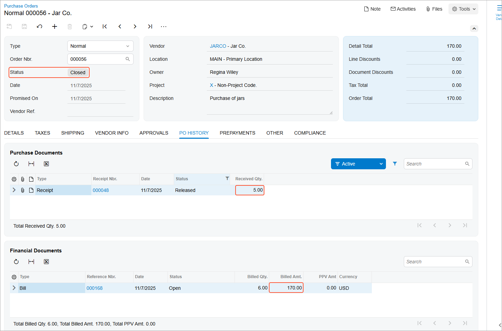

# Purchases of Services Without Receipts: Process Activity {#_973c83fc-a226-41f5-8ba2-3cb73a645ded .task}

In this activity, you will prepare and process a purchase order that includes a line for a service that does not need to be included in a purchase receipt when it is purchased.

For simplicity, this chapter focuses on purchases of only services that do not require corresponding purchase receipts. However, this activity demonstrates a purchase of both a service that does not need to be included in a purchase receipt and a stock item that does need to be included in a purchase receipt.

**Attention:** This activity is based on the *U100* dataset. If you are using another dataset or if any system settings have been changed in *U100*, these changes can affect the workflow of the activity and the results of the processing. To avoid issues, restore the *U100* dataset to its initial state.

## Story {#section_gmc_4qx_hlb .section}

Suppose that you, as a purchasing manager for SweetLife Fruits &amp; Jams, urgently need to buy some jars for packing SweetLife’s produced jam, which is sold in the retail store. The company buys these jars \(which are tracked as stock items in the system\) from Jar Co., which offers free delivery of the jars.

You order the jars, but you will not be able to use Jar Co.'s regular delivery service because its soonest free delivery is in three days. Because you are in urgent need of the jars, you agree to pay Jar Co. an extra service fee to arrange for delivery by a third party. You have defined this delivery in the system as a service that does not need to be included in a purchase receipt.

Thus, you need to process a purchase order for Jar Co. that includes both the jars \(at their normal price\) and the expedited delivery service. You also need to process the corresponding purchase receipt \(which includes only the jars\) and AP bill \(which includes the jars and the expedited delivery service\).

## Configuration Overview {#section_hmc_4qx_hlb .section}

In the *U100* dataset, the following tasks have been performed to support this activity:

-   On the [Enable/Disable Features](CS_10_00_00.md) \(CS100000\) form, the *Inventory* feature has been enabled.
-   On the [Vendors](AP_30_30_00.md) \(AP303000\) form, the *JARCO \(Jar Co.\)* vendor has been defined.
-   On the [Non-Stock Items](IN_20_20_00.md) \(IN202000\) form, the *URGDELIVERY \(One-time delivery service\)* non-stock item has been defined, and the **Require Receipt** check box has been cleared for this item on the **General** tab. This indicates that when this item is purchased, it does not need to be included in a purchase receipt.
-   On the [Stock Items](IN_20_25_00.md) \(IN202500\) form, the *JAR96 \(Glass jar 96 oz., 24 pcs\)* stock item has been defined. Because stock items are by definition items whose movements are tracked in inventory, when they are purchased, they must be included in the purchase receipt corresponding to the purchase order.

    **Tip:** For details about the process of purchasing stock items, see [Purchases of Stock Items: Process Activity](OrderMgmt_Standard_Inventory_Purchase_Process_Activity.md).

## Process Overview {#section_jmc_4qx_hlb .section}

In this activity, you will create a purchase order on the [Purchase Orders](PO_30_10_00.md) \(PO301000\) form and add the purchased expedited delivery service and jars to it. Although the service does not need to be included in a purchase receipt, because the jars are stock items, you will process a purchase receipt for them on the [Purchase Receipts](PO_30_20_00.md) \(PO302000\) form. Then on the [Bills and Adjustments](AP_30_10_00.md) \(AP301000\) form, you will create an AP bill to pay the vendor.

## System Preparation {#section_kmc_4qx_hlb .section}

Before you start processing the purchase of services without a purchase receipt, you should do the following:

1.  Launch the Acumatica ERP website with the *U100* dataset preloaded and sign in to the system as a sales and purchasing manager by using the *wiley* username and *123* password.
2.  On the [Purchase Orders Preferences](PO_10_10_00.md) \(PO101000\) form, make sure that the **Process Service lines from Normal Purchase Orders via Purchase Receipts** check box is cleared so that the system does not include service lines in purchase receipts.
3.  In the info area, in the upper-right corner of the top pane of the Acumatica ERP screen, make sure that the business date in your system is set to today’s date. For simplicity, in this activity, you will create and process all documents in the system on this business date.
4.  On the Company and Branch Selection menu in the top pane of the Acumatica ERP screen, select the *SweetLife Store* branch.

## Step 1: Creating a Purchase Order {#section_lmc_4qx_hlb .section}

To create a purchase order that includes the jars and the expedited delivery service, do the following:

1.  On the [Purchase Orders](PO_30_10_00.md) \(PO301000\) form, add a new record.
2.  In the Summary area, specify the following settings:
    -   **Type**: *Normal*
    -   **Vendor**: *JARCO*
    -   **Description**: `Purchase of jars`
3.  On the table toolbar of the **Details** tab, click **Add Row**.
4.  Specify the following settings in the added row:
    -   **Branch**: *RETAIL*
    -   **Inventory ID**: *JAR96*
    -   **Warehouse**: *RETAIL*
    -   **Order Qty.**: `5`
    -   **Unit Cost**: `30`
5.  On the table toolbar of the **Details** tab, click **Add Row**.
6.  Specify the following settings in the added row:
    -   **Branch**: *RETAIL*
    -   **Inventory ID**: *URGDELIVERY*
    -   **Order Qty.**: `1`
    -   **Unit Cost**: `20`
7.  On the form toolbar, click **Remove Hold**. Notice that the purchase order is assigned the *Open* status.

## Step 2: Processing the Purchase Receipt for the Jars {#section_mmc_4qx_hlb .section}

Although the *URGDELIVERY* non-stock item does not need to be included in a purchase receipt, the purchase order also consists of the *JAR96* stock item. When this item is purchased, it needs to be included in the corresponding purchase receipt, because the movements of all stock items are carefully tracked in inventory. Thus, you still need to create a purchase receipt.

Create the purchase receipt for the purchase order as follows:

1.  While you are still viewing the purchase order on the [Purchase Orders](PO_30_10_00.md) \(PO301000\) form, click **Enter PO Receipt** on the form toolbar. The system prepares the purchase receipt for the selected purchase order and opens it on the [Purchase Receipts](PO_30_20_00.md) \(PO302000\) form.
2.  Review the purchase receipt.

    Notice that the line with the *URGDELIVERY* service, which had been included in the purchase order, is absent in the purchase receipt. This is because the **Require Receipt** check box is cleared for the non-stock item on the [Non-Stock Items](IN_20_20_00.md) \(IN202000\) form.

3.  On the form toolbar, click **Save**.
4.  Review the details of the prepared purchase receipt. Notice that the **Create Bill** check box is cleared in the Summary area. \(You will create the bill manually in the next step.\)
5.  On the form toolbar, click **Release**.

## Step 3: Processing the AP Bill {#section_kzy_nsr_hlb .section}

To process the AP bill related to the purchase order, do the following:

1.  Return to the purchase order that you have processed earlier in this activity on the [Purchase Orders](PO_30_10_00.md) \(PO301000\) form, and click **Enter AP Bill** on the More menu.

    The system generates an AP bill for the vendor of the goods and shows the created document on the [Bills and Adjustments](AP_30_10_00.md) \(AP301000\) form.

2.  In the **Description** box, enter `Purchase of jars with expedited delivery`.
3.  On the form toolbar, click **Remove Hold**.
4.  Click **Release**.
5.  Return to the purchase order for *JARCO* on the [Purchase Orders](PO_30_10_00.md) form, and review its settings. Notice that the order now has a status of *Closed*, as shown in the screenshot below.
6.  On the **PO History** tab, notice the following:

    -   The left pane lists the purchase receipt, which includes only the received stock item from this purchase order.
    -   The right pane lists the AP bill that you prepared for the purchase order. It includes the received stock item and a service item.
    The inclusion of these documents on the tab indicates that the purchased jars have been received and the jars and the delivery have been billed in full, so the purchasing process is completed.

    

**Parent topic:**[Processing Purchases of Services Without Receipts](../UserGuide/OrderMgmt_Purchase_of_Services_without_Receipt_Mapref.md)

