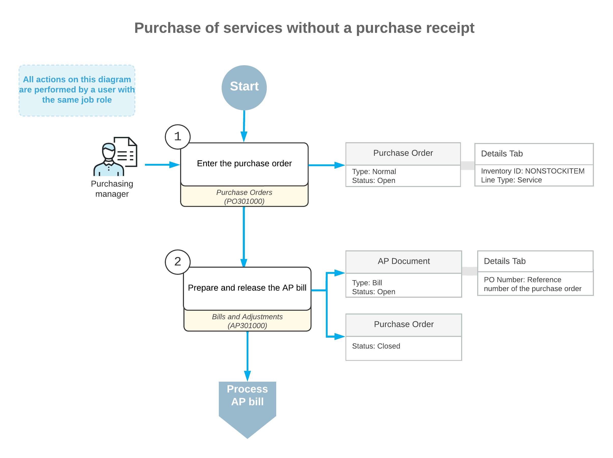

# Purchases of Services Without Receipts: General Information {#_8bf6ae8d-a6d1-4dc3-a5f1-f86bb38c7011 .concept}

Non-stock items in Acumatica ERP are used to represent products that cannot be stocked in warehouses \(such as services or charges\) or physical entities whose quantities you do not need to track. If a non-stock item is included in a purchase order, the item’s settings determine whether the item must be included in a corresponding purchase receipt.

The following sections explain how to process a purchase order with services that will not be included in purchase receipts for the order. They also explain which documents are prepared during the processing of the purchase.

## Learning Objectives {#section_fbp_s1x_hlb .section}

In this chapter, you will do the following:

-   Enter a purchase order for a service that does not need to be included in the corresponding purchase receipt
-   Prepare an AP bill for the purchase order

## Applicable Scenario {#section_gbp_s1x_hlb .section}

You may need to process a purchase order that includes services. Purchases of services are usually processed without purchase receipts and the corresponding bills are created in the system.

**Tip:** Some services may need a receipt. For example, you may want to track the quantity of hours spent on rendering the service or you may want proof of receiving the service.

## Purchase of Services Not Included in Receipts {#section_hbp_s1x_hlb .section}

In Acumatica ERP, you create a purchase order by using the [Purchase Orders](PO_30_10_00.md) \(PO301000\) form. You use a purchase order of the *Normal* type for processing a standard purchase of services.

When you create a new purchase order, you first select the *Normal* type and the vendor in the Summary area. Then on the **Details** tab, you add lines with items and services to be purchased from the vendor. These lines include services that do not need to be added to the purchase receipt for the order.

Once the purchased services have been provided, you need to create an AP bill on the [Bills and Adjustments](AP_30_10_00.md) \(AP301000\) form to increase the vendor's balance in the system by the amount to be paid for the received services.

## Workflow of a Purchase of Services Without a Purchase Receipt { .section}

Services that do not require purchase receipts may or may not be included in purchase orders with items that require a corresponding purchase receipt. If you are processing a purchase order with only services that do not require a purchase receipt, the typical processing of a purchase order involves the actions and generated documents shown in the following diagram.

**Parent topic:**[Processing Purchases of Services Without Receipts](../UserGuide/OrderMgmt_Purchase_of_Services_without_Receipt_Mapref.md)

