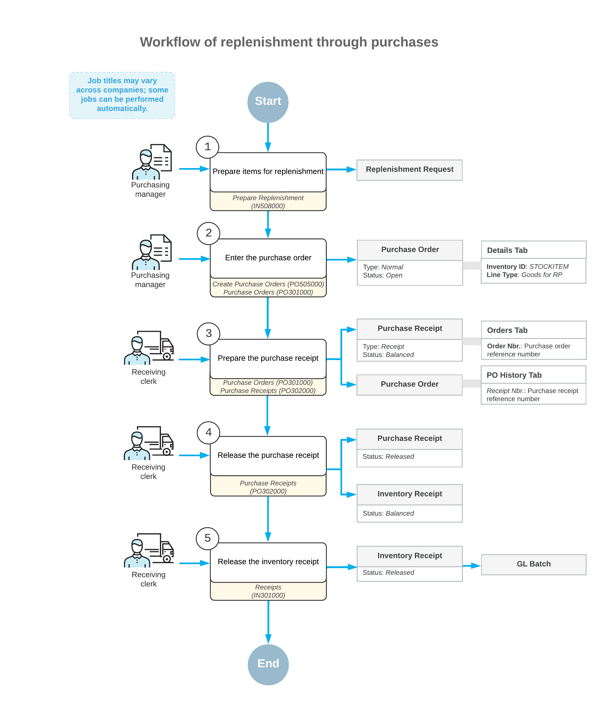

# Replenishment Through Purchases: General Information {#_3c80c7f1-3c6e-4b81-b41b-eee40f418bca .concept}

The replenishment functionality in Acumatica ERP can accommodate various ways of replenishing stock items. You can maintain the needed level of stock at your warehouses by purchasing the appropriate quantity of items from vendors.

## Learning Objectives { .section}

In this chapter, you will do the following:

-   Become familiar with the general workflow of item replenishment through purchases
-   Replenish stock by purchasing items from a vendor

## Applicable Scenario { .section}

You perform replenishment through purchases if your company needs to optimize the replenishment of stock and to purchase stock items at the right time from particular vendors when the stock is below a certain level.

## Replenishment Through Purchases in Acumatica ERP { .section}

You can use the functionality of replenishment through purchases if the *Inventory Replenishment* feature and one or both of the following features are enabled on the [Enable/Disable Features](CS_10_00_00.md) \(CS100000\) form:

-   *Multiple Warehouse Locations*
-   *Multiple Warehouses*

On the [Prepare Replenishment](IN_50_80_00.md) \(IN508000\) form, you can view the list of stock items that require replenishment. A stock item is listed on the form if for the item at a warehouse where the item is needed, the following settings are specified on the **Inventory Planning** tab of the [Item Warehouse Details](IN_20_45_00.md) \(IN204500\) form:

-   **Reorder Point**: The stock level that prompts the system to replenish the stock of the item at this warehouse when the available quantity is below the reorder point specified for this item at this warehouse.
-   **Replenishment Source**: *Purchase*.

On the [Prepare Replenishment](IN_50_80_00.md) form, the quantity to process is calculated in the base unit of measure \(UOM\). On the [Create Purchase Orders](PO_50_50_00.md) \(PO505000\) form, the quantity specified in the **Quantity** column is recalculated in the purchase UOM and displayed in the **UOM** column. For example, if ten stock items should be purchased in one box, then the quantity of ten UOMs is converted to one box to be purchased.

For details about the configuration of replenishment and the calculation of replenishment parameters, see [Replenishment for Stock Items](../ImplementationGuide/config_OrderMgmt_Replenishment_Mapref.md).

## General Steps of Replenishment Through Purchases { .section}

To replenish stock items by purchasing them from a vendor, you perform the following general steps:

1.  On the [Prepare Replenishment](IN_50_80_00.md) \(IN508000\) form, which lists the stock items that require replenishment, you process all stock items or only those you select.
2.  You create the needed purchase orders for all the stock items to be purchased from vendors by using the [Create Purchase Orders](PO_50_50_00.md) \(PO505000\) form. You can work with each purchase order on the [Purchase Orders](PO_30_10_00.md) \(PO301000\) form.
3.  You create and release the following documents to reflect the receipt of the purchased items:
    -   The purchase receipt on the [Purchase Receipts](PO_30_20_00.md) \(PO302000\) form
    -   The inventory receipt on the [Receipts](IN_30_10_00.md) \(IN301000\) form

## Workflow of Replenishment Through Purchases {#section_vv2_1y4_y4b .section}

A general workflow of replenishment through purchases involves the steps and generated documents shown in the following diagram.

**Parent topic:**[Replenishing Inventory Through Purchases](../UserGuide/OrderMgmt_Replenishment_by_Purchase_Mapref.md)

