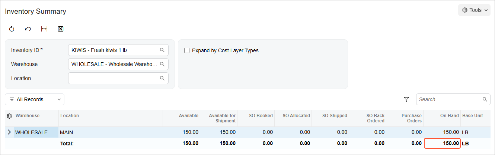

# Replenishment Through Purchases: Process Activity {#_2586133f-c4e3-4121-b51b-10d5c6ca5e42 .task}

The following activity demonstrates how to prepare and perform a replenishment by purchasing the required quantity of goods from a vendor.

**Attention:** This activity is based on the *U100* dataset. If you are using another dataset or if any system settings have been changed in *U100*, these changes can affect the workflow of the activity and the results of the processing. To avoid issues, restore the *U100* dataset to its initial state.

## Story { .section}

Suppose that you are Matt Parker, a purchasing manager of the SweetLife Fruits &amp; Jams company. As part of your everyday routine, you buy fruits, including kiwis, in the SweetLife Head Office and Wholesale Center branch and refill stock. This branch orders fruit directly from vendors. It is time to buy kiwis when you have 50 pounds or less of the item in the available stock. You need to specify replenishment settings for the item and replenish the item in the Wholesale warehouse.

You replenish kiwis in the *WHOLESALE* warehouse by purchasing the stock item from a vendor. The *KIWIS* stock item appears in the list of items for replenishment on the [Prepare Replenishment](IN_50_80_00.md) \(IN508000\) form when you have 50 pounds \(which is the base unit of measure for this item\) or less of the item in the available stock.

## Configuration Overview {#section_tz4_djx_cnb .section}

In the *U100* dataset, the following tasks have been performed to support this activity:

-   On the [Enable/Disable Features](CS_10_00_00.md) \(CS100000\) form, the following features have been enabled:
    -   *Multiple Warehouses*
    -   *Inventory Replenishment*
-   On the [Replenishment Classes](IN_20_88_00.md) \(IN208800\) form, the *PURCHASE* replenishment class has been created.
-   On the [Warehouses](IN_20_40_00.md) \(IN204000\) form, the *WHOLESALE* warehouse has been created.
-   On the [Stock Items](IN_20_25_00.md) \(IN202500\) form, the *KIWIS* stock item has been created.

## Process Overview { .section}

In this activity, you will do the following:

1.  On the [Stock Items](IN_20_25_00.md) \(IN202500\) form, specify the replenishment and vendor settings of the *KIWIS* stock item.
2.  On the [Item Warehouse Details](IN_20_45_00.md) \(IN204500\) form, review the replenishment settings of the *KIWIS* stock item in the *WHOLESALE* warehouse.
3.  On the [Prepare Replenishment](IN_50_80_00.md) \(IN508000\) form, prepare and process the stock items that require replenishment.
4.  On the [Create Purchase Orders](PO_50_50_00.md) \(PO505000\) form, prepare a purchase order for the vendor. On the [Purchase Orders](PO_30_10_00.md) \(PO301000\) form, you will take it off hold and send it to the vendor.
5.  On the [Purchase Receipts](PO_30_20_00.md) \(PO302000\) form, prepare and process the purchase receipt for the items; the corresponding inventory receipt is automatically created on the [Receipts](IN_30_10_00.md) \(IN301000\) form and released.

## System Preparation { .section}

Before you start preparing and performing replenishment through purchases, you should do the following:

1.  Launch the Acumatica ERP website, and sign in to a company with the *U100* dataset preloaded. You should sign in as purchasing manager Matt Parker with the *parker* username and the *123* password.
2.  In the info area at the upper-right corner of the top pane of the Acumatica ERP screen, make sure that the business date is set to *1/30/2026*. If a different date is displayed, click the Business Date menu button and select *1/30/2026* from the calendar. For simplicity, you'll create and process all documents in this activity using this business date.
3.  On the Company and Branch Selection menu, in the top pane of the Acumatica ERP screen, select the *SweetLife Head Office and Wholesale Center* branch.

## Step 1: Specifying the Replenishment and Vendor Settings of the Stock Item { .section}

To specify the replenishment and vendor settings of the *KIWIS* stock item, do the following:

1.  Open the *KIWIS* stock item on the [Stock Items](IN_20_25_00.md) \(IN202500\) form.
2.  Go the **Vendors** tab. Notice that there is one row for the *ALLFRUITS* vendor.
3.  In the **Lot Size** column, type `15`.
4.  On the **Inventory Planning** tab, in the row that has *Purchase* in the **Source** column, specify the following settings:
    -   **Reorder Point**: *50*
    -   **Max. Qty.**: *140*
5.  On the form toolbar, click **Save**.

## Step 2: Reviewing the Replenishment Settings of the Item-Warehouse Pair { .section}

To review the replenishment settings of the *KIWIS* stock item in the *WHOLESALE* warehouse, do the following:

1.  Open the [Item Warehouse Details](IN_20_45_00.md) \(IN204500\) form.
2.  In the Summary area, specify the following settings:
    -   **Inventory ID**: *KIWIS*
    -   **Warehouse**: *WHOLESALE*
3.  On the **Inventory Planning** tab, make sure that the following settings have been specified:

    -   **Override Replenishment Settings**: Cleared
    -   **Seasonality**: *NONE*
    -   **Replenishment Source**: *Purchase*
    -   **Replenishment Method**: *Min./Max.*
    -   **Replenishment Warehouse**: Not selected
    -   **Reorder Point**: *50*
    -   **Max. Qty.**: *140*
    With these settings, you replenish kiwis in the *WHOLESALE* warehouse by purchasing the stock item from a vendor. The *KIWIS* stock item appears in the list of items for replenishment on the [Prepare Replenishment](IN_50_80_00.md) \(IN508000\) form when you have 50 pounds \(which is the base unit of measure for this item\) or less of the item in the available stock. The **Max. Qty.** value is used for the calculation of replenishment parameters in the *WHOLESALE* warehouse. For details, see [Configuration of Replenishment: Replenishment Methods](../ImplementationGuide/config_OrderMgmt_Replenishment_Methods.md).

## Step 3: Preparing the Replenishment { .section}

Suppose that as part of your everyday routine, you need to check whether any stock items in the *SweetLife Head Office and Wholesale Center* branch require replenishment; if so, you need to process them. Do the following:

1.  Open the [Prepare Replenishment](IN_50_80_00.md) \(IN508000\) form.
2.  In the Selection area, specify the following settings:

    -   **Warehouse**: *WHOLESALE*
    -   **Purchase Date**: *1/30/2026*
    -   **Me**: Cleared
    -   **Only Suggested Items**: Selected

        With this setting, only items that require replenishment are displayed in the table.

    The table shows the items pending replenishment in the *SweetLife Head Office and Wholesale Center* branch.

3.  In the row for the *KIWIS* stock item, make sure that the following settings are specified:
    -   **Replenishment Source**: *Purchase*
    -   **Preferred Vendor ID**: *ALLFRUITS*
4.  In the **Qty. to Process** column of this row, notice that *150* is specified. On the **Vendors** tab of the [Stock Items](IN_20_25_00.md) \(IN202500\) form, the *ALLFRUITS* vendor's lot size is 15, so the system has increased the quantity to be a multiple of 15.
5.  In this row, select the check box in the unlabeled column.
6.  On the form toolbar, click **Process**. The **Processing** dialog box opens, showing the progress and then the results of the processing. The system generates the replenishment request for the purchase, which consists of the *KIWIS* item, and adds the request to the [Create Purchase Orders](PO_50_50_00.md) \(PO505000\) form.
7.  Click **Close** to close the **Processing** dialog box.

    Notice that the row for the *KIWIS* stock item is no longer displayed in the table.

Now you can create a purchase order for the 150 pounds of kiwis.

## Step 4: Creating the Purchase Order { .section}

To create the purchase order for the All Fruits Mall vendor, do the following:

1.  On the [Create Purchase Orders](PO_50_50_00.md) \(PO505000\) form, in the row with the *IN Replanned* plan type and the *KIWIS* stock item, select the check box in the unlabeled column.
2.  On the form toolbar, click **Process**.

    The system creates a purchase order for 150 pounds of kiwis for the *ALLFRUITS* vendor and opens the order on the [Purchase Orders](PO_30_10_00.md) \(PO301000\) form.

3.  On the form toolbar, click **Remove Hold**. The system saves the purchase order and changes its status to *Open*.

    Suppose that you now send the purchase order to the All Fruits Mall vendor by email.

4.  Open the [Inventory Summary](IN_40_10_00.md) \(IN401000\) form.
5.  In the Selection area, specify the following settings:

    -   **Inventory ID**: *KIWIS*
    -   **Warehouse**: *WHOLESALE*
    Notice that in the **On Hand** column, the quantity is *0*.

## Step 5: Receiving the Stock Items from the Vendor { .section}

Suppose that the All Fruits Mall vendor has delivered kiwis to your *WHOLESALE* warehouse.

To create the documents that reflect the receipt of the purchased item, do the following:

1.  On the [Purchase Orders](PO_30_10_00.md) \(PO301000\) form, open the purchase order with 150 pounds of kiwis, which you have created in the previous step.
2.  On the form toolbar, click **Enter PO Receipt**. The system opens the [Purchase Receipts](PO_30_20_00.md) \(PO302000\) form with the new purchase receipt. The receipt has the *Balanced* status and the data copied from the linked purchase order.
3.  On the form toolbar, click **Release**. The system creates and releases the inventory receipt. On the **Other** tab, in the **IN Ref. Nbr.** column, you can view the reference number of the created inventory receipt; you could also click the reference number link to view the inventory receipt on the [Receipts](IN_30_10_00.md) \(IN301000\) form.
4.  Open the [Inventory Summary](IN_40_10_00.md) \(IN401000\) form.
5.  In the Selection area, specify the following settings:

    -   **Inventory ID**: *KIWIS*
    -   **Warehouse**: *WHOLESALE*
    In the **On Hand** column, notice that the quantity is *150*, as shown in the following screenshot.

    

    **Tip:** If you need to change the order of columns in any table, you can drag a column by its header to the new place in the table.

You have replenished kiwis in the *WHOLESALE* warehouse.

**Parent topic:**[Replenishing Inventory Through Purchases](../UserGuide/OrderMgmt_Replenishment_by_Purchase_Mapref.md)

