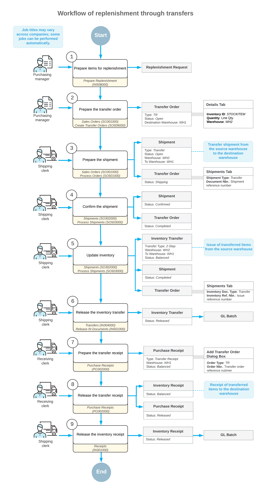

# Replenishment Through Transfers: General Information {#_9668b1a2-8f98-4200-abe4-4299513b205d .concept}

The replenishment functionality in Acumatica ERP can accommodate various ways of replenishing stock items. You can maintain a particular quantity of stock items by transferring items from a warehouse where the items are available to a destination warehouse.

## Learning Objectives { .section}

In this chapter, you will do the following:

-   Become familiar with the general workflow of item replenishment through transfers
-   Replenish stock by transferring items between warehouses

## Applicable Scenario { .section}

You perform replenishment through transfers if your company has multiple warehouses and replenishes stock items by transferring them from another warehouse where they are available.

## Replenishment Through Transfers in Acumatica ERP { .section}

You can use the functionality of replenishment through transfers between warehouses if the *Inventory Replenishment* and *Multiple Warehouses* features are enabled on the [Enable/Disable Features](CS_10_00_00.md) \(CS100000\) form.

On the [Prepare Replenishment](IN_50_80_00.md) \(IN508000\) form, you can view the list of stock items that require replenishment. A stock item is listed on the form if for the item at the warehouse where the item is needed, the following settings are specified on the **Inventory Planning** tab of the [Item Warehouse Details](IN_20_45_00.md) \(IN204500\) form:

-   **Reorder Point**: The stock level that prompts the system to replenish the stock of the item at this warehouse when the available quantity is below the reorder point specified for this item at this warehouse.
-   **Replenishment Source**: *Transfer*.

You initially specify these settings on the [Stock Items](IN_20_25_00.md) \(IN202500\) form for a stock item. These settings are copied to the [Item Warehouse Details](IN_20_45_00.md) form for each combination of the stock item and a warehouse. On this form, you can adjust the settings for the item in the warehouse where the item is stocked.

On the [Prepare Replenishment](IN_50_80_00.md) form, the quantity to process is calculated in the base unit of measure \(UOM\). On the [Create Transfer Orders](SO_50_90_00.md) \(SO509000\) form, the quantity specified in the **Quantity** column is recalculated in the purchase UOM and displayed in the **UOM** column. For example, if ten stock items should be transferred in one box, then the quantity of ten UOMs is converted to one box to be transferred.

For details about the configuration of replenishment and the calculation of replenishment parameters, see [Replenishment for Stock Items](../ImplementationGuide/config_OrderMgmt_Replenishment_Mapref.md).

## General Steps of Replenishment Through Transfers { .section}

To replenish stock items by transferring them from one warehouse to another, you perform the following general steps:

1.  On the [Prepare Replenishment](IN_50_80_00.md) \(IN508000\) form, which lists the stock items that require replenishment, you process all stock items or only those you select. As a result, the system creates replenishment requests, which are internal Acumatica ERP records that are used as the basis for transfer orders. Replenishment requests for items of the *Transfer* source are listed on the [Create Transfer Orders](SO_50_90_00.md) \(SO509000\) form.
2.  You generate transfer orders requesting replenishment by using the [Create Transfer Orders](SO_50_90_00.md) form. The system will generate orders of the *TR* type on the [Sales Orders](SO_30_10_00.md) \(SO301000\) form.
3.  When the stock items are shipped from the source warehouse to the destination warehouse, you create the shipment on the [Shipments](SO_30_20_00.md) \(SO302000\) form, confirm the shipment, and update the inventory.
4.  When you are receiving the items, you create purchase receipts of the *Transfer* type and release them on the [Purchase Receipts](PO_30_20_00.md) \(PO302000\) form.

## Workflow of Replenishment Through Transfers {#section_vv2_1y4_y4b .section}

A general workflow of replenishment through transfers involves the steps and generated documents shown in the following diagram.

**Parent topic:**[Replenishing Inventory Through Transfers](../UserGuide/OrderMgmt_Replenishment_by_Transfer_Mapref.md)

