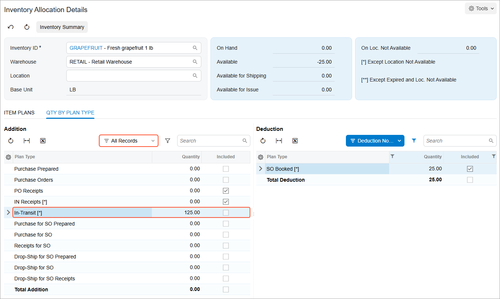
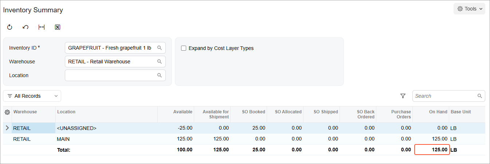

# Replenishment Through Transfers: Process Activity {#_398be72d-184c-42d0-a472-61d1ca9fda6c .task}

The following activity demonstrates how to prepare and perform replenishment in Acumatica ERP by transferring goods between warehouses.

**Attention:** This activity is based on the *U100* dataset. If you are using another dataset or if any system settings have been changed in *U100*, these changes can affect the workflow of the activity and the results of the processing. To avoid issues, restore the *U100* dataset to its initial state.

## Story { .section}

Suppose that you are Matt Parker, a purchasing manager of the SweetLife Fruits &amp; Jams company. You are going to buy grapefruit for the SweetLife Store branch and refill the stock in the Retail warehouse. In this branch, replenishment is performed by transferring the needed goods from the Wholesale warehouse of the SweetLife Head Office and Wholesale Center branch to the Retail warehouse.

## Configuration Overview {#section_tz4_djx_cnb .section}

In the *U100* dataset, the following tasks have been performed to support this activity:

-   On the [Enable/Disable Features](CS_10_00_00.md) \(CS100000\) form, the following features have been enabled:
    -   *Multiple Warehouses*
    -   *Multiple Warehouse Locations*
    -   *Inventory Replenishment*
-   On the [Warehouses](IN_20_40_00.md) \(IN204000\) form, the *WHOLESALE* and *RETAIL* warehouses have been created.
-   On the [Stock Items](IN_20_25_00.md) \(IN202500\) form, the *GRAPEFRUIT* stock item has been created.
-   On the [Order Types](SO_20_10_00.md) \(SO201000\) form, the *Transfer* \(*TR*\) order type, which can be specified on the [Sales Orders](SO_30_10_00.md) \(SO301000\) form for a transfer order, has been created.
-   On the [Sales Orders](SO_30_10_00.md) form, for the Cakeado customer, a sales order dated *01/25/2026* has been created for 25 pounds of grapefruit.

## Process Overview { .section}

In this activity, you will do the following:

1.  On the [Stock Items](IN_20_25_00.md) \(IN202500\) form, specify the replenishment settings of the *GRAPEFRUIT* stock item.
2.  On the [Item Warehouse Details](IN_20_45_00.md) \(IN204500\) form, review the replenishment settings of the *GRAPEFRUIT* stock item in the *RETAIL* warehouse.
3.  Prepare and process the stock items that require replenishment on the [Prepare Replenishment](IN_50_80_00.md) \(IN508000\) form.
4.  Prepare and process the documents for shipping items from the *WHOLESALE* warehouse by using the [Create Transfer Orders](SO_50_90_00.md) \(SO509000\), [Sales Orders](SO_30_10_00.md) \(SO301000\), and [Shipments](SO_30_20_00.md) \(SO302000\) forms.
5.  Prepare and process the purchase receipt for the items in the *RETAIL* warehouse on the [Purchase Receipts](PO_30_20_00.md) \(PO302000\) form; the corresponding inventory receipt is automatically created on the [Receipts](IN_30_10_00.md) \(IN301000\) form and released.

## System Preparation { .section}

Before you start preparing and performing replenishment through transfers, do the following:

1.  Launch the Acumatica ERP website, and sign in to a company with the *U100* dataset preloaded. You should sign in as purchasing manager Matt Parker with the *parker* username and the *123* password.
2.  In the info area at the upper-right corner of the top pane of the Acumatica ERP screen, make sure that the business date is set to *1/30/2026*. If a different date is displayed, click the Business Date menu button and select *1/30/2026* from the calendar. For simplicity, you'll create and process all documents in this activity using this business date.
3.  On the Company and Branch Selection menu in the top pane of the Acumatica ERP screen, select the *SweetLife Store* branch.

## Step 1: Specifying the Replenishment Settings of a Stock Item { .section}

To specify the replenishment settings of the *GRAPEFRUIT* stock item, do the following:

1.  Open the *GRAPEFRUIT* stock item on the [Stock Items](IN_20_25_00.md) \(IN202500\) form.
2.  On the **Inventory Planning** tab, in the row that has *Transfer* in the **Source** column, specify the following settings:
    -   **Reorder Point**: *30*
    -   **Max. Qty.**: *100*
3.  On the form toolbar, click **Save**.

## Step 2: Reviewing the Replenishment Settings of the Item-Warehouse Pair { .section}

To review the replenishment settings of the *GRAPEFRUIT* stock item in the *RETAIL* warehouse, you should do the following:

1.  Open the [Item Warehouse Details](IN_20_45_00.md) \(IN204500\) form.
2.  In the Summary area, specify the following settings:
    -   **Inventory ID**: *GRAPEFRUIT*
    -   **Warehouse**: *RETAIL*
3.  On the **Inventory Planning** tab, make sure that the following settings are specified:

    -   **Override Replenishment Settings**: Cleared
    -   **Seasonality**: *NONE*
    -   **Replenishment Source**: *Transfer*
    -   **Replenishment Method**: *Min./Max.*
    -   **Replenishment Warehouse**: *WHOLESALE*
    -   **Reorder Point**: `30`
    -   **Max. Qty.**: `100`
    With these settings, you replenish grapefruit in the *RETAIL* warehouse by transferring the needed quantities of the item from the *WHOLESALE* warehouse. The *GRAPEFRUIT* stock item appears in the list of items for replenishment on the [Prepare Replenishment](IN_50_80_00.md) \(IN508000\) form when you have 30 pounds \(which is the base unit of measure for this item\) or less of the item in stock. The **Max Qty.** value is used for the calculation of replenishment parameters in the *RETAIL* warehouse. For details, see [Configuration of Replenishment: Replenishment Methods](../ImplementationGuide/config_OrderMgmt_Replenishment_Methods.md).

## Step 3: Preparing the Replenishment { .section}

To process any items in the SweetLife Store branch that require replenishment, do the following:

1.  Open the [Prepare Replenishment](IN_50_80_00.md) \(IN508000\) form.
2.  In the Selection area, specify the following settings to view in the table the items pending replenishment in the SweetLife Store branch:

    -   **Warehouse**: *RETAIL*
    -   **Purchase Date**: *1/30/2026*
    -   **Me**: Cleared
    -   **Only Suggested Items**: Selected

        With this setting, only items that require replenishment are displayed on the form.

    The table shows the items pending replenishment in the SweetLife Store branch \(to which you are signed in\).

3.  In the row for the *GRAPEFRUIT* stock item, make sure that the following settings are specified:
    -   **Replenishment Source**: *Transfer*
    -   **Source Warehouse**: *WHOLESALE*
4.  In the **Qty. to Process** column of this row, notice that *125* is shown. Because a sales order for 25 pounds of grapefruit exists in the system, the system added this quantity to the quantity to be replenished.

    **Tip:** To view this sales order, on the [Sales Orders](SO_30_10_00.md) \(SO301000\) form, open the sales order for the Cakeado customer dated *01/25/2026*.

5.  In the row for the *GRAPEFRUIT* stock item, select the check box in the unlabeled column.
6.  On the form toolbar, click **Process**. The **Processing** dialog box opens, showing the progress and then the results of the processing. The system generates the replenishment request for the transfer, which consists of the *GRAPEFRUIT* item, and adds the request on the [Create Transfer Orders](SO_50_90_00.md) \(SO509000\) form.
7.  Close the **Processing** dialog box. Notice that the row with the *GRAPEFRUIT* stock item is no longer displayed in the table.

## Step 4: Shipping the Stock Items Between the Warehouses { .section}

Now that you have prepared the replenishment request for the grapefruit, you need to prepare the documents for shipping the fruits from the *WHOLESALE* warehouse to the *RETAIL* warehouse. Do the following:

1.  On the [Create Transfer Orders](SO_50_90_00.md) \(SO509000\) form, in the row with *IN Replanned* in the **Plan Type** box and *GRAPEFRUIT* in the **Inventory ID** box, select the unlabeled check box.
2.  On the form toolbar, click **Process**.

    The system creates a transfer order for a two-step transfer and opens the order on the [Sales Orders](SO_30_10_00.md) \(SO301000\) form.

3.  On the form toolbar, click **Create Shipment**.
4.  In the **Specify Shipment Parameters** dialog box, which opens, make sure that the *1/30/2026* date and the *WHOLESALE* source warehouse are specified, and click **OK**. The system closes the dialog box, creates the related shipment of the *Transfer* type, and opens it on the [Shipments](SO_30_20_00.md) \(SO302000\) form.
5.  In the **Warehouse ID** box of the Summary area, notice that *WHOLESALE* is specified, and in the **To Warehouse** box, notice that *RETAIL* is specified. This indicates that the grapefruit will be shipped from the *WHOLESALE* warehouse to the *RETAIL* warehouse.
6.  To confirm the created shipment, on the form toolbar, click **Confirm Shipment**.
7.  To update the inventory of the *WHOLESALE* warehouse, on the form toolbar, click **Update IN**. The system issues the *GRAPEFRUIT* stock item from the *WHOLESALE* warehouse. On the **Orders** tab, in the **Inventory Ref. Nbr.** column, you can see the reference number of the transfer, which is also a link; you could click the link to open the transfer of the *2-Step* type on the [Transfers](IN_30_40_00.md) \(IN304000\) form.
8.  On the [Inventory Allocation Details](IN_40_20_00.md) \(IN402000\) form, in the Selection area, do the following:
    1.  In the **Inventory ID** box of the Selection area, select *GRAPEFRUIT*.
    2.  In the **Warehouse** box, select *RETAIL*.
    3.  In the **On Hand** box, note the current quantity of grapefruit on hand.
9.  On the **Qty by Plan Type** tab, on the toolbar of the **Addition** table, select *All Records*.
10. In the row that has *In-Transit* in the **Plan Type** column, make sure that the quantity is *125*, as shown in the following screenshot. This quantity of grapefruit is ready to be received in the *RETAIL* warehouse.

    

## Step 5: Receiving the Stock Items in the Retail Warehouse { .section}

To create the documents to reflect the receipt of the grapefruit in the *RETAIL* warehouse, do the following:

1.  On the [Purchase Receipts](PO_30_20_00.md) \(PO302000\) form, add a new record.
2.  In the Summary area, specify the following settings:
    -   **Type**: *Transfer Receipt*
    -   **Date**: *1/30/2026*
    -   **Warehouse**: *RETAIL*
3.  On the **Details** tab, do the following:
    1.  On the table toolbar, click **Add Transfer**.
    2.  In the **Add Transfer Order** dialog box, which opens, select the check box in the unlabeled column of the only row with the transfer order that you have processed earlier in this activity.
    3.  Click **Add &amp; Close** to close the dialog box and add the line of the transfer order to the receipt.
4.  On the form toolbar, click **Release** to release the transfer receipt. The system creates and releases the inventory receipt.
5.  Open the [Inventory Summary](IN_40_10_00.md) \(IN401000\) form.
6.  In the Selection area, specify the following settings:

    1.  **Inventory ID**: *GRAPEFRUIT*
    2.  **Warehouse**: *RETAIL*
    Notice that in the **On Hand** column, the quantity is *125*, as shown in the following screenshot.

    

    **Tip:** If you need to change the order of columns in any table, you can drag a column by its header to the new place in the table.

You have replenished grapefruit in the *RETAIL* warehouse.

**Parent topic:**[Replenishing Inventory Through Transfers](../UserGuide/OrderMgmt_Replenishment_by_Transfer_Mapref.md)

