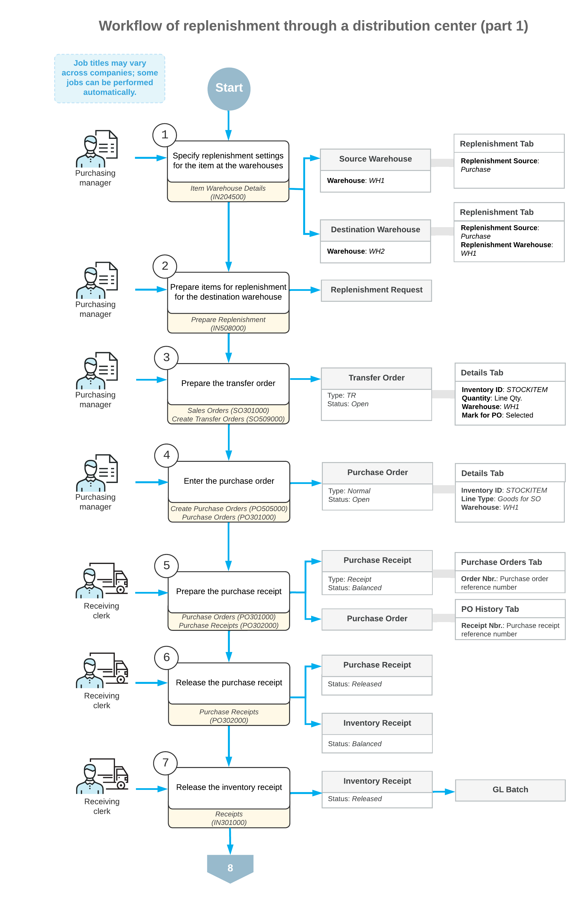
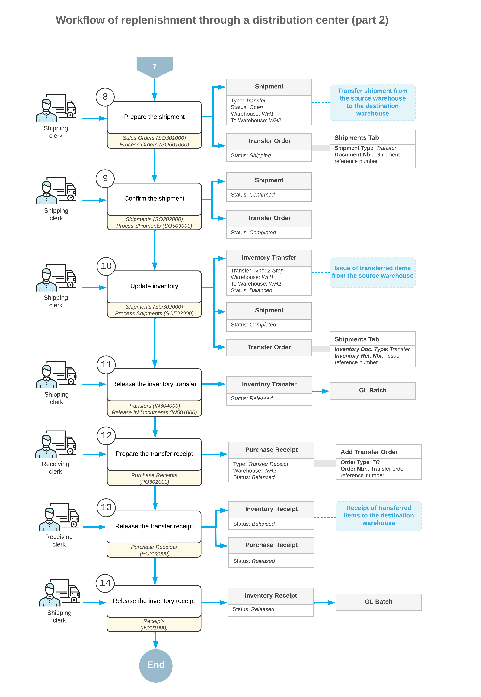

# Replenishment Through a Distribution Center: General Information {#_35b53494-2d65-4f16-a0c8-405edbcde591 .concept}

The replenishment functionality in Acumatica ERP can accommodate various ways of replenishing stock items. You can maintain a particular quantity of stock items in a destination warehouse by purchasing items that are first received at a source warehouse and then transferred to the destination warehouse. The company may use this source warehouse as a distribution center.

## Learning Objectives { .section}

In this chapter, you will do the following:

-   Become familiar with the general workflow of item replenishment through a distribution center
-   Replenish stock by transferring items from a distribution center to the destination warehouse

## Applicable Scenario { .section}

You perform replenishment through a warehouse that functions as a distribution center if your company performs consolidated purchasing to this warehouse and other warehouses are replenished from the distribution center.

## Replenishment Through a Distribution Center in Acumatica ERP { .section}

You can use the functionality of replenishment through a distribution center if the *Inventory Replenishment* and *Multiple Warehouses* features are enabled on the [Enable/Disable Features](CS_10_00_00.md) \(CS100000\) form.

In Acumatica ERP, if your company has multiple warehouses, you can configure replenishment for multiple warehouses by performing centralized purchasing to a distribution center. This distribution center is then the source warehouse for transfers to destination warehouses.

On the [Prepare Replenishment](IN_50_80_00.md) \(IN508000\) form, you can view the list of stock items that require replenishment. A stock item is listed on the form if for the item at the warehouse where the item is needed, the following settings are specified on the **Inventory Planning** tab of the [Item Warehouse Details](IN_20_45_00.md) \(IN204500\) form:

-   **Reorder Point**: The stock level that prompts the system to replenish the stock of the item at this warehouse when the available quantity is below the reorder point specified for this item at this warehouse.
-   **Replenishment Source**: *Purchase*.
-   **Replenishment Warehouse**: The warehouse that functions as a distribution center.

For details about the configuration of replenishment and the calculation of replenishment parameters, see [Replenishment for Stock Items](../ImplementationGuide/config_OrderMgmt_Replenishment_Mapref.md).

On the [Prepare Replenishment](IN_50_80_00.md) form, the quantity to process is calculated in the base unit of measure \(UOM\). On the [Create Purchase Orders](PO_50_50_00.md) \(IN505000\) and [Create Transfer Orders](SO_50_90_00.md) \(SO509000\) forms, the quantity specified in the **Quantity** column is recalculated in the purchase UOM and displayed in the **UOM** column. For example, if ten stock items should be purchased in one box, then the quantity of ten UOMs is converted to one box to be purchased.

## General Steps of Replenishment Through a Distribution Center { .section}

To replenish stock items by purchasing items that are first received at a distribution center and transferring the items to the destination warehouse, you perform the following general steps:

1.  On the **Inventory Planning** tab of the [Item Warehouse Details](IN_20_45_00.md) \(IN204500\) form, for the stock items in the distribution center, you select *Purchase* as the replenishment source; you do not specify a replenishment warehouse. For the stock items in the destination warehouses \(which should be replenished through purchasing to a distribution center\), you specify *Purchase* as the replenishment source and select the distribution center as the replenishment warehouse.
2.  For the source warehouses, you process the needed stock items that require replenishment: On the [Prepare Replenishment](IN_50_80_00.md) \(IN508000\) form, which lists the stock items that require replenishment, you process all stock items or only those you select.
3.  You generate transfer orders requesting replenishment by using the [Create Transfer Orders](SO_50_90_00.md) \(SO509000\) form. These orders will move the products from the replenishment warehouse to the warehouse in which you need to replenish the item. When you generate the transfer orders, for the orders of the *TR* type on the **Details** tab of the [Sales Orders](SO_30_10_00.md) \(SO301000\) form, the system selects the **Mark for PO** check box for each row.
4.  You generate purchase orders by using the [Create Purchase Orders](PO_50_50_00.md) \(PO505000\) form. The system will create a purchase order for the source warehouse, which you can work with on the [Purchase Orders](PO_30_10_00.md) \(PO301000\) form.
5.  You create and release the following documents to reflect the receipt of the purchased items in the source warehouse:
    -   The purchase receipt on the [Purchase Receipts](PO_30_20_00.md) \(PO302000\) form
    -   The inventory receipt on the [Receipts](IN_30_10_00.md) \(IN301000\) form
6.  By using the [Sales Orders](SO_30_10_00.md) form as a starting point, you create the shipment from the transfer order that you have created. On the [Shipments](SO_30_20_00.md) \(SO302000\) form, you confirm the shipment and update the inventory.
7.  You receive the stock items in the destination warehouse as follows:
    1.  You create and release a transfer receipt on the [Purchase Receipts](PO_30_20_00.md) form.
    2.  The system creates and releases the related inventory receipt on the [Receipts](IN_30_10_00.md) form.

## Workflow of Replenishment Through a Distribution Center {#section_vv2_1y4_y4b .section}

A general workflow of replenishment by purchase though a distribution center involves the steps and generated documents shown in the following diagrams.

**Parent topic:**[Replenishing Inventory Through a Distribution Center](../UserGuide/OrderMgmt_Replenishment_thru_DistrCenter_Mapref.md)

