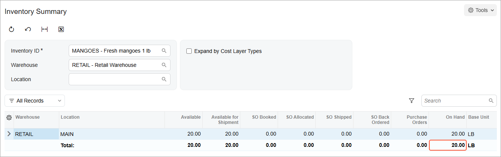

# Replenishment Through a Distribution Center: Process Activity {#_4c175555-2d87-4317-9b36-095522afc91f .task}

The following activity demonstrates how to prepare and perform the replenishment of goods through a distribution center.

**Attention:** This activity is based on the *U100* dataset. If you are using another dataset or if any system settings have been changed in *U100*, these changes can affect the workflow of the activity and the results of the processing. To avoid issues, restore the *U100* dataset to its initial state.

## Story { .section}

Suppose that you are Matt Parker, a purchasing manager at the SweetLife Fruits &amp; Jams company. The SweetLife Store branch regularly receives small orders for mangoes from a customer. To fill your stock, you order mangoes from the Glory Fruit Case vendor by using the replenishment functionality.

In the SweetLife company, fruits are delivered to the Wholesale warehouse, which serves as a distribution center for the other warehouses. To make sure that mangoes are allocated for the Retail warehouse, you will purchase mangoes to the Wholesale warehouse and then transfer the fruits from the Wholesale warehouse to the Retail warehouse.

## Configuration Overview {#section_tz4_djx_cnb .section}

In the *U100* dataset, the following tasks have been performed to support this activity:

-   On the [Enable/Disable Features](CS_10_00_00.md) \(CS100000\) form, the following features have been enabled:
    -   *Multiple Warehouses*
    -   *Inventory Replenishment*
-   On the [Warehouses](IN_20_40_00.md) \(IN204000\) form, the *WHOLESALE* and *RETAIL* warehouses have been created.
-   On the [Stock Items](IN_20_25_00.md) \(IN202500\) form, the *MANGOES* stock item has been created.
-   On the [Order Types](SO_20_10_00.md) \(SO201000\) form, the *Transfer* \(*TR*\) order type, which can be selected on the [Sales Orders](SO_30_10_00.md) \(SO301000\) form for a transfer order, has been created.

## Process Overview { .section}

In this activity, you will do the following:

1.  On the [Stock Items](IN_20_25_00.md) \(IN202500\) form, specify the economic order quantity for the *MANGOES* stock item.
2.  On the [Item Warehouse Details](IN_20_45_00.md) \(IN204500\) form, review the replenishment settings of the *MANGOES* stock item in the *RETAIL* warehouse.
3.  Prepare replenishment for the needed stock items in the *RETAIL* warehouse on the [Prepare Replenishment](IN_50_80_00.md) \(IN508000\) form.
4.  Prepare a transfer order on the [Create Transfer Orders](SO_50_90_00.md) \(SO509000\) form.
5.  Prepare a purchase order for the vendor to the *WHOLESALE* warehouse on the [Create Purchase Orders](PO_50_50_00.md) \(PO505000\) form. On the [Purchase Orders](PO_30_10_00.md) \(PO301000\) form, you will take it off hold.
6.  Prepare and process the purchase receipt for the items in the *WHOLESALE* warehouse on the [Purchase Receipts](PO_30_20_00.md) \(PO302000\) form; the corresponding inventory receipt is automatically created on the [Receipts](IN_30_10_00.md) \(IN301000\) form and released.
7.  Prepare and process the sales order on the [Sales Orders](SO_30_10_00.md) \(SO301000\) form and the shipment on the [Shipments](SO_30_20_00.md) \(SO302000\) form to ship items from the *WHOLESALE* warehouse to the *RETAIL* warehouse.
8.  Prepare and process the purchase receipt for the items in the *RETAIL* warehouse on the [Purchase Receipts](PO_30_20_00.md) form; the corresponding inventory receipt is automatically created on the [Receipts](IN_30_10_00.md) form and released.

## System Preparation { .section}

Before you start preparing and performing replenishment through a distribution center, you should do the following:

1.  Launch the Acumatica ERP website, and sign in to a company with the *U100* dataset preloaded. You should sign in as purchasing manager Matt Parker with the *parker* username and the *123* password.
2.  In the info area at the upper-right corner of the top pane of the Acumatica ERP screen, make sure that the business date is set to *1/30/2026*. If a different date is displayed, click the Business Date menu button and select *1/30/2026* from the calendar. For simplicity, you'll create and process all documents in this activity using this business date.
3.  On the Company and Branch Selection menu, in the top pane of the Acumatica ERP screen, make sure the *SweetLife Head Office and Wholesale Center* branch is selected.

## Step 1: Specifying the Economic Order Quantity for the Stock Item { .section}

To specify the economic order quantity for the *MANGOES* stock item, do the following:

1.  Open the *MANGOES* stock item on the [Stock Items](IN_20_25_00.md) \(IN202500\) form.
2.  Go to the **Vendors** tab. Notice that there is one row for the *GLORYFRUIT* vendor.
3.  In the **EOQ** column, type `20`. You will use the economic order quantity as the fixed quantity. SweetLife's warehouse specialists have determined this quantity of the *MANGOES* item by estimating the cost of ordering mangoes from the Glory Fruit Case vendor.
4.  On the form toolbar, click **Save**.

For the *MANGOES* stock item, the *Fixed Reorder Quantity* replenishment method is used in the *RETAIL* warehouse. Based on this quantity, a request for replenishment for the same quantity can be generated on the [Prepare Replenishment](IN_50_80_00.md) \(IN508000\) form.

## Step 2: Reviewing the Replenishment Settings of the Item-Warehouse Pair { .section}

To review the replenishment settings of the *MANGOES* stock item in the *RETAIL* warehouse, do the following:

1.  Open the [Item Warehouse Details](IN_20_45_00.md) \(IN204500\) form.
2.  In the Summary area, specify the following settings:
    -   **Inventory ID**: *MANGOES*
    -   **Warehouse**: *RETAIL*
3.  On the **Inventory Planning** tab, make sure that the following settings are specified:

    -   **Override Replenishment Settings**: Selected
    -   **Seasonality**: *NONE*
    -   **Replenishment Source**: *Purchase*
    -   **Replenishment Method**: *Fixed Reorder Qty*
    -   **Replenishment Warehouse**: *WHOLESALE*
    -   **Reorder Point**: *10*
    -   **EOQ**: *20*
    With these settings, you replenish mangoes in the *RETAIL* warehouse by purchasing the item through the *WHOLESALE* warehouse. The *MANGOES* item appears in the list of items for replenishment on the [Prepare Replenishment](IN_50_80_00.md) \(IN508000\) form when you have 10 pounds \(which is the base unit of measure for this item\) or less of the item in the available stock. Also, 20 pounds of mangoes will be used as the fixed quantity for the calculation of replenishment parameters in the *RETAIL* warehouse.

## Step 3: Preparing the Replenishment { .section}

To prepare the replenishment for mangoes in the *RETAIL* warehouse, do the following:

1.  Open the [Prepare Replenishment](IN_50_80_00.md) \(IN508000\) form.
2.  In the Selection area, specify the following settings:

    -   **Warehouse**: *RETAIL*
    -   **Purchase Date**: *1/30/2026*
    -   **Me**: Cleared
    -   **Only Suggested Items**: Selected

        With this setting, only items that require replenishment are displayed.

    The table shows the items pending replenishment in the *SweetLife Head Office and Wholesale Center* branch, to which you are signed in.

3.  In the row for the *MANGOES* stock item, review the following settings:
    -   **Qty. to Process**: *20*
    -   **Replenishment Source**: *Purchase*
    -   **Source Warehouse** \(replenishment warehouse\): *WHOLESALE*
    -   **Preferred Vendor ID**: *GLORYFRUIT*
4.  In this row, select the check box in the unlabeled column.
5.  On the form toolbar, click **Process**. The **Processing** dialog box opens, showing the progress and then the results of the processing. The system generates a replenishment request for the *MANGOES* stock item and adds the request to the [Create Transfer Orders](SO_50_90_00.md) \(SO509000\) form.
6.  Click **Close** to close the **Processing** dialog box.

    Notice that the row for the *MANGOES* stock item is no longer displayed in the table.

Now you can create a transfer order.

## Step 4: Creating the Transfer Order { .section}

To create a transfer order for the 20 pounds of mangoes, do the following:

1.  On the [Create Transfer Orders](SO_50_90_00.md) \(SO509000\) form, in the row with the *IN Replanned* plan type and the *MANGOES* stock item, select the check box in the unlabeled column.
2.  On the form toolbar, click **Process**.

    The system creates a transfer order for 20 pounds of mangoes and opens it on the [Sales Orders](SO_30_10_00.md) \(SO301000\) form. Notice that the status of the order is *Open*. In the table footer, you can see that the *On Hand* quantity of mangoes is *0*. This means that you cannot ship mangoes from the *WHOLESALE* warehouse yet because the item is not in stock and needs to be purchased.

3.  On the **Details** tab, for the *MANGOES* line, make sure that the **Mark for PO** check box is selected. This means that the order line is marked for purchasing.

## Step 5: Creating the Purchase Order { .section}

To create the purchase order to purchase mangoes from the Glory Fruit Case vendor, do the following:

1.  While you are still viewing the transfer order on the [Sales Orders](SO_30_10_00.md) \(SO301000\) form, click **Create Purchase Order** on the More menu, under **Replenishment**.
2.  On the [Create Purchase Orders](PO_50_50_00.md) \(PO505000\) form, which opens, in the row with the *SO to Purchase* plan type and the *MANGOES* stock item, select the check box in the unlabeled column.
3.  On the form toolbar, click **Process**.

    The system creates a purchase order for 20 pounds of mangoes and opens it on the [Purchase Orders](PO_30_10_00.md) \(PO301000\) form. Notice that the status of the order is *On Hold*.

4.  On the form toolbar, click **Remove Hold**. The system changes the status of the purchase order to *Open*.

Suppose that you now print the purchase order and send it to the Glory Fruit Case vendor by mail.

## Step 6: Receiving the Stock Items from the Vendor { .section}

Suppose that the Glory Fruit Case vendor has delivered the mangoes to the Wholesale warehouse. To prepare the documents to reflect the receipt of the mangoes, do the following:

1.  While you are still viewing the purchase order with 20 pounds of mangoes on the [Purchase Orders](PO_30_10_00.md) \(PO301000\) form, click **Enter PO Receipt** on the form toolbar. The system opens the [Purchase Receipts](PO_30_20_00.md) \(PO302000\) form with the new receipt. The receipt has the *Balanced* status and the data copied from the linked purchase order.
2.  On the form toolbar, click **Release**. The system creates and releases the purchase receipt. On the **Other** tab, in the **IN Ref. Nbr.** box, you can view the reference number of the created inventory receipt; you could also click the reference number link to view the inventory receipt on the [Receipts](IN_30_10_00.md) \(IN301000\) form.
3.  Open the [Inventory Summary](IN_40_10_00.md) \(IN401000\) form.
4.  In the Selection area, specify the following settings:

    1.  **Inventory ID**: *MANGOES*
    2.  **Warehouse**: *WHOLESALE*
    In the **On Hand** column, notice that the quantity of *20*, representing the 20 pounds of mangoes that you have received. In the **SO Allocated** column, notice that *20* is displayed, which means that this quantity is allocated for the sales order of the *Transfer* type to the *RETAIL* warehouse.

The mangoes are ready for shipment to the *RETAIL* warehouse.

## Step 7: Shipping the Stock Items from the Distribution Center { .section}

To prepare the documents for shipping the mangoes from the *WHOLESALE* warehouse to the *RETAIL* warehouse, do the following:

1.  On the [Sales Orders](SO_30_10_00.md) \(SO301000\) form, open the transfer order for the 20 pounds of mangoes. You prepared this transfer order in Step 4 of this activity to transfer the purchased fruits from the *WHOLESALE* warehouse to the *RETAIL* warehouse.
2.  On the form toolbar, click **Create Shipment**.
3.  In the **Specify Shipment Parameters** dialog box, which opens, make sure that the *1/30/2026* date and the *WHOLESALE* source warehouse are specified, and click **OK**. The system closes the dialog box, creates the related shipment of the *Transfer* type, and opens it on the [Shipments](SO_30_20_00.md) \(SO302000\) form.
4.  On the form toolbar, click **Confirm Shipment**.
5.  To update the inventory of the *WHOLESALE* warehouse and issue the items from the *WHOLESALE* warehouse, on the form toolbar, click **Update IN**. The system issues the mangoes from the *WHOLESALE* warehouse and changes the status of the shipment to *Completed*. On the **Orders** tab, in the **Inventory Ref. Nbr.** column, you can view the reference number of the created transfer order; if needed, you could click the link to open the transfer of the *2-Step* type on the [Transfers](IN_30_40_00.md) \(IN304000\) form.

## Step 8: Receiving the Stock Items in the Warehouse { .section}

Suppose that the *RETAIL* warehouse receives the mangoes. To update the stock, do the following:

1.  On the [Purchase Receipts](PO_30_20_00.md) \(PO302000\) form, add a new record.
2.  In the Summary area, specify the following settings:
    -   **Type**: *Transfer Receipt*
    -   **Warehouse**: *RETAIL*
3.  On the **Details** tab, do the following:
    1.  On the table toolbar, click **Add Transfer**.
    2.  In the **Add Transfer Order** dialog box, which opens, select the check box in the unlabeled column of the only row, which is for the transfer that you have processed earlier in this activity.
    3.  Click **Add &amp; Close** to add the line with the stock item to be received to the transfer receipt.
4.  On the form toolbar, click **Release**. The system releases the transfer receipt and creates and releases the related inventory receipt. On the **Other** tab, in the **IN Ref. Nbr.** box, you can view the reference number of the created inventory receipt; if needed, you could also click the reference number link to view the inventory receipt on the [Receipts](IN_30_10_00.md) \(IN301000\) form.
5.  Open the [Inventory Summary](IN_40_10_00.md) \(IN401000\) form.
6.  In the Selection area, specify the following settings:

    1.  **Inventory ID**: *MANGOES*
    2.  **Warehouse**: *RETAIL*
    Notice that in the **On Hand** column, the quantity is *20*, as shown in the following screenshot.

    

    **Tip:** If you need to change the order of columns in any table, you can drag a column by its header to the new place in the table.

Now the 20 pounds of mangoes are available for sale in the *RETAIL* warehouse.

**Parent topic:**[Replenishing Inventory Through a Distribution Center](../UserGuide/OrderMgmt_Replenishment_thru_DistrCenter_Mapref.md)

