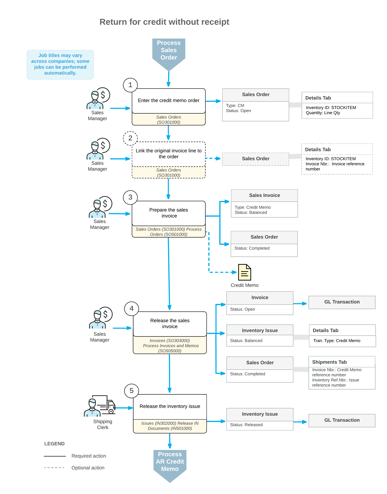

# Returns for Credit with Receipts: General Information {#_b74274c0-269c-4545-b5b5-7e8b87b41f9c .concept}

Acumatica ERP provides support for the most common types of return processes, which gives you the flexibility to manage various types of customer returns according to the return policies of your company.

Returns for credit with receipt of items are one type of returns. These returns are processed in the system as return orders of the *RC* order type. With this type, a customer returns an item, which you need to receive to inventory. You then process a credit memo to adjust the customer's balance in the system.

## Learning Objectives { .section}

In this chapter, you will do the following:

-   Create a return order that is linked to the sales order in which the returned items were sold
-   Create an incoming shipment \(receipt\) of the returned item or items, and confirm the shipment
-   Create a credit memo for the original sales order
-   Process the credit memo and the related inventory and AR documents

## Applicable Scenario { .section}

You create a return order for credit \(that is, an order with the *RC* predefined order type\) to perform a customer return for credit with the returned item or items received to inventory and the AR documents issued to adjust the customer balance in the system.

## Processing of Returned Items for Credit { .section}

The standard process of return for credit typically includes the entry of a return order, the addition of items to be returned, the processing of the receipt of the returned items to inventory, and the preparation of the related AR document to a customer.

In general, the [Sales Orders](SO_30_10_00.md) \(SO301000\) form is the starting point for the creation of a customer return. You create a new return order and add the item or items that are being returned by the customer. You can add a line and select the item to be returned without linking it to a sales document, or add a line with a reference to the original sales invoice for which the return is performed. To add an item with a link to the original sales invoice, on the [Sales Orders](SO_30_10_00.md) form, you click **Add Invoice** on the table toolbar of the **Details** tab and select the line of the needed invoice in the **Add Invoice Details** dialog box \(which opens\). If an item to be returned has a specific lot or serial number, you should select this particular item from the list of invoice lines.

The receipt of the items returned to inventory is processed in the system as an incoming shipment document with the *Receipt* operation type. After you have prepared and confirmed the document reflecting the receipt of items to inventory, you need to update the customer's balance in the amount of the returned items by preparing and releasing a credit memo \(which is a sales invoice of the *Credit Memo* type\). The credit memo is a financial document in the system that contains links to the applicable shipments and sales orders. You can review the prepared credit memo on the [Invoices](SO_30_30_00.md) \(SO303000\) form; then you can release it. When the credit memo is released, you can view it on the [Invoices and Memos](AR_30_10_00.md) \(AR301000\) form as an AR credit memo. An AR credit memo does not contain the links to the applicable shipments and sales orders. Also, the AR credit memo can be applied to the customer balance.

To finish the return process, you need to process the AR credit memo to completion. You can apply the credit memo to the original invoice, or process a customer refund if the original invoice was already paid. For details on credit memo application, see [AR Invoice Correction: General Information](Finance_CorrectingARInvoices_GeneralInfo.md). For details on the processing of a customer refund, see [Refunds: To Create a Refund and Apply a Credit Memo to It](Finance_ProcessingCustomerRefunds_Activity1.md).

## Workflow of a Return for Credit with a Receipt { .section}

The processing of a return order for credit involves the actions and generated documents shown in the following diagram.

**Parent topic:**[Processing Customer Returns for Credit with Receipts](../UserGuide/OrderMgmt_Return_for_Credit_with_Receipt_Mapref.md)

