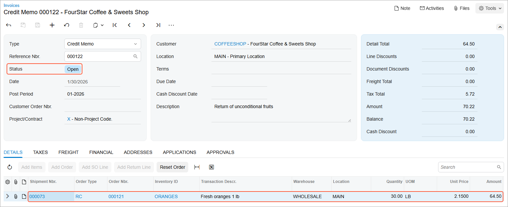

# Returns for Credit with Receipts: Process Activity {#_61e6d626-4c36-4c7b-897e-11b07a8055c2 .task}

The following activity demonstrates how to prepare and process to completion a customer return for a particular sales order with the returned item or items being received to inventory and a credit memo to the customer being created.

**Attention:** This activity is based on the *U100* dataset. If you are using another dataset or if any system settings have been changed in *U100*, these changes can affect the workflow of the activity and the results of the processing. To avoid issues, restore the *U100* dataset to its initial state.

## Story { .section}

Suppose that you are Grace Norman, a sales manager in the SweetLife Fruits &amp; Jams company. On January 30, 2026, the FourStar Coffee &amp; Sweets Shop customer requests authorization for the return of the oranges ordered on January 29, 2026, because the customer was not satisfied with the quality of the shipped fruits. You authorize the return with shipping of the returned items to SweetLife’s main warehouse. Acting as the sales manager, you need to process this return.

## Configuration Overview { .section}

In the *U100* dataset, for the purposes of this activity, the following tasks have been performed:

-   On the [Enable/Disable Features](CS_10_00_00.md) \(CS100000\) form, the following features have been enabled:
    -   *Inventory and Order Management*, which provides the standard functionality of inventory and order management
    -   *Inventory*, which gives you the ability to maintain stock items by using forms related to the inventory functionality and to create and process sales and purchase documents that include stock items
-   On the [Order Types](SO_20_10_00.md) \(SO201000\) form, the *RC* order type has been configured and activated.
-   On the [Customers](AR_30_30_00.md) \(AR303000\) form, the *COFFEESHOP \(FourStar Coffee &amp; Sweets Shop\)* customer has been defined.
-   On the [Stock Items](IN_20_25_00.md) \(IN202500\) form, the *ORANGES* and *LEMONS* stock items have been created.
-   On the [Invoices](SO_30_30_00.md) \(SO303000\) form, an invoice for the *COFFEESHOP* customer has been created that has the *ORANGES* and *LEMONS* stock items and is dated *1/29/2026*.
-   The following sales documents, for which you will process a return, have been created:
    -   On the [Sales Orders](SO_30_10_00.md) \(SO301000\) form, a sales order for the *COFFEESHOP* customer dated *1/29/2026*
    -   On the [Shipments](SO_30_20_00.md) \(SO302000\) form, a shipment for the *COFFEESHOP* customer dated *1/29/2026*

## Process Overview { .section}

To process a return for credit with a receipt, you will create a return order of the *RC* type on the [Sales Orders](SO_30_10_00.md) \(SO301000\) form, and add to it the line or lines of the sales invoice that has been prepared for the sales order for which you need to process a return. Then you will receive the returned items to inventory on the [Shipments](SO_30_20_00.md) \(SO302000\) form by creating a shipment with the *Receipt* operation and confirming it. After the items have been received to inventory, you will create a credit memo to decrease the customer's debt in the system by the amount of the returned items. Finally, after reviewing the details of the prepared credit memo on the [Invoices](SO_30_30_00.md) \(SO303000\) form, you will release it.

## System Preparation { .section}

Before you start preparing and processing the customer return, you should do the following:

1.  Launch the Acumatica ERP website with the *U100* dataset preloaded, and sign in as sales manager Grace Norman by using the *norman* username and the *123* password.
2.  In the info area at the upper-right corner of the top pane of the Acumatica ERP screen, make sure that the business date is set to *1/30/2026*. If a different date is displayed, click the Business Date menu button and select *1/30/2026* from the calendar. For simplicity, you'll create and process all documents in this activity using this business date.
3.  On the Company and Branch Selection menu, in the top pane of the Acumatica ERP screen, make sure the *SweetLife Head Office and Wholesale Center* branch is selected.

## Step 1: Creating a Return Order { .section}

To create a return order, do the following:

1.  On the [Sales Orders](SO_30_10_00.md) \(SO301000\) form, add a new record.

    **Tip:** To open the form for creating a new record, type the form ID in the Search box, and on the Search form, point at the form title and click **New** right of the title.

2.  In the Summary area, specify the following settings:
    -   **Order Type**: *RC*
    -   **Customer**: *COFFEESHOP*
    -   **Date**: *1/30/2026*
    -   **Requested On**: *1/30/2026*
    -   **Description**: `Return of unconditional fruits`
3.  On the form toolbar, click **Save**.

## Step 2: Adding the Item to Be Returned { .section}

To add the invoice line with the *SO* type to the return order, do the following:

1.  While you are still viewing the return order on the [Sales Orders](SO_30_10_00.md) \(SO301000\) form, on the table toolbar of the **Details** tab, click **Add Invoice**.
2.  In the **Add Invoice Details** dialog box, which opens, do the following:
    1.  In the **AR Doc. Type** box, select *Invoice*.
    2.  In the **AR Doc. Nbr.** box, select the reference number of the invoice to *COFFEESHOP* dated *1/29/2026*. The invoice lines appear in the table of the dialog box.
    3.  In the table, select the unlabeled check box in the *ORANGES* line.
    4.  Click **Add &amp; Close**, which closes the dialog box and adds the line to the **Details** tab of the return order.
3.  Review the details of the added line, and make sure that the related invoice reference number is specified in the **Invoice Nbr.** column.
4.  On the form toolbar, click **Save**.

## Step 3: Receiving the Returned Items { .section}

To process the receipt of items to inventory, do the following:

1.  While you are still viewing the return order on the [Sales Orders](SO_30_10_00.md) \(SO301000\) form, on the form toolbar, click **Create Receipt** to create a receipt of the returned items.
2.  In the **Specify Shipment Parameters** dialog box, which opens, make sure that *1/30/2026* is selected as the **Shipment Date** and *WHOLESALE* is selected as the **Warehouse ID**.
3.  Click **OK**. The system closes the dialog box and opens the prepared shipment with the *Receipt* operation on the [Shipments](SO_30_20_00.md) \(SO302000\) form.
4.  On the form toolbar, click **Confirm Shipment**.

## Step 4: Processing a Credit Memo { .section}

To prepare a credit memo to the customer to adjust the customer's balance, do the following:

1.  While you are still viewing the shipment on the [Shipments](SO_30_20_00.md) \(SO302000\) form, on the form toolbar, click **Prepare Invoice**. Wait for the system to complete the operation. The system creates a credit memo to the customer and opens it on the [Invoices](SO_30_30_00.md) \(SO303000\) form.
2.  In the Summary area, make sure that the **Date** is set to *1/30/2026*.
3.  On the form toolbar, click **Release** to release the credit memo, which is assigned the *Open* status, as shown in the following screenshot.

    

You have completely processed the customer return.

## Activity Recap { .section}

In this activity, we have illustrated how the sales manager has done the following:

1.  Created a return order of the *RC* type and has added the items the customer is returning
2.  Created and confirmed a shipment with the *Receipt* operation type
3.  Prepared and released a credit memo to adjust the customer’s balance

**Parent topic:**[Processing Customer Returns for Credit with Receipts](../UserGuide/OrderMgmt_Return_for_Credit_with_Receipt_Mapref.md)

