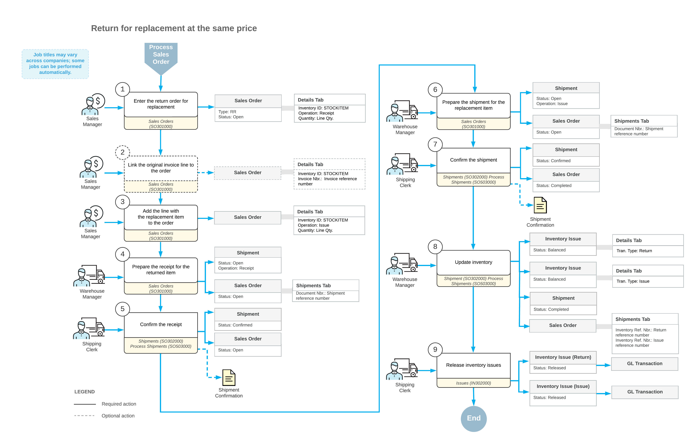

# Returns for Replacement at the Same Price: General Information {#_7debbe6b-07d8-4161-905c-bcc9fbb8f7bf .concept}

Acumatica ERP provides support for the most common types of return processes, which gives you the flexibility to manage various types of customer returns according to the return policies of your company.

Returns for replacement at the same price are one type of returns. These returns are processed in the system as return orders of the *RR* \(*Return with Replacement*\) order type. With this type, a customer returns an item and requests that the item be replaced with the same or another item at exactly the same price, so that you do not need to process an invoice or a credit memo. Return orders of the *RR* type may involve the exact replacement of a single item or multiple items.

## Learning Objectives { .section}

In this chapter, you will do the following:

-   Create a return order that is linked to the invoice that was used to record the sale of the returned items
-   Create an incoming shipment \(receipt\) of the returned items, and confirm the shipment
-   Create a shipment of the replacement items to the customer
-   Update inventory to reflect the replacement of the returned items

## Applicable Scenario { .section}

You create a return for replacement at the same price \(that is, an order with the *RR* predefined order type\) to perform a customer return in which the customer receives an exact replacement of a particular item or specific items. The exact replacement is the replacement of the same items at the same price. The customer returns the rejected goods, the goods are returned to inventory, and the customer receives a replacement for the rejected goods. Since the items are replaced at exactly the same price, you do not need to process any AR documents.

## Processing of Returned Items for Replacement { .section}

The standard process of return for replacement at the same price typically includes the following steps:

-   The entry of an order of the *RR* type
-   The addition of the items to be returned and the items to be shipped for replacement
-   The processing of the receipt of the returned items to inventory
-   The processing of a shipment of replacement items to the customer
-   The updating of the inventory

In general, the [Sales Orders](SO_30_10_00.md) \(SO301000\) form is the starting point for the creation of a customer return. You create a new order of the *RR* type and add the item or items that the customer has returned. You can add an item to be returned without linking it to a sales document, or add a line with a reference to the original sales invoice for which you perform the return. To add the item to be returned with a link to the original sales invoice, on the [Sales Orders](SO_30_10_00.md) form, you click **Add Invoice** on the table toolbar of the **Details** tab and select the line of the needed invoice in the **Add Invoice Details** dialog box, which opens.

A line corresponding to an item being returned \(whether or not it is linked to a sales invoice\) has the *Receipt* operation specified in the **Operation** column. Because this is an order of the *RR* type, each return line should have a corresponding replacement line: a line with the *Issue* operation type for a replacement item. If the item in a line with the *Receipt* operation is not tracked by serial or lot numbers, you can select the **Auto-Create Issue** check box for the line so that the system will automatically add the corresponding replacement line when you confirm the receipt of the returned items.

If an item to be returned has a specific lot or serial number, you should select this particular item \(with its lot or serial number\) from the list of invoice lines. For the items to be returned that are lot- or serial- tracked, you must clear the **Auto Create Issue** check box for the return line. Instead, you add the replacement line manually.

After you have specified the details in the *RR* order, you need to create and confirm two documents: a receipt of returned items \(also referred to as an *incoming shipment*\) and a shipment of replacement items to customer. To create a receipt, on the More menu of the [Sales Orders](SO_30_10_00.md) form, you click **Create Receipt**. To create a shipment, on the More menu of the [Sales Orders](SO_30_10_00.md) form, you click **Create Shipment**. You create the incoming shipment for the return of items on the [Shipments](SO_30_20_00.md) \(SO302000\) form and confirm it by clicking **Confirm Shipment**. Then you create the outgoing shipment for the replacement of items; you also review and confirm the shipment.

You can update the inventory for each shipment separately by opening the shipment on the [Shipments](SO_30_20_00.md) form and clicking **Update IN** on the More menu; this causes the system to generate the appropriate inventory transaction and to update the item availability data. On release of the inventory documents, batches of GL transactions are generated.

Sales invoices are not generated for an *RR* order because the returned item is replaced with another item at the same price.

## Workflow of a Return for Replacement at the Same Price { .section}

The processing of a return for replacement at the same price involves the actions and generated documents shown in the following diagram.

**Parent topic:**[Processing Customer Returns for Replacement at the Same Price](../UserGuide/OrderMgmt_Return_for_Replacement_Same_Price_Mapref.md)

