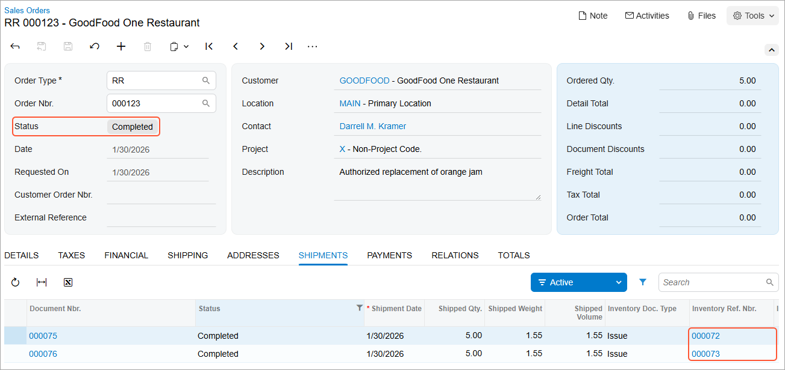

# Returns for Replacement at the Same Price: Process Activity {#_708b8baf-3306-4ff1-976c-c687bb033482 .task}

The following activity demonstrates how to prepare and process to completion a customer return of items with the exact replacement of items \(that is, with the same items for the same price\), which does not require an invoice to be processed.

**Attention:** This activity is based on the *U100* dataset. If you are using another dataset or if any system settings have been changed in *U100*, these changes can affect the workflow of the activity and the results of the processing. To avoid issues, restore the *U100* dataset to its initial state.

## Story { .section}

Suppose that you are Grace Norman, a sales manager in the SweetLife Fruits &amp; Jams company. On January 30, 2026, the GoodFood One Restaurant customer asks for the replacement of five small jars of orange jam \(ordered on January 25, 2026\) with the same number of the same jam jars because the lids appeared to be dented. The returned jars must be temporarily placed to inventory so that the quality assurance would assess them to track the source of the damage. You authorize the return.

Acting as the sales manager, you need to process the return of items to inventory with shipping the exact replacement of the returned items to the customer.

## Configuration Overview { .section}

In the *U100* dataset, for the purposes of this activity, the following tasks have been performed:

-   On the [Enable/Disable Features](CS_10_00_00.md) \(CS100000\) form, the following features have been enabled:
    -   *Inventory and Order Management*, which provides the standard functionality of inventory and order management
    -   *Inventory*, which gives you the ability to maintain stock items by using forms related to the inventory functionality and to create and process sales and purchase documents that include stock items
-   On the [Sales Orders Preferences](SO_10_10_00.md) \(SO101000\) form, the **Automatically Release IN Documents** check box has been selected.
-   On the [Order Types](SO_20_10_00.md) \(SO201000\) form, the *RR* order type has been configured and activated.
-   On the [Customers](AR_30_30_00.md) \(AR303000\) form, the *GOODFOOD \(GoodFood One Restaurant\)* customer has been defined.
-   On the [Stock Items](IN_20_25_00.md) \(IN202500\) form, the *ORJAM08* and *APJAM08* stock items have been created.
-   The following sales documents, for which you will process a return, have been created:
    -   On the [Sales Orders](SO_30_10_00.md) \(SO301000\) form, the sales order for the *GOODFOOD* customer that includes the *ORJAM08* and *APJAM08* stock items and is dated *1/25/2026*
    -   On the [Invoices](SO_30_30_00.md) \(SO303000\) form, the invoice for the *GOODFOOD* customer has been created in the amount of $201.74.
    -   On the [Shipments](SO_30_20_00.md) \(SO302000\) form, the shipment to the *GOODFOOD* customer that includes the *ORJAM08* and *APJAM08* stock items and is dated *1/25/2026*

## Process Overview { .section}

To process a customer return with an exact replacement, you will create an order of the *RR* \(*Return with Replacement*\) type on the [Sales Orders](SO_30_10_00.md) \(SO301000\) form, and add to it the line or lines of the sales invoice that has been prepared for the sales order for which you need to process a return. You will receive the returned items to inventory by creating a shipment with the *Receipt* operation. Then you will process another shipment to record the delivery of the replacement items to the customer. Because the returned and replacement items have the same price, you will not need to process any accounts receivable documents.

Finally, you will update the inventory by using the **Update IN** command on the [Process Shipments](SO_50_30_00.md) \(SO503000\) form; this action generates inventory documents that record the receiving and issuing of the items in this order.

## System Preparation { .section}

Before you start preparing and processing the customer return for replacement at the same price, do the following:

1.  Launch the Acumatica ERP website, and sign in as a sales manager Grace Norman by using the *norman* username and the *123* password.
2.  In the info area at the upper-right corner of the top pane of the Acumatica ERP screen, make sure that the business date is set to *1/30/2026*. If a different date is displayed, click the Business Date menu button and select *1/30/2026* from the calendar. For simplicity, you'll create and process all documents in this activity using this business date.
3.  On the Company and Branch Selection menu, in the top pane of the Acumatica ERP screen, make sure the *SweetLife Head Office and Wholesale Center* branch is selected.

## Step 1: Creating a Return Order of the RR Type { .section}

To create a return order of the *RR* \(*Return with Replacement*\) type, do the following:

1.  On the [Sales Orders](SO_30_10_00.md) \(SO301000\) form, add a new record.

    **Tip:** To open the form for creating a new record, type the form ID in the Search box, and on the Search form, point at the form title and click **New** right of the title.

2.  In the Summary area, specify the following settings:
    -   **Order Type**: *RR*
    -   **Customer**: *GOODFOOD*
    -   **Date**: *1/30/2026*
    -   **Requested On**: *1/30/2026*
    -   **Description**: `Authorized replacement of orange jam`
3.  On the form toolbar, click **Save**.

You have created a sales order of the *RR* type, but have not added lines to it. Now you can add to the return order the line of the sales invoice that had been prepared for the sales order for which you need to process a return.

## Step 2: Adding the Items to Be Returned { .section}

To add the line of the sales invoice to return order for which you need to process a return, do the following:

1.  While you are still viewing the return order on the [Sales Orders](SO_30_10_00.md) \(SO301000\) form, on the table toolbar of the **Details** tab, click **Add Invoice**.
2.  In the **Add Invoice Details** dialog box, which opens, do the following:
    1.  In the **AR Doc. Type** box, select *Invoice*.
    2.  In the **AR Doc. Nbr.** box, select the reference number of the invoice to *GOODFOOD* in the amount of *201.74* dated *1/25/2026*. The invoice lines appear in the table of the dialog box.
    3.  In the table, select the unlabeled check box in the *ORJAM08* line.
    4.  Click **Add &amp; Close**, which closes the dialog box and adds the line to the **Details** tab.
3.  Review the details of the added line, and make sure that the related invoice reference number is specified in the **Invoice Nbr.** column.
4.  In the line, change **Quantity** to `5`, which is the number of jars to be replaced.
5.  Also, in the line, make sure that the **Auto Create Issue** check box is selected. With this check box selected, the line with the item for replacement will be created and added automatically to the return order on receipt confirmation.
6.  On the form toolbar, click **Save**. Notice that the return order has the *Open* status.

## Step 3: Receiving the Returned Items { .section}

To process the receipt of items to inventory, do the following:

1.  While you are still viewing the return order on the [Sales Orders](SO_30_10_00.md) \(SO301000\) form, on the form toolbar, click **Create Receipt** to create a receipt of returned items.
2.  In the **Specify Shipment Parameters** dialog box, which opens, make sure that *1/30/2026* is selected as the **Shipment Date** and *WHOLESALE* is specified in the **Warehouse ID** box.
3.  Click **OK**. Wait for the system to complete the operation. The system closes the dialog box and opens the prepared shipment with the *Receipt* operation on the [Shipments](SO_30_20_00.md) \(SO302000\) form.
4.  On the form toolbar, click **Confirm Shipment** to confirm the receipt of the returned items.

Now you can process the shipping of the items replacement to the customer.

## Step 4: Shipping the Replacement Items { .section}

To process the shipping of the items replacement to the customer, do the following:

1.  Open the *RR* order that you have prepared on the [Sales Orders](SO_30_10_00.md) \(SO301000\) form and review it. On the **Details** tab, notice that the line with the replacement item has been added automatically when you confirmed the receipt of the returned items. The line has the same inventory item and unit price as the item that had been returned. Also, it has *Issue* in the **Operation** column, and a negative quantity in the **Quantity** column.
2.  On the form toolbar, click **Create Shipment** to create a shipment of the replacement item to the customer.
3.  In the **Specify Shipment Parameters** dialog box, which opens, make sure that *1/30/2026* is selected in the **Shipment Date** box and *WHOLESALE* is specified in the **Warehouse ID** box. Click **OK**. Wait for the system to complete the operation. The system opens the prepared shipment with the *Issue* operation on the [Shipments](SO_30_20_00.md) \(SO302000\) form.
4.  On the **Details** tab, in the only line, specify *Main* in the **Location** column.
5.  On the form toolbar, click **Confirm Shipment**.

The replacement item has the same price and quantity, so no invoice to the customer is required. To record the movement of items and complete the process, you need to update the inventory.

## Step 5: Updating Inventory { .section}

To update the inventory, do the following:

1.  Open the [Process Shipments](SO_50_30_00.md) \(SO503000\) form.
2.  In the **Action** box, select *Update IN*.
3.  In the **End Date** box, specify *1/30/2026*.
4.  In the table, select the unlabeled check boxes next to the lines with two confirmed shipments to the *GOODFOOD* customer that you have prepared earlier in this activity.
5.  On the form toolbar, click **Process**. The **Processing** dialog box opens. Wait for the system to complete the operation. Close the dialog box. The table no longer lists any lines with shipments. For the selected shipment lines, the system generates two inventory issues: an issue with the *Return* transaction type for the receipt, and an issue with the *Issue* transaction type for the shipment of the replacement item.
6.  Open the order of the *RR* type that you have prepared on the [Sales Orders](SO_30_10_00.md) \(SO301000\) form and review the return order. The return order now has the *Completed* status, as you can see in the following screenshot. On the **Shipments** tab, make sure that the reference numbers of the issues generated for both the receipt and the shipment are shown in the **Inventory Ref. Nbr.** column \(also shown in the following screenshot\), which indicates that the corresponding inventory documents have been generated.

    

7.  Click the link in the **Inventory Ref Nbr.** column in the first line. On the [Issues](IN_30_20_00.md) \(IN302000\) form, which opens in a pop-up window, make sure that the issue has the *Released* status. Close the issue.
8.  Click the link in the **Inventory Ref Nbr.** column in the second line. On the [Issues](IN_30_20_00.md) form, which opens in a pop-up window, make sure that the issue has the *Released* status. Close the issue.

The customer return with replacement for the same price is now complete.

## Activity Recap { .section}

In this activity, we have illustrated how the sales manager has done the following:

1.  Created a return order of the *RR* type and has added the items the customer is returning
2.  Created and confirmed a shipment with the *Receipt* operation type
3.  Created and confirmed a shipment of the replacement items to the customer
4.  Updated the inventory to reflect the movement of received and issued items

**Parent topic:**[Processing Customer Returns for Replacement at the Same Price](../UserGuide/OrderMgmt_Return_for_Replacement_Same_Price_Mapref.md)

