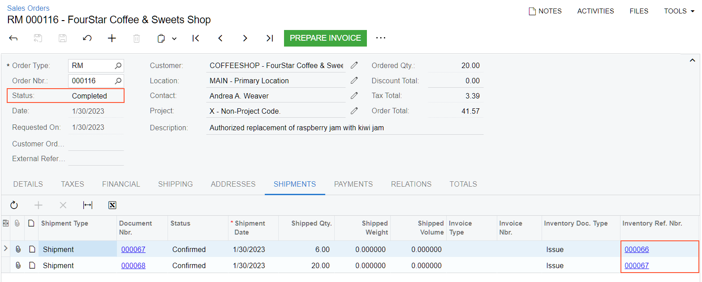

# Returns for Replacement at Another Price: Process Activity {#_e8eb64df-a85c-4bb3-8d38-bacde3e281dd .task}

The following activity demonstrates how to prepare and process to completion a customer return of items with the replacement of items that differ from those that are returned. Because the replacement items have a higher price, you also need to process an invoice.

**Attention:** This activity is based on the *U100* dataset. If you are using another dataset or if any system settings have been changed in *U100*, these changes can affect the workflow of the activity and the results of the processing. To avoid issues, restore the *U100* dataset to its initial state.

## Story { .section}

Suppose that you are Grace Norman, a sales manager in the SweetLife Fruits &amp; Jams company. On January 20, 2023, the FourStar Coffee &amp; Sweets Shop customer ordered 12 medium jars of raspberry jam and 10 medium jars of strawberry jam. On January 30, 2026, the customer asks for the replacement of 6 jars of raspberry jam with 20 small jars of kiwi jam. You authorize the return.

## Configuration Overview {#section_tz4_djx_cnb .section}

In the *U100* dataset, the following tasks have been performed to support this activity:

-   On the [Enable/Disable Features](CS_10_00_00.md) \(CS100000\) form, the following features have been enabled:
    -   *Inventory and Order Management*, which provides the standard functionality of inventory and order management
    -   *Inventory*, which gives you the ability to maintain stock items by using forms related to the inventory functionality and to create and process sales and purchase documents that include stock items
-   On the [Sales Orders Preferences](SO_10_10_00.md) \(SO101000\) form, the **Automatically Release IN Documents** check box has been selected.
-   On the [Order Types](SO_20_10_00.md) \(SO201000\) form, the *RM* order type has been configured and activated.
-   On the [Customers](AR_30_30_00.md) \(AR303000\) form, the *COFFEESHOP \(FourStar Coffee &amp; Sweets Shop\)* customer has been created.
-   On the [Stock Items](IN_20_25_00.md) \(IN202500\) form, the *RASPJAM32*, *STRAWJAM32*, and *KIWIJAM08* stock items have been created.
-   The following sales documents, for which you will process a return, have been created:
    -   On the [Sales Orders](SO_30_10_00.md) \(SO301000\) form, the sales order for the *COFFEESHOP* customer that includes the *RASPJAM32* and *STRAWJAM32* stock items and is dated *1/20/2026*
    -   On the [Shipments](SO_30_20_00.md) \(SO302000\) form, the shipment to the *COFFEESHOP* customer that includes the *RASPJAM32* and *STRAWJAM32* stock items and is dated *1/20/2026*
    -   On the [Invoices](SO_30_30_00.md) \(SO303000\) form, the invoice for the *COFFEESHOP* customer has been created in the amount of $127.91.

## Process Overview { .section}

To process a customer return with a replacement for another price, you will create an order of the *RM* type \(RMA order\) on the [Sales Orders](SO_30_10_00.md) \(SO301000\) form, and add to it the line of the sales invoice that has been prepared for the sales order for which you need to process a return. You will receive the returned items to inventory by creating a shipment with the *Receipt* operation. Then you will process another shipment to record the delivery of the replacement items to the customer.

You will update the inventory by using the **Update IN** command on the [Process Shipments](SO_50_30_00.md) \(SO503000\) form; this action generates inventory documents that record the receiving and issuing of the items in this order. Finally, because the returned and replacement items have different prices, you will process accounts receivable documents.

## System Preparation { .section}

Before you start preparing and processing the customer return for replacement at another price, do the following:

1.  Launch the Acumatica ERP website with the *U100* dataset preloaded, and sign in as sales manager Grace Norman by using the *norman* username and the *123* password.
2.  In the info area at the upper-right corner of the top pane of the Acumatica ERP screen, make sure that the business date is set to *1/30/2026*. If a different date is displayed, click the Business Date menu button and select *1/30/2026* from the calendar. For simplicity, you'll create and process all documents in this activity using this business date.

## Step 1: Creating an RMA Order { .section}

To create an RMA order, do the following:

1.  On the [Sales Orders](SO_30_10_00.md) \(SO301000\) form, add a new record.
2.  In the Summary area, specify the following settings:
    -   **Order Type**: *RM*
    -   **Customer**: *COFFEESHOP*
    -   **Date**: *1/30/2026*
    -   **Requested On**: *1/30/2026*
    -   **Description**: `Authorized replacement of raspberry jam with kiwi jam`
3.  On the form toolbar, click **Save**.

You have created the RMA order. Notice that the order has the *Open* status. Now you can add the line of the sales invoice that had been prepared for the sales order for which you need to process a return with replacement.

## Step 2: Adding the Items to the RMA Order { .section}

To add the line of the original sales invoice to the RMA order for which you need to process a return with replacement, do the following:

1.  While you are still viewing the *RM* order on the [Sales Orders](SO_30_10_00.md) \(SO301000\) form, on the table toolbar of the **Details** tab, click **Add Invoice**.
2.  In the **Add Invoice Details** dialog box, which opens, do the following:
    1.  In the **AR Doc. Type** box, select *Invoice*.
    2.  In the **AR Doc. Nbr.** box, select the reference number of the invoice to the *COFFEESHOP* customer in the amount of *127.91* dated *1/20/2026*. The invoice lines appear in the table of the dialog box.
    3.  In the table, select the unlabeled check box in the *RASPJAM32* line.
    4.  Click **Add &amp; Close** to add the line to the **Details** tab and close the dialog box.
3.  Review the details of the added line, and make sure that the related invoice reference number is specified in the **Invoice Nbr.** column.
4.  In the line, change **Quantity** to `-6`, which is the number of jars to be replaced.
5.  Clear the **Auto Create Issue** check box. With this check box cleared, no line with the item for replacement will be created and added to the return order on receipt confirmation.
6.  On the table toolbar of the **Details** tab, do the following:
    1.  On the table toolbar, click **Add Row**.
    2.  Specify the following settings for this row:
        -   **Inventory ID**: *KIWIJAM08*
        -   **Warehouse**: *WHOLESALE*
        -   **Order Qty.**: `20`
7.  On the form toolbar, click **Save**.

## Step 3: Receiving the Returned Items from the Customer { .section}

To process the receipt of items to inventory, do the following:

1.  While you are still viewing the RMA order on the [Sales Orders](SO_30_10_00.md) \(SO301000\) form, on the form toolbar, click **Create Receipt** to create a receipt of returned items.
2.  In the **Specify Shipment Parameters** dialog box, which opens, make sure that *1/30/2026* is selected as the **Shipment Date**and *WHOLESALE* is specified in the **Warehouse ID** box.
3.  Click **OK**. Wait for the system to complete the operation. The system closes the dialog box and opens the prepared shipment with the *Receipt* operation on the [Shipments](SO_30_20_00.md) \(SO302000\) form.
4.  On the form toolbar, click **Confirm Shipment** to confirm the receipt of the returned items from the customer.

## Step 4: Shipping the Replacement Items to the Customer { .section}

To process the shipping of the items replacement to the customer, do the following:

1.  Open the RMA order that you have prepared on the [Sales Orders](SO_30_10_00.md) \(SO301000\) form.
2.  On the form toolbar, click **Create Shipment** to create a shipment of the replacement item to the customer.
3.  In the **Specify Shipment Parameters** dialog box, which opens, make sure that *1/30/2026* is selected in the **Shipment Date** box and *WHOLESALE* is specified in the **Warehouse ID** box. Click **OK**. Wait for the system to complete the operation. The system opens the prepared shipment with the *Issue* operation on the [Shipments](SO_30_20_00.md) \(SO302000\) form.
4.  On the form toolbar, click **Confirm Shipment**.

## Step 5: Updating Inventory { .section}

To update the inventory, do the following:

1.  Open the [Process Shipments](SO_50_30_00.md) \(SO503000\) form.
2.  In the **Action** box, select *Update IN*.
3.  In the **End Date** box, specify *1/30/2026*.
4.  In the table, select the unlabeled check boxes next to the lines with two confirmed shipments to the *COFFEESHOP* customer that you have prepared earlier in this activity.
5.  On the form toolbar, click **Process**. The **Processing** dialog box opens. Wait for the system to complete the operation. Close the dialog box. The table no longer lists any lines with shipments. For the selected shipment lines, the system generates two inventory issues: an issue with the *Return* transaction type for the receipt, and an issue with the *Issue* transaction type for the shipment of the replacement item.
6.  Open the RMA order that you have earlier prepared on the [Sales Orders](SO_30_10_00.md) \(SO301000\) form and review the order. The return order now has the *Completed* status, as you can see in the following screenshot. On the **Shipments** tab, make sure that the reference numbers of the issues generated for both the receipt and the shipment are shown in the **Inventory Ref. Nbr.** column \(also shown in the following screenshot\), which indicates that the corresponding inventory documents have been generated.

    

7.  Click the link in the **Inventory Ref Nbr.** column in the first line. On the [Issues](IN_30_20_00.md) \(IN302000\) form, which opens in a pop-up window, make sure that the issue has the *Released* status. Close the issue.
8.  Click the link in the **Inventory Ref Nbr.** column in the second line. On the [Issues](IN_30_20_00.md) form, which opens in a pop-up window, make sure that the issue has the *Released* status. Close the issue.

## Step 6: Processing an Invoice for the RMA Order { .section}

To process an invoice for the RMA order, do the following:

1.  While you are still viewing the RMA order on the [Sales Orders](SO_30_10_00.md) \(SO301000\) form, on the form toolbar, click **Prepare Invoice**.
2.  On the [Invoices](SO_30_30_00.md) \(SO303000\) form, which opens, review the details of the document of the *Invoice* type.
3.  On the form toolbar, click **Release**. The invoice is assigned the *Open* status.
4.  Return to the RMA order on the [Sales Orders](SO_30_10_00.md) form. On the **Shipments** tab, notice that the links to the invoice has been inserted for each line in the **Invoice Nbr.** column.

The customer return for replacement at another price is now complete.

**Parent topic:**[Processing Customer Returns for Replacement at Another Price](../UserGuide/OrderMgmt_Returns_for_Replacement_at_Another_Price_Mapref.md)

