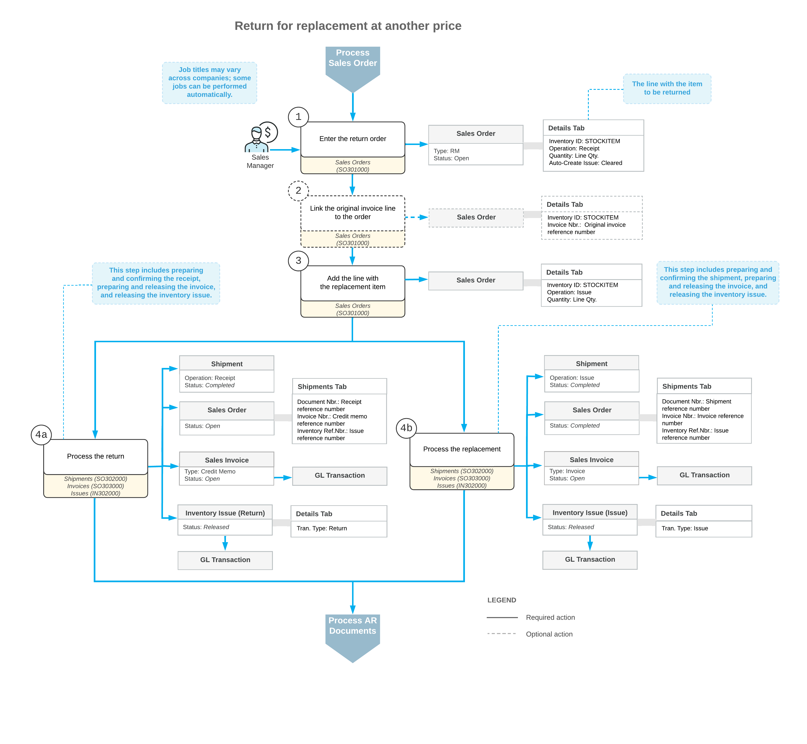

# Returns for Replacement at Another Price: General Information {#_8fbc134e-da4b-48ff-946b-e508797c5766 .concept}

Acumatica ERP supports returns of goods for replacement with goods that differ from those that are returned. The returns may include freight, shipping, and handling charges, and the goods may be returned at higher or lower prices. To process such a return, you use a return merchandise authorization \(RMA\) order, which is an order with the *RM* predefined order type.

## Learning Objectives { .section}

In this chapter, you will do the following:

-   Become familiar with the general steps involved in the workflow of processing an RMA order
-   Create an RMA order
-   Process an RMA order

## Applicable Scenario { .section}

You create a return for replacement at another price \(that is, an order of the *RM* predefined order type\) to perform a customer return in which you return an inventory item for replacement. The customer returns the rejected goods, the goods are returned to inventory, and the customer receives a replacement for the rejected goods at another price. For this RMA order, different items than those returned may be included for replacement; freight, shipping, and handling charges may be included, and the replacement items have higher or lower prices than the returned items. Because the items are replaced at a different price, you also need to process AR documents.

## General Steps of Returns for Replacement at Another Price { .section}

This section describes the general workflow of a return for replacement at another price; for simplicity, a single item is returned and replaced in this workflow.

To process a return of a stock item for replacement at another price, you perform the following general steps:

1.  On the [Sales Orders](SO_30_10_00.md) \(SO301000\) form, you create a new RMA order.
2.  Optional: On the same form, you add the item to be returned by doing either of the following:

    -   You add the stock item to be returned and include a link to the original invoice \(that is, the invoice for which the return is being performed\) by clicking **Add Invoice** on the table toolbar of the **Details** tab and selecting the line of the needed invoice in the **Add Invoice Details** dialog box, which opens. For the line, notice that by default, the *Receipt* operation is inserted in the **Operation** column, and a negative quantity is inserted in the **Quantity** column.
    -   You add the stock item to be returned without linking it to an invoice. To do this, you click **Add Items** on the table toolbar of the **Details** tab, and select the item in the **Inventory Lookup** dialog box, which opens. In this case, for the line that has the stock item, you need to specify a negative quantity in the **Quantity** column. When you do, the option in the **Operation** column will be changed to *Receipt* from *Issue* \(the default operation\).
    **Tip:** The default operation inserted for a new line on the **Details** tab of the [Sales Orders](SO_30_10_00.md) form is specified on the **Templates** tab of the [Order Types](SO_20_10_00.md) form for the sales order type.

    After you have added the *Receipt* lines, make sure that the **Auto-Create Issue** check box is cleared in these lines \(because you need to add replacement items and specify their details manually\).

3.  While you are still on the [Sales Orders](SO_30_10_00.md) form, you manually add a line with a positive quantity for the replacement item. Notice that by default, this line has the *Issue* operation. Each line with the *Receipt* operation type in an RMA order has a negative quantity, and the corresponding line with the *Issue* operation type has a positive quantity for a replacement item. Alternatively, if the returned item is not tracked by serial or lot numbers, you can select the **Auto-Create Issue** check box for the line and manually change the price; on shipment confirmation, the system will add the corresponding lines of the *Issue* type automatically and copy the line details from the lines of the *Receipt* type.
4.  You process the receipt of the returned item and the shipment of the replacement item \(both of which are processed as shipments\) by performing the following general steps \(see Items 4a and 4b in the diagram below\):
    1.  Prepare the receipt \(for return\) and the shipment \(for replacement\) by doing the following on the [Sales Orders](SO_30_10_00.md) form:

        -   To begin preparing the receipt \(that is, the incoming shipment with the *Receipt* operation type\), you click**Create Receipt** on the More menu. You enter the needed settings in the**Specify Shipment Parameters** dialog box, which opens.
        -   To begin preparing the outgoing shipment with the *Issue* operation type, you click **Create Shipment** on the form toolbar. You then enter the needed settings in the **Specify Shipment Parameters** dialog box.
        You can review the prepared shipments on the [Shipments](SO_30_20_00.md) \(SO302000\) form.

    2.  Confirm the receipt and the shipment.

        You can confirm a particular receipt or shipment by selecting it on the [Shipments](SO_30_20_00.md) form and clicking **Confirm Shipment**. When both the receipt and the shipment are confirmed, the original RMA order is assigned the *Completed* status.

    3.  Prepare the sales invoices for the receipt and the shipment by selecting the document on the [Shipments](SO_30_20_00.md) form and then clicking **Prepare Invoice** on the More menu.

        You can review the prepared documents on the [Invoices](SO_30_30_00.md) \(SO303000\) form. For the return, the system generates an invoice of the *Credit Memo* type; for the shipment, the system generates a sales invoice of the *Invoice* type.

        **Tip:** You can print an invoice by clicking **Print Invoice**, under **Printing and Emailing**, on the More menu of the [Invoices](SO_30_30_00.md) form.

    4.  Release the sales invoices. The system automatically generates the following inventory issues:

        -   The issue with the *Return* transaction type for the return
        -   The issue with the *Issue* transaction type for replacement
        Also, you can review the related AR credit memo and invoice on the [Invoices and Memos](AR_30_10_00.md) \(AR301000\) form.

    5.  Release the generated inventory issues.

        The generated inventory issues are released automatically if the **Automatically Release IN Documents** check box is selected on the [Sales Orders Preferences](SO_10_10_00.md) \(SO101000\) form. If this check box is cleared, you have to release each inventory issue manually by clicking **Release** on the form toolbar of the [Issues](IN_30_20_00.md) \(IN302000\) form. On release of each inventory issue, a batch of GL transactions is generated.

## Workflow of a Return for Replacement at Another Price {#section_vv2_1y4_y4b .section}

A general workflow of a return for replacement at another price involves the steps and generated documents shown in the following diagram.

**Parent topic:**[Processing Customer Returns for Replacement at Another Price](../UserGuide/OrderMgmt_Returns_for_Replacement_at_Another_Price_Mapref.md)

