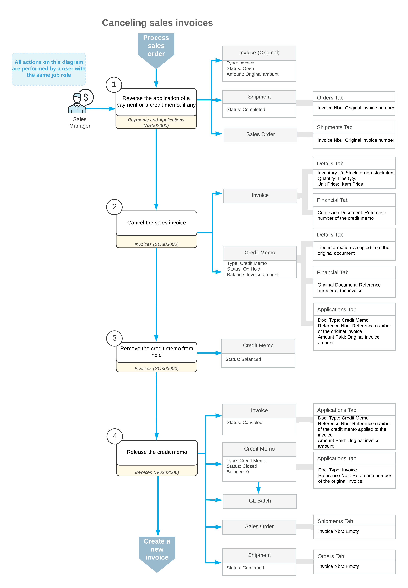

# Sales Invoice Correction: Cancellation of an Invoice {#_707e4961-915d-454f-8668-6c72773823ed .concept}

This topic explains how you can cancel a sales invoice that has been prepared for a sales order and released.

## Cancellation of a Sales Invoice { .section}

You can cancel a sales invoice on the [Invoices](SO_30_30_00.md) \(SO303000\) form if it has the *Open* status. If a payment or credit memo has been applied the sales invoice, you must first reverse the application and then cancel the invoice.

To cancel the invoice, while viewing it on the [Invoices](SO_30_30_00.md) form, you click **Cancel Invoice** on the More menu. The system creates a credit memo—the cancellation credit memo—in the full amount of the invoice being canceled, with all the settings from the original invoice copied, and displays it on the same form. In the credit memo that has been created you can change the date, posting period, and description, all of which are copied from the sales invoice being canceled.

The cancellation credit memo can be applied only to the original invoice for which it has been prepared. When you release the cancellation credit memo, the system applies it to the original invoice automatically, assigns the *Canceled* status to the original invoice, and assigns the *Closed* status to the cancellation credit memo.

When the original invoice is canceled, the system removes the links between it and the related sales orders and shipments, and assigns the related shipment the *Confirmed* status. You can now create a new sales invoice for this shipment, if needed. The inventory issue transaction related to the canceled invoice is not affected by the invoice cancellation; it is still linked to the shipment.

## Workflow of Invoice Cancellation { .section}

The following diagram illustrates the workflow related to the cancellation of a sales invoice.

**Parent topic:**[Correcting Sales Invoices](../UserGuide/OrderMgmt_SO_Invoice_Correction_Mapref.md)

