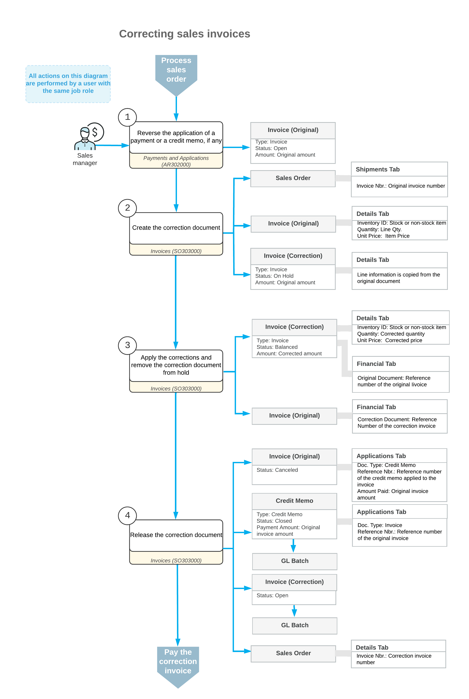

# Sales Invoice Correction: General Information {#_20e87c72-4ac9-4e40-a94f-557484c30f4e .concept}

After items have been shipped to a customer, you create and release a sales invoice, which increases the customer's debt. Once the sales invoice has been released, the settings of the invoice, including the invoice amounts, cannot be changed directly in the sales invoice.

In Acumatica ERP, there are two ways to correct a sales invoice that has been released \(which in this context is the *original invoice*\): either create correction invoice, or cancel the original sales invoice and then create a new invoice with the correct settings.

## Learning Objectives { .section}

In this chapter, you will learn how to do the following:

-   Create a correction document for a sales invoice
-   Cancel a sales invoice by creating a cancellation credit memo and applying this credit memo to it
-   Review the correction and cancellation documents
-   Review the GL transactions generated on release of correction or cancellation documents

## Applicable Scenarios { .section}

You correct sales invoices in any of the following cases:

-   You need to decrease the outstanding amount of a sales invoice because the invoice overcharged the customer, the customer reported receiving damaged goods, or the applicable taxes were calculated incorrectly.
-   You need to increase the amount of a sales invoice because of additional expenses being incurred during the delivery of the goods or services listed in the original invoice, or if the applicable taxes have been calculated incorrectly.
-   You need to cancel a sales invoice because the customer decided to negate the sale.
-   You need to cancel a sales invoice and create a new one if some significant data in the invoice needs to be changed \(for example, if you need to add more lines to this invoice\).

## Correction of a Sales Invoice { .section}

You can correct a sales invoice on the [Invoices](SO_30_30_00.md) \(SO303000\) form if it has the *Open* status. If a payment or credit memo has been applied to the sales invoice, you must first reverse the application and then correct the invoice.

To correct the sales invoice, while viewing it on the [Invoices](SO_30_30_00.md) form, you click **Correct Invoice** on the More menu. The system creates a correction invoice and displays it on the same form, with all the settings from the original invoice copied to the correction invoice. After you have made all needed changes in the correction invoice, you release it. On release of the correction invoice, the system automatically generates and releases a credit memo on the [Invoices](SO_30_30_00.md) form in the amount of the original invoice, applies it to the original invoice, and assigns the *Canceled* status to the original invoice. Also, the correction invoice is assigned the *Open* status; in the related sales order and shipment, the system replaces the links to the original invoice with the links to the correction invoice.

The following documents are involved in the process of correcting a sales invoice:

-   The original sales invoice, a document with the *Invoice* type and *Open* status.
-   The correction invoice, a document with the *Invoice* type. This document is linked to the original invoice. In the correction invoice, you can correct any settings as needed, but you cannot add new lines or remove existing lines.
-   The cancellation credit memo, a document with the *Credit Memo* type. In this document, the system uses the latest date from the original invoice or the correction invoice. If the original invoice has a non-base currency, for the credit memo, the system will insert the currency rate that is effective on this date in the Summary area of the form.

**Tip:** Although the documents are created on the [Invoices](SO_30_30_00.md) form, after they have been released, they can also be viewed on the [Invoices and Memos](AR_30_10_00.md) \(AR301000\) form.

## Workflow of Invoice Correction { .section}

The following diagram illustrates the workflow related to the correction of a sales invoice.

## Known Process Limitations { .section}

The following limitations apply to the processes of correcting and canceling sales invoices that have been created on the [Invoices](SO_30_30_00.md) \(SO303000\) form:

-   It is not possible to cancel or correct sales invoices whose credit terms \(specified in the **Terms** box of the Summary area of the form\) are multiple-installment.
-   It is not possible to cancel or correct sales invoices related to direct sales—that is, the invoices in which the stock items listed on the **Details** tab have been added directly without links to related shipments and sales orders \(in the **Shipment Nbr.** and **Order Nbr.** columns, respectively\).
-   It is not possible to cancel or correct sales invoices created for sales orders that are processed and completed without processing a shipment. For example, if an invoice is created and released for a sales order that contains only service items \(a service item is a non-stock item that has the **Require Receipt** and **Require Shipment** check boxes cleared on the **General** tab of the [Non-Stock Items](IN_20_20_00.md) \(IN202000\) form\), this invoice cannot be canceled or corrected.
-   It is not possible to reverse an application of the cancellation credit memo to a sales invoice on the **Application History** tab of the [Payments and Applications](AR_30_20_00.md) \(AP302000\) form.

**Parent topic:**[Correcting Sales Invoices](../UserGuide/OrderMgmt_SO_Invoice_Correction_Mapref.md)

