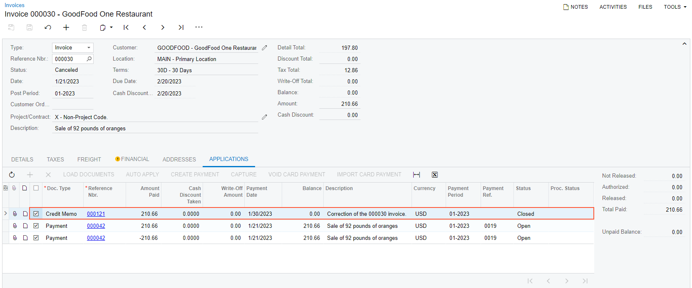

# Sales Invoice Correction: To Correct an Invoice {#_0e8aa085-4737-4b3f-9c94-2d2e7113bb2a .task}

The following activity will walk you through the process of correcting a sales invoice that was created for a sales order.

**Attention:** This activity is based on the *U100* dataset. If you are using another dataset or if any system settings have been changed in *U100*, these changes can affect the workflow of the activity and the results of the processing. To avoid issues, restore the *U100* dataset to its initial state.

## Story { .section}

Suppose that on January 21, 2026, GoodFood One Restaurant ordered 92 pounds of oranges from the main office of SweetLife. The ordered fruits were shipped from the Wholesale warehouse to the customer's location, and a sales invoice were prepared and paid. Further suppose that the customer later informed you that the price of oranges in the invoice was specified incorrectly \(the price in the invoice sent to customer was $2.15, and it should have been $1.99\). Acting as a sales manager, you need to correct the error introduced in sales documents, and prepare a correct invoice for the customer.

## Configuration Overview { .section}

In the *U100* dataset, for the purposes of this activity, the following tasks have been performed:

-   The *Inventory* feature, which provides the ability to create sales and purchase orders that include stock items, have been enabled on the [Enable/Disable Features](CS_10_00_00.md) \(CS101000\) form.
-   On the [Order Types](SO_20_10_00.md) \(SO201000\) form, the *SO* order type has been configured and activated.
-   On the [Stock Items](IN_20_25_00.md) \(IN202500\) form, the *ORANGES* stock item has been defined.
-   On the [Customers](AR_30_30_00.md) \(AR303000\) form, the *GOODFOOD \(GoodFood One Restaurant\)* customer has been defined. Additionally, the following sales documents that you need to correct have been processed in the system: a sales order for *GOODFOOD* has been created, a shipment for the sales order has been prepared and confirmed, and a sales invoice has been prepared, released, and paid in full.

## Process Overview { .section}

To be able to correct the sales invoice that was processed and paid, you will first reverse the payment application on the [Payments and Applications](AR_30_20_00.md) \(AR302000\) form. Then on the [Invoices](SO_30_30_00.md) \(SO303000\) form, you will create a correction invoice with the correct unit price and release this invoice, which will cause the system to cancel the invoice with the incorrect data and apply a credit memo to it. You will then apply the payment to the correction invoice.

## System Preparation { .section}

Do the following:

1.  Launch the Acumatica ERP website, and sign in to a company with the *U100* dataset preloaded. To sign in as a sales and purchasing manager, use the *wiley* username and the *123* password.
2.  In the info area, in the upper-right corner of the top pane of the Acumatica ERP screen, make sure that the business date in your system is set to *1/30/2026*. If a different date is displayed, click the Business Date menu button, and select *1/30/2026* on the calendar. For simplicity, in this activity, you will create and process all documents in the system on this business date.
3.  On the Company and Branch Selection menu, also on the top pane of the Acumatica ERP screen, make sure that the *SweetLife Head Office and Wholesale Center* branch is selected. If it is not selected, click the Company and Branch Selection menu to view the list of branches that you have access to, and then click *SweetLife Head Office and Wholesale Center*.

## Step 1: Reversing the Payment Application { .section}

To reverse the payment application to the sales invoice that you are going to correct, do the following:

1.  On the [Sales Orders](SO_30_10_00.md) \(SO301000\) form, open the sales order for the *GOODFOOD* customer in the amount of $210.66, dated *1/21/2026*.
2.  On the **Shipments** tab, click the link in the **Invoice Nbr.** column to open the sales invoice prepared for the sales order on the [Invoices](SO_30_30_00.md) \(SO303000\) form.

    In the Summary area of the form, notice that the sales invoice is assigned the *Closed* status because it was paid in full. You need to reverse the payment to be able to correct the invoice.

3.  On the **Applications** tab, click the link in the **Reference Nbr.** column of the only row to open the payment that was applied to invoice on the [Payments and Applications](AR_30_20_00.md) \(AR302000\) form.
4.  On the table toolbar of the **Application History** tab, click **Reverse Application**.
5.  On the form toolbar, click **Release** to release the reversal of the payment application.

    On the **Application History** tab, a reversing line for the full payment amount appears. The payment application is now reversed; the payment is assigned the *Open* status.

## Step 2: Creating the Correction Invoice { .section}

Now that you have reversed the payment, you can create the correction sales invoice as follows:

1.  While you are still viewing the payment you have reversed on the [Payments and Applications](AR_30_20_00.md) \(AR302000\) form, on the **Application History** tab, click the link in the **Reference Nbr.** column of either row to open the sales invoice on the [Invoices](SO_30_30_00.md) \(SO303000\) form. Notice that the invoice is now assigned the *Open* status.
2.  On the More menu, click **Correct Invoice**. The system creates a correction invoice and opens it on the same form.
3.  On the form toolbar, click **Save** to save the prepared invoice. The system displays a warning on the **Financial** tab indicating that the current document is a correction document.
4.  In the only line on the **Details** tab, change the **Unit Price** to `1.99`.

    **Note:** In the correction invoice, it is not allowed to change the data related to the shipment, such as inventory ID, quantity, or warehouse.

5.  On the form toolbar, click **Remove Hold**, and then click **Release**. Notice that the invoice is assigned the *Open* status.
6.  On the **Financial** tab, click the **Original Document** link to open the original invoice \(that is, the invoice that was corrected\) on the [Invoices](SO_30_30_00.md) form.
7.  On the **Applications** tab, review the line with the *Credit Memo* document type, as shown in the following screenshot. The credit memo was automatically generated when you released the correction invoice and was applied to the original document; this is why the original invoice is now assigned the *Canceled* status, as you can also see in the screenshot.

    

8.  On the [Sales Orders](SO_30_10_00.md) \(SO301000\) form, again open the sales order for the *GOODFOOD* customer in the amount of $210.66, dated *1/21/2026*. On the **Shipments** tab, notice that the reference number of the correction invoice \(and a link to this invoice\) is now shown in the **Invoice Nbr.** column.

## Step 3: Applying a Payment to Correction Document { .section}

To apply the payment to the correction sales invoice that you have created, do the following:

1.  On the [Payments and Applications](AR_30_20_00.md) \(AR302000\) form, open the payment to *GOODFOOD* in the amount of $210.66.
2.  On the **Documents to Apply** tab, add a new line with the *Invoice* type, and in the **Reference Nbr.** box, select the reference number of the correction invoice that you have created earlier in this activity.
3.  On the form toolbar, click **Release**. Due to the changed price of the oranges, the payment still has an available balance of $11.33 that can be applied to any other customer invoice \(which is shown in the **Available Balance** box in the Summary area\).
4.  On the **Application History** tab, click the reference number of the invoice to which you applied the payment \(that is, the correction invoice\), to open it on the [Invoices](SO_30_30_00.md) \(SO303000\) form. The invoice that was paid is now assigned the *Closed* status.

You have finished the process of correcting the sales invoice.

**Parent topic:**[Correcting Sales Invoices](../UserGuide/OrderMgmt_SO_Invoice_Correction_Mapref.md)

