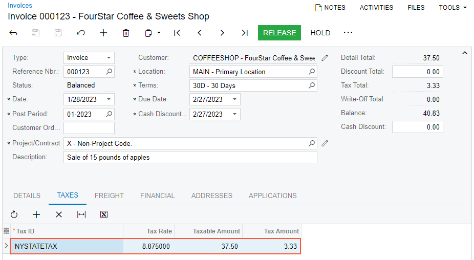

# Sales Invoice Correction: To Cancel an Invoice {#_7d1566a5-7ea9-42d1-a49f-88573fb316e4 .task}

The following activity will walk you through the process of canceling a sales invoice that was created for a sales order.

**Attention:** This activity is based on the *U100* dataset. If you are using another dataset or if any system settings have been changed in *U100*, these changes can affect the workflow of the activity and the results of the processing. To avoid issues, restore the *U100* dataset to its initial state.

## Story { .section}

Suppose that on January 28, 2026, FourStar Coffee &amp; Sweets Shop ordered 15 pounds of apples from the main office of SweetLife. The ordered fruits were shipped from the Wholesale warehouse to the customer's location, and a sales invoice was prepared. Further suppose that you later noticed that the sales taxes had not been calculated for the sales invoice because the *EXEMPT* tax category had been specified in the sales order line by mistake. Acting as a sales manager, you need to cancel the incorrect invoice and create a new one with the correct information.

## Configuration Overview { .section}

In the *U100* dataset, for the purposes of this activity, the following tasks have been performed:

-   The *Inventory* feature, which provides the ability to create sales and purchase orders that include stock items, have been enabled on the [Enable/Disable Features](CS_10_00_00.md) \(CS101000\) form.
-   On the [Order Types](SO_20_10_00.md) \(SO201000\) form, the *SO* order type has been configured and activated.
-   On the [Stock Items](IN_20_25_00.md) \(IN202500\) form, the *APPLES* stock item has been defined.
-   On the [Customers](AR_30_30_00.md) \(AR303000\) form, the *COFFEESHOP \(FourStar Coffee &amp; Sweets Shop\)* customer has been defined. Additionally, the sales documents that you need to correct have been processed in the system: a sales order to *COFFEESHOP* has been created, a shipment for the sales order has been prepared and confirmed, and a sales invoice has been prepared and released.

## Process Overview { .section}

To correct the mistake of taxes not being charged on the sales invoice on the [Invoices](SO_30_30_00.md) \(SO303000\) form, you will cancel the invoice. Then you will change the tax category in the sales order line on the [Sales Orders](SO_30_10_00.md) \(SO301000\) form, and prepare a new sales invoice for the sales order with the correct information.

## System Preparation { .section}

Do the following:

1.  Launch the Acumatica ERP website, and sign in to a company with the *U100* dataset preloaded. To sign in as a sales and purchasing manager, use the *wiley* username and the *123* password.
2.  In the info area, in the upper-right corner of the top pane of the Acumatica ERP screen, make sure that the business date in your system is set to *1/30/2026*. If a different date is displayed, click the Business Date menu button, and select *1/30/2026* on the calendar. For simplicity, in this activity, you will create and process all documents in the system on this business date.
3.  On the Company and Branch Selection menu, also on the top pane of the Acumatica ERP screen, make sure that the *SweetLife Head Office and Wholesale Center* branch is selected. If it is not selected, click the Company and Branch Selection menu to view the list of branches that you have access to, and then click *SweetLife Head Office and Wholesale Center*.

## Step 1: Canceling the Sales Invoice { .section}

To cancel the sales invoice with the incorrect tax category, do the following:

1.  On the [Sales Orders](SO_30_10_00.md) \(SO301000\) form, open the sales order for the *COFFEESHOP* customer in the amount of $37.50, dated *1/28/2026*.
2.  On the **Shipments** tab, click the **Invoice Nbr.** link to open the sales invoice on the [Invoices](SO_30_30_00.md) \(SO303000\) form.
3.  Review the **Taxes** tab. Notice that the *NYNOTAX* tax code with the 0% tax rate has been applied to the sales invoice, so the tax amount is $0.00, which is incorrect.
4.  On the More menu, click **Cancel Invoice**.

    The system creates a cancellation credit memo with the same settings as the invoice you were viewing, and opens it on the same form.

5.  On the form toolbar, click **Remove Hold**, and then click **Release**. The credit memo is assigned the *Closed* status, because it has been applied in full to the invoice.
6.  On the **Financial** tab, click the link in the **Original Document** box to open the invoice that was canceled on the [Invoices](SO_30_30_00.md) form. Notice that the invoice is now assigned the *Canceled* status.

## Step 2: Creating the New Sales invoice { .section}

To create the sales invoice with the correct tax information, do the following:

1.  On the [Sales Orders](SO_30_10_00.md) \(SO301000\) form, again open the sales order for *COFFEESHOP \(FourStar Coffee &amp; Sweets Shop\)* dated *1/28/_2026_*.
2.  On the form toolbar, click **Prepare Invoice**. The system creates the new sales invoice for the sales order and opens it on the [Invoices](SO_30_30_00.md) \(SO303000\) form.
3.  In the only line on the **Details** tab, change the tax category to *TAXABLE* and save the invoice.
4.  Review the **Taxes** tab, and make sure that the *NYSTATETAX* has been applied to the invoice and the calculated tax amount is $3.33, as shown in the following screenshot.

    

5.  On the form toolbar, click **Release** to release the invoice.
6.  On the **Details** tab, click the link in the **Order Nbr.** column in the only line to open the related sales order on the [Sales Orders](SO_30_10_00.md) form.
7.  On the **Shipments** tab, notice that the reference number of the newly created invoice is now shown in the **Invoice Nbr.** column.

You have canceled the sales invoice with incorrect data and prepared a new one.

**Parent topic:**[Correcting Sales Invoices](../UserGuide/OrderMgmt_SO_Invoice_Correction_Mapref.md)

