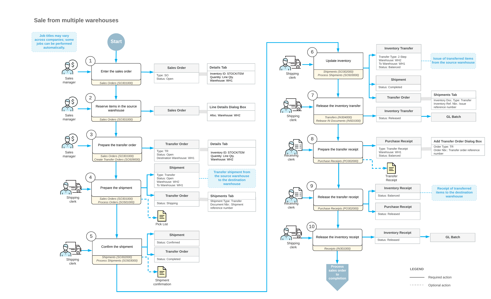

# Sales from Multiple Warehouses: General Information {#_d826b5f1-a25a-44e7-a801-5124a679c25c .concept}

When you are entering a sales order, you may notice that some of the ordered items are not available in the warehouse from which you are going to ship the order, but the quantity needed to fulfill the order is available in another warehouse. For fulfilling this sales order, you need to allocate items in the other warehouse, and then transfer these items to the warehouse from which the order will be shipped. In Acumatica ERP, you can process the transfer of allocated goods from one warehouse to another by creating and processing a transfer order based on the applicable sales order.

## Learning Objectives { .section}

In this chapter, you will do the following:

-   Create a sales order with items allocated in different warehouses.
-   Prepare a transfer order for a sales order.
-   Process a transfer order to completion to transfer the included items.
-   Process a sales order after the items have been transferred to the destination warehouse.

## Applicable Scenarios { .section}

You may need to process a sales order with goods from multiple warehouses in the following cases:

-   You have only a part of the ordered items in the warehouse specified in the sales order, but the rest of the items are currently available at another warehouse \(or multiple warehouses\), so the sales order can be completed with the items from different warehouses.
-   Your company uses one warehouse as a distribution center, so that all items are received to this warehouse and then are distributed to smaller warehouses on demand.

## Sale of Stock Items from Multiple Warehouses { .section}

When you process a sale of inventory items, you can reserve one line or multiple lines of an open sales order of the *SO* type in a warehouse other than the warehouse selected in the line. To be able to process a sales order with stock items that you have allocated \(that is, reserved\) in a remote warehouse \(that is, a warehouse other than the one specified in the order\), you first need to transfer the reserved items from the remote source warehouse \(where you reserved the items\) to the destination warehouse \(for which the sales order is processed\). For this purpose, you need to prepare and process a transfer order \(that is, an order of the *TR* predefined order type\).

The standard sales process typically starts with the entry of a sales order on the [Sales Orders](SO_30_10_00.md) \(SO301000\) form. To obtain the sufficient quantity of items for the sales order, you manually reserve the quantity for each specific item in the source warehouse. For the items allocated in a warehouse other than the warehouse specified in the sales order, the system automatically generates transfer requests of the *SO Allocated* plan type based on which you generate transfer orders related to sales orders. To be able to complete the sales order, you need to perform a transfer of the items allocated in a source warehouse to the destination warehouse by creating and processing a transfer order \(or multiple orders\).

To create a transfer order for a sales order, while viewing the sales order with allocated items on the [Sales Orders](SO_30_10_00.md) form, you click **Create Transfer Order** on the More menu; then you create one transfer order or multiple transfer orders on the [Create Transfer Orders](SO_50_90_00.md) \(SO509000\) form, which opens. This form shows transfer requests for the sales orders that have the *Open* status.

A transfer order is fulfilled by one shipment or by multiple shipments from the source warehouse \(in which the item is allocated\) to the destination warehouse. You create a shipment for a transfer order from the [Sales Orders](SO_30_10_00.md) form by clicking **Create Shipment** on the More menu; on the [Shipments](SO_30_20_00.md) \(SO302000\) form, which opens, you then confirm the shipment by clicking **Confirm Shipment** on the More menu.

To update the item quantities in the source warehouse and complete the shipment, while you are still viewing the shipment on the [Shipments](SO_30_20_00.md) form, you click **Update IN** on the More menu; the system generates the two-step inventory transfer transaction, which issues items from the source warehouse. On release of this inventory transfer, the system generates a batch of general ledger transactions.

To complete the processing of the two-step inventory transfer, you prepare a transfer receipt to record the receiving of items to the destination warehouse. You manually create the transfer receipt \(a receipt of the *Transfer Receipt* type\) on the [Purchase Receipts](PO_30_20_00.md) \(PO302000\) form and add to the receipt the lines from one transfer order or multiple transfer orders. A transfer receipt may include only some of the lines from a transfer order; also, you can change the quantity in a particular line if the items specified in this line were received partially.

On release of the transfer receipt, the inventory receipt transaction is generated in the system to reflect the receipt of the items to the destination warehouse. On release of the inventory receipt, a batch of GL transactions is generated. Thus, the quantity of the item that has been transferred from the source warehouse to the destination warehouse becomes available for sale.

After all transferred stock items have been received to the destination warehouse, you complete the sales order as you would if you had just entered it: You process a shipment of all items from the destination warehouse, and you process the related sales invoice. For details about the general steps of sales order processing, see [Processing Sales of Stock Items](OrderMgmt_Sale_of_Stock_Items_Mapref.md).

## Workflow of a Sale from Multiple Warehouses { .section}

For a sales order for which the items have been allocated in multiple warehouses, the processing involves the actions and generated documents shown in the following diagram.

**Parent topic:**[Processing Sales from Multiple Warehouses](../UserGuide/OrderMgmt_Sale_from_Multiple_Warehouses_Mapref.md)

