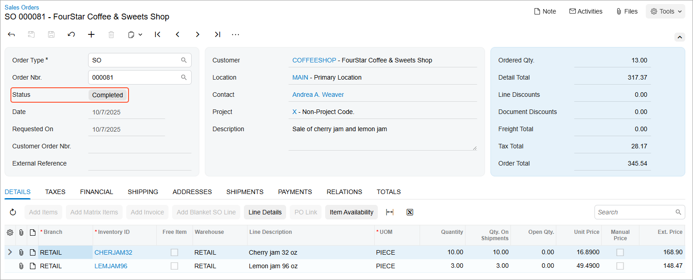

# Sales from Multiple Warehouses: Process Activity {#_71de77ee-4bfc-48b6-9f09-35bd12a1ea7b .task}

In the following activity, you will process a sales order with items allocated in multiple warehouses.

**Attention:** This activity is based on the *U100* dataset. If you are using another dataset or if any system settings have been changed in *U100*, these changes can affect the workflow of the activity and the results of the processing. To avoid issues, restore the *U100* dataset to its initial state.

## Story { .section}

Suppose that the FourStar Coffee &amp; Sweets Shop customer ordered cherry jam in 32-ounce jars and lemon jam in 96-ounce jars at SweetLife’s retail store. When entering this sales order, a sales manager has noticed that the 32-ounce jars of cherry jam are currently out of stock in the retail warehouse, and has decided to allocate the unavailable quantity of jam in the SweetLife’s wholesale warehouse.

To complete the customer’s request, acting as sales manager of the SweetLife store Regina Wiley, you need to enter the sales order and allocate the needed items, process a transfer of cherry jam from the wholesale warehouse to the SweetLife store's warehouse, and then process the sales order to completion.

## Configuration Overview {#section_qnv_sty_clb .section}

In the *U100* dataset, for the purposes of this activity, the following tasks have been performed:

-   On the [Enable/Disable Features](CS_10_00_00.md) \(CS100000\) form, the following features have been enabled:
    -   *Inventory and Order Management*, which provides the standard functionality of inventory and order management
    -   *Inventory*, which gives you the ability to maintain stock items by using forms related to the inventory functionality and to create and process sales and purchase documents that include stock items
    -   *Multiple Warehouses*, which provides the ability to process transfers of items between warehouses
-   On the [Warehouses](IN_20_40_00.md) \(IN204000\) form, the *WHOLESALE* and *RETAIL* warehouses have been created.
-   On the [Customers](AR_30_30_00.md) \(AR303000\) form, the *COFFEESHOP* customer has been created.
-   On the [Stock Items](IN_20_25_00.md) \(IN202500\) form, the *CHERJAM32* and *LEMJAM96* stock items have been created.
-   On the [Order Types](SO_20_10_00.md) \(SO201000\) form, the *TR* order type has been configured.

## Process Overview { .section}

In this activity, to perform a sale of stock items from multiple warehouses, you will create a sales order on the [Sales Orders](SO_30_10_00.md) \(SO301000\) form, select the customer to which the items are being sold, and add items to the order. Then you will allocate the unavailable items in the warehouse in which these items are currently on hand.

To transfer items from the source warehouse to the destination warehouse, you will create a transfer order on the [Create Transfer Orders](SO_50_90_00.md) \(SO509000\) form. Then you will process the transfer order to completion as follows:

1.  Process the related shipment between warehouses \(which causes the items to be issued from the source warehouse\) on the [Shipments](SO_30_20_00.md) \(SO302000\) form.
2.  Process the related transfer receipt \(which records the receipt of the items to the destination warehouse\) on the [Purchase Receipts](PO_30_20_00.md) \(PO302000\) form. After you process the transfer receipt, all the items required for the sales order become available in the destination warehouse, so that you can process the initial sales order to completion.

On the [Shipments](SO_30_20_00.md) form, you will create a shipment document for the sales order and confirm the shipment. You then will use the [Invoices](SO_30_30_00.md) \(SO303000\) form to prepare the corresponding invoice for the customer and release it.

## System Preparation { .section}

Before you start performing a sale of stock items from multiple warehouses, you should do the following:

1.  Launch the Acumatica ERP website with the *U100* dataset preloaded, and sign in as purchasing manager Regina Wiley by using the *wiley* username and the *123* password.
2.  In the info area, in the upper-right corner of the top pane of the Acumatica ERP screen, make sure that the business date in your system is set to today’s date. For simplicity, in this activity, you will create and process all documents in the system on this business date.
3.  On the Company and Branch Selection menu in the top pane of the Acumatica ERP screen, select the *SweetLife Store* branch.
4.  Make sure that you have completed the [Sales Order Types: To Activate the TR Order Type](../ImplementationGuide/config_Sales_Order_Types_To_Activate_TR_Order_Type.md).

## Step 1: Creating the Sales Order { .section}

To create the sales order, do the following:

1.  On the [Sales Orders](SO_30_10_00.md) \(SO301000\) form, add a new record.
2.  In the Summary area, specify the following settings:
    -   **Order Type**: *SO*
    -   **Customer**: *COFFEESHOP*
    -   **Description**: `Sale of cherry jam and lemon jam`
3.  On the **Details** tab, add rows with the settings shown in the following table.

    |Branch|Inventory ID|Warehouse|Quantity|Unit Price|
    |------|------------|---------|--------|----------|
    |*RETAIL*|*CHERJAM32*|*RETAIL*|`10`|`16.89`|
    |*RETAIL*|*LEMJAM96*|*RETAIL*|`3`|`49.49`|

    Notice that the system displays a warning in the **Quantity** column of the *CHERJAM32* line indicating that the specified quantity is not available in the selected warehouse.

4.  On the form toolbar, click **Save**. The sales order is saved with the *Open* status.

Now you can reserve 32-ounce jars of cherry jam, which are not available in the SweetLife Store warehouse, in a warehouse which has a sufficient quantity of the item.

## Step 2: Allocating the Items in Another Warehouse { .section}

To allocate the items that are not available in the *RETAIL* warehouse, while you are still viewing the sales order on the [Sales Orders](SO_30_10_00.md) \(SO301000\) form, do the following:

1.  On the **Details** tab, click the *CHERJAM32* line, and on the table toolbar, click **Line Details**.
2.  In the **Line Details** dialog box, which opens, do the following:

    1.  In the only line, select the **Allocated** check box.
    2.  In the **Alloc. Warehouse** column, select *WHOLESALE*.
    3.  Click **OK** to save your changes and close the dialog box.
    Notice that the warehouse in the line on the **Details** tab has not changed, but in the table footer, the **Allocated** quantity is now equal to 10.

3.  On the form toolbar, click **Save**.

Now you can create a transfer order to move the items from the Wholesale warehouse to the SweetLife's Store warehouse.

## Step 3: Creating the Transfer Order { .section}

To create the transfer order for the allocated items from the sales order, do the following:

1.  While you are still viewing the sales order on the [Sales Orders](SO_30_10_00.md) \(SO301000\) form, click **Create Transfer Order** on the More menu.
2.  On the [Create Transfer Orders](SO_50_90_00.md) \(SO509000\) form, which opens, select the unlabeled check box in the line with *SO Allocated* specified as the **Plan Type** and *CHERJAM32* specified as the **Inventory ID**. This line is the transfer request related to the line of the sales order that you have allocated in another warehouse. In the line, make sure that *WHOLESALE* is specified as the **From Warehouse** and *RETAIL* is specified as the **To Warehouse**.
3.  On the form toolbar, click **Process** to process the transfer request you have selected. The system creates a transfer order of the *TR* order type and opens it on the [Sales Orders](SO_30_10_00.md) form.
4.  In the **Description** box in the Summary area, type `Transferred goods for sales order from COFFEESHOP`.
5.  On the form toolbar, click **Save**.

Now you can process the created transfer order to completion.

## Step 4: Processing the Transfer Order { .section}

To process the transfer order to completion, do the following:

1.  While you are still viewing the transfer order that you have created on the [Sales Orders](SO_30_10_00.md) \(SO301000\) form, on the form toolbar, click **Create Shipment**.
2.  In the **Specify Shipment Parameters** dialog box, which opens, make sure that today's date and the *WHOLESALE* warehouse are selected, and click **OK**. The system creates a shipment with the *Transfer* type and opens it on the [Shipments](SO_30_20_00.md) \(SO302000\) form.
3.  Review the Summary area of the shipment, and make sure that **Warehouse ID** is *WHOLESALE* and **To Warehouse** is *RETAIL*. Also, review the only line included in the shipment, and make sure its details are correct.
4.  On the form toolbar, click **Confirm Shipment**. The shipment is assigned the *Confirmed* status.
5.  On the form toolbar, click **Update IN** to generate the inventory transfer transaction that issues the items from the source warehouse to the destination warehouse. The shipment is assigned the *Completed* status.
6.  On the **Orders** tab, click the link in the **Inventory Ref. Nbr.** column in the only row.
7.  On the [Transfers](IN_30_40_00.md) \(IN304000\) form, which opens in a pop-up window, make sure that the generated inventory transfer has the *Released* status.

## Step 5: Processing the Transfer Receipt {#section_ng4_fwy_clb .section}

To process the transfer receipt, do the following:

1.  On the [Purchase Receipts](PO_30_20_00.md) \(PO302000\) form, add a new record.
2.  In the Summary area, specify the following settings:
    -   **Type**: *Transfer Receipt*
    -   **Warehouse**: *RETAIL*
3.  On the table toolbar of the **Details** tab, click **Add Transfer**. The **Add Transfer Order** dialog box opens. It shows the list of completed transfer orders with completed shipments whose items have not been received to the destination warehouse yet.
4.  In the dialog box, select the unlabeled check box for the transfer order you have processed earlier, and click **Add &amp; Close** to close the dialog box and return to the [Purchase Receipts](PO_30_20_00.md) form.
5.  On the **Details** tab, review the details of the added line with the *CHERJAM32* item.
6.  On the form toolbar, click **Release** to release the transfer receipt.
7.  On the **Other** tab, click the **IN Ref. Nbr.** link to open the related inventory receipt transaction on the [Receipts](IN_30_10_00.md) \(IN301000\) form.
8.  Make sure the inventory receipt has the *Released* status, which means that the items have been received to the *RETAIL* warehouse and are now available for shipping. Close the pop-up window.

Now you can finish processing the sales order, because all of the ordered items are on hand in the SweetLife’s Store warehouse.

## Step 6: Processing the Shipment { .section}

To create and process the shipment that is associated with the sales order, do the following:

1.  On the [Sales Orders](SO_30_10_00.md) \(SO301000\) form, open the sales order of the *SO* type that you have created in Step 1, and on the form toolbar, click **Create Shipment**.
2.  In the **Specify Shipment Parameters** dialog box, which opens, make sure that today's date and the *RETAIL* warehouse are selected, and click **OK**. The system creates a shipment and opens it on the [Shipments](SO_30_20_00.md) \(SO302000\) form.
3.  On the **Details** tab, make sure that both order lines have been included in the shipment and that the shipped quantity in both lines is equal to the ordered quantity.
4.  On the More menu, click **Confirm Shipment**.

The shipment is assigned the *Confirmed* status, and now you can prepare the invoice to bill the customer and increase the customer's debt in the system.

## Step 7: Processing the Sales Invoice for the Customer { .section}

To complete the processing of a sale, you need to generate an invoice to the customer. Do the following:

1.  While you are still viewing the shipment that you have created on the [Shipments](SO_30_20_00.md) \(SO302000\) form, on the form toolbar, click **Prepare Invoice**.
2.  On the [Invoices](SO_30_30_00.md) \(SO303000\) form, which opens, review the details of the invoice to make sure that both items have been included in the invoice.
3.  On the form toolbar, click **Release** to release the invoice.
4.  Return to the sales order of the *SO* type on the [Sales Orders](SO_30_10_00.md) \(SO301000\) form that you created in Step 1, and notice that the order is now assigned the *Completed* status, as shown in the following screenshot.

    

**Parent topic:**[Processing Sales from Multiple Warehouses](../UserGuide/OrderMgmt_Sale_from_Multiple_Warehouses_Mapref.md)

