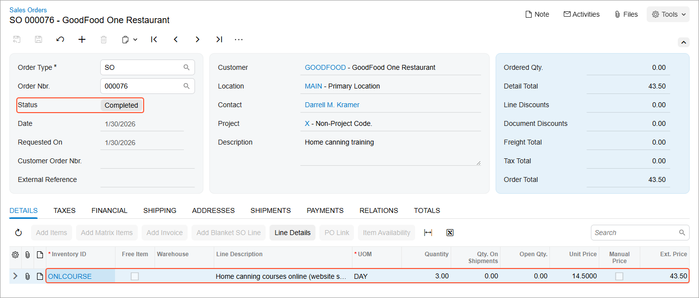

# Sales of Services: Process Activity {#_5bd56d6d-764b-4a94-81c2-e6147768eb8e .task}

In this activity, you will prepare and process a sales order for non-stock items that represent services and thus do not need to be shipped to the customer's location.

**Attention:** This activity is based on the *U100* dataset. If you are using another dataset or if any system settings have been changed in *U100*, these changes can affect the workflow of the activity and the results of the processing. To avoid issues, restore the *U100* dataset to its initial state.

## Story { .section}

Suppose that the GoodFood One Restaurant manager has ordered a three-day training course on home canning for the restaurant's employees. The online course is a service, so no shipping needs to occur. You, as a sales manager, need to reflect these details in the system by entering and processing the appropriate documents.

## Configuration Overview { .section}

In the *U100* dataset, the following tasks have been performed to support this activity:

-   On the [Enable/Disable Features](CS_10_00_00.md) \(CS100000\) form, the *Inventory and Order Management* feature has been enabled.
-   On the [Order Types](SO_20_10_00.md) \(SO201000\) form, the *SO* order type has been configured and activated.
-   On the [Customers](AR_30_30_00.md) \(AR303000\) form, the *GOODFOOD \(GoodFood One Restaurant\)* customer has been created.
-   On the [Non-Stock Items](IN_20_20_00.md) \(IN202000\) form, the *ONLCOURSE \(Home canning courses online \(website session\)* non-stock item has been created.

## Process Overview { .section}

In this activity, you will create a sales order on the [Sales Orders](SO_30_10_00.md) \(SO301000\) form, and then add a service line to it. After that, you will use the [Invoices](SO_30_30_00.md) \(SO303000\) form to prepare a related invoice to the customer and release it.

## System Preparation { .section}

Before you start processing a sales order that includes service items, you should do the following:

1.  Launch the Acumatica ERP website with the *U100* dataset preloaded, and sign in to the system as a sales and purchasing manager. You should sign in by using the *norman* username and the *123* password.
2.  In the info area at the upper-right corner of the top pane of the Acumatica ERP screen, make sure that the business date is set to *1/30/2026*. If a different date is displayed, click the Business Date menu button and select *1/30/2026* from the calendar. For simplicity, you'll create and process all documents in this activity using this business date.

## Step 1: Creating a Sales Order { .section}

To create a sales order, do the following:

1.  On the [Sales Orders](SO_30_10_00.md) \(SO301000\) form, add a new record.
2.  In the Summary area, specify the following settings:
    -   **Order Type**: *SO*
    -   **Customer**: *GOODFOOD*
    -   **Description**: `Home canning training`
3.  On the **Details** tab, click **Add Row** on the table toolbar.
4.  Specify the following settings in the row:
    -   **Inventory ID**: *ONLCOURSE*
    -   **Quantity**: `3`
    -   **Unit Price**: `14.5` \(inserted automatically\)
5.  On the form toolbar, click **Save**. Notice that the sales order has the *Open* status.

## Step 2: Processing the Sales Invoice { .section}

To prepare and release the sales invoice that is related to the sales order, do the following:

1.  While you are still viewing the sales order on the [Sales Orders](SO_30_10_00.md) \(SO301000\) form, on the More menu, click **Prepare Invoice**. The system prepares a sales invoice and opens it on the [Invoices](SO_30_30_00.md) \(SO303000\) form.
2.  On this form, review the details of the prepared invoice. The invoice has one line on the **Details** tab, as the initial sales order does. In the **Order Nbr.** column of this tab, the system has inserted the reference number of the related sales order; this number is also a link you can click to view the document on the [Sales Orders](SO_30_10_00.md) form. Notice that the **Shipment Nbr.** column of the **Details** tab does not have a reference number.
3.  On the form toolbar, click **Release** to release the invoice. The invoice is assigned the *Open* status. Once released, the invoice becomes visible on the [Invoices and Memos](AR_30_10_00.md) \(AR301000\) form.
4.  On the **Details** tab, in the only row, click the link in the **Order Nbr.** column to view the associated sales order.
5.  On the [Sales Orders](SO_30_10_00.md) form, which opens, review the details of the sales order, as shown in the following screenshot. Notice that the sales order has the *Completed* status, which the system assigned on release of the sales invoice, and which means that the processing of the sale is completed.

    

**Parent topic:**[Processing Sales of Services](../UserGuide/OrderMgmt_Sale_of_Services_Mapref.md)

