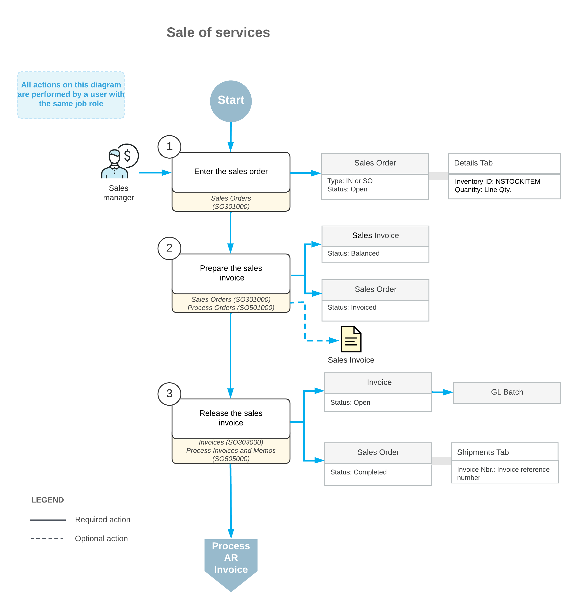

# Sales of Services: General Information {#_77257f81-55a3-4010-aaf8-2a97fd6ac19a .concept}

Non-stock items in Acumatica ERP, which are defined on the [Non-Stock Items](IN_20_20_00.md) \(IN202000\) form during implementation, are used to represent the products that cannot be stocked in warehouses \(such as services or charges\) or physical entities whose quantities you do not need to track.

The following sections describe the sales process of non-stock items that represent services.

## Learning Objectives { .section}

In this chapter, you will do the following:

-   Create a sales order for a sale of services
-   Prepare an invoice that corresponds to the sales order

## Applicable Scenario { .section}

You process a sales order with a service line or multiple service lines if you need to track this sale \(and then bill the customer for the provided services\), which does not involve a shipment being processed in the system.

## Sales of Services { .section}

Although you could record the billing for a sale of services directly in the system by using an AR invoice, by entering sales orders for all sales, you implement a single entry point for the processing and tracking of sales. For a sale of services, you start with entering a sales order of the *SO* or *IN* type on the [Sales Orders](SO_30_10_00.md) \(SO301000\) form and add to the order the non-stock item or items representing the needed services.

After you have entered the sales order, you need to bill the customer for the sold services by preparing a sales invoice, which is a financial document in the system that contains links to the applicable sales orders. You can review the prepared sales invoice on the [Invoices](SO_30_30_00.md) \(SO303000\) form; then you can release it. When the sales invoice is released, it becomes visible on the [Invoices and Memos](AR_30_10_00.md) \(AR301000\) form as an AR invoice.

An AR invoice on the [Invoices and Memos](AR_30_10_00.md) form is a financial document that does not contain links to the applicable sales orders, as the sales invoice does. The AR invoice and sales invoice have the same reference number, which the system prints in the customer statement. On both the [Invoices](SO_30_30_00.md) form and the [Invoices and Memos](AR_30_10_00.md) form, you can view the link to the batch of the general ledger transactions that was generated when the invoice was released. For more information on processing AR invoices, see [Processing AR Invoices](Finance_ARInvoices_Mapref.md).

## Workflow of Sales of Services { .section}

If a sales order includes only services that do not involve shipping, the typical processing of the sales order involves the actions and generated documents shown in the following diagram.

**Parent topic:**[Processing Sales of Services](../UserGuide/OrderMgmt_Sale_of_Services_Mapref.md)

