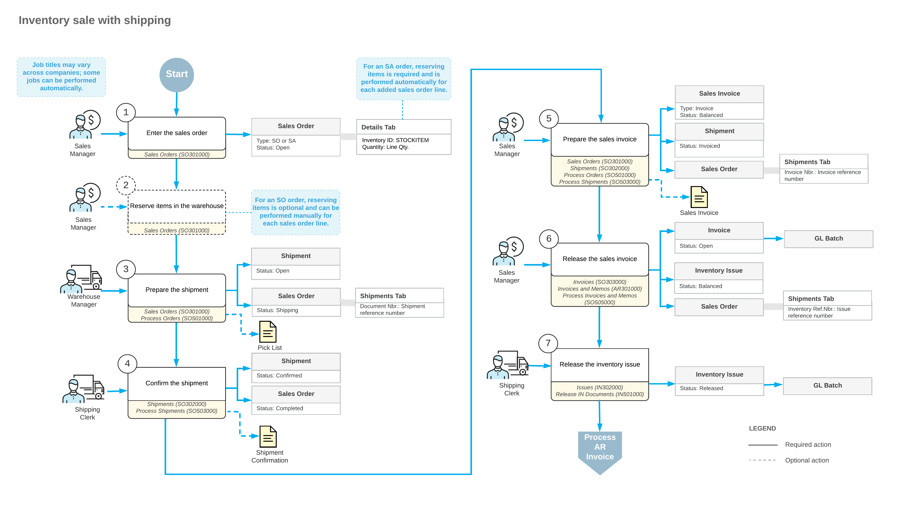

# Sales of Stock Items: General Information {#_0720ea72-819e-4533-9cd8-72737f93b955 .concept}

In a typical distribution organization, a customer order may be taken over the phone or received by email. In Acumatica ERP, you can process a sale of stock items by creating and processing a corresponding sales order. A sales order represents a customer request to buy particular goods in a specified quantity on a specified date.

## Learning Objectives { .section}

In this chapter, you will do the following:

-   Create a sales order with stock items
-   Create the shipment for the sales order
-   Confirm the shipment
-   Create the invoice for the sales order
-   Process the sales invoice and the related inventory and accounts receivable documents

## Applicable Scenario { .section}

You process a sales order with a stock item if you need to record the sale of goods with shipping the items to a customer, updating item quantities in inventory, and preparing an invoice to the customer for the sold goods.

## Sale of Stock Items with Automatic or Manual Allocation { .section}

The standard sales process typically includes entering a sales order, processing a shipment of the items with items being issued from inventory, and preparing the related invoice to a customer. In Acumatica ERP, to process a sale that requires the items to be shipped before an invoice can be prepared, you can use a sales order of the *SO* or *SA* type on the [Sales Orders](SO_30_10_00.md) \(SO301000\) form. Consider the following points as you decide which of the order types to use:

-   For a new order of the *SO* type, the items are not reserved in inventory automatically. You can manually allocate \(reserve\) the requested quantity for a specific stock item or multiple items if this is required by your company policies or was requested by the customer. Also, you may want to reserve a line item if the item is available but the quantity required for the order line is distributed between different warehouses and any transfers are required.
-   When you save a new order of the *SA* type, the system automatically reserves the requested quantities of stock items for this order \(or the available part, if only part of requested quantity is available for any item\). If the ordered quantity cannot be fully allocated at the specified location or warehouse, you can manually allocate the unavailable quantity in other warehouses or locations. If you prepare a shipment for an *SA* order that has an unallocated quantity, the order will be shipped partially even if the ordered quantities are available for shipping at another warehouse or warehouse location but were not allocated for this particular order.

On the **Details** tab of the [Sales Orders](SO_30_10_00.md) form, you can view the allocation for each sales order line and change it, if needed, by clicking a line and clicking **Line Details** on the table toolbar. The quantities of the items that have been allocated for the order \(automatically or manually\) cannot be shipped for another order.

The way the order will be fulfilled depends on the item availability and on the shipping rules specified for the order and for the sales order lines on the [Sales Orders](SO_30_10_00.md) form. These shipping rules determine whether the goods in the sales order should be shipped only in full, partial shipments for the available quantities are allowed with the remainder canceled, or partial shipments are allowed with the remainder on back order. For detailed information, see [Shipping Rule Combinations](SO__con_Shipping_Rules.md). On the [Shipments](SO_30_20_00.md) \(SO302000\) form, you can review the details of a shipment document prepared for an order; then you can confirm the shipment of items.

**Tip:** You can create a shipment only if each item listed on the **Details** tab of the [Sales Orders](SO_30_10_00.md) form has a location for which sales are allowed—that is, the **Sales Allowed** check box is selected on the **Locations** tab of the [Warehouses](IN_20_40_00.md) \(IN204000\) form.

After you have prepared and confirmed the shipment or shipments related to the sales order, you need to bill the customer for the shipped items by preparing a sales invoice, which is a financial document in the system that contains links to the applicable shipments and sales orders. You can review the prepared sales invoice on the [Invoices](SO_30_30_00.md) \(SO303000\) form; then you can release it. When the sales invoice is released, the system automatically generates a corresponding inventory issue for the shipped items with the date and posting period of the invoice. Also, the sales invoice becomes visible on the [Invoices and Memos](AR_30_10_00.md) \(AR301000\) form as an AR invoice.

An AR invoice on the [Invoices and Memos](AR_30_10_00.md) form is a financial document that does not contain links to the applicable shipments and sales orders, as the sales invoice does. The AR invoice and sales invoice have the same reference number, which the system prints in the customer statement. On both the [Invoices](SO_30_30_00.md) form and the [Invoices and Memos](AR_30_10_00.md) form, you can view the link to the batch of the general ledger transactions that was generated when the invoice was released. For more information on processing AR invoices, see [Processing AR Invoices](Finance_ARInvoices_Mapref.md).

## Workflow of a Sale of Stock Items { .section}

For a sales order of the *SO* or *SA* type that includes stock items, the typical processing involves the actions and generated documents shown in the following diagram.

**Parent topic:**[Processing Sales of Stock Items](../UserGuide/OrderMgmt_Sale_of_Stock_Items_Mapref.md)

