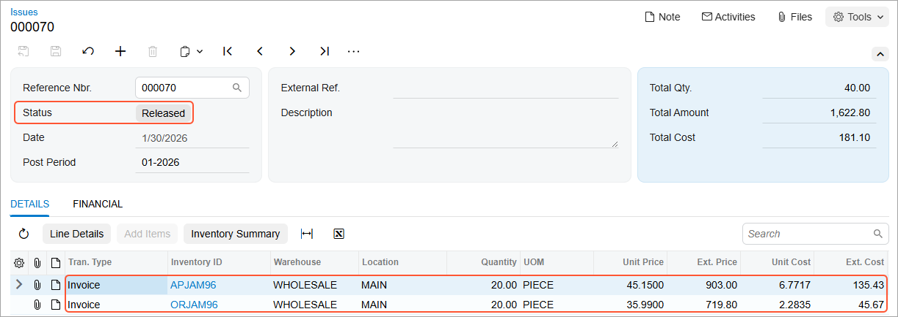

# Sales of Stock Items: Process Activity {#_45433ef7-a12c-49aa-8721-007ea09401df .task}

The following activity demonstrates how to prepare and process to completion a sales order with manual allocation of stock items.

**Attention:** This activity is based on the *U100* dataset. If you are using another dataset or if any system settings have been changed in *U100*, these changes can affect the workflow of the activity and the results of the processing. To avoid issues, restore the *U100* dataset to its initial state.

## Story { .section}

Suppose that you are Grace Norman, a sales manager of the SweetLife Fruits &amp; Jams company. On January 30, 2026, the GoodFood One Restaurant wholesale customer has ordered a large amount of orange and apple jams in 96-ounce jars from the main office of SweetLife, where you are employed, for the café's baking needs. The ordered jams are stored in the warehouse of the SweetLife’s main office. You, as a sales manager, need to enter and process the appropriate documents.

## Configuration Overview { .section}

In the *U100* dataset, for the purposes of this activity, the following tasks have been performed:

-   On the [Enable/Disable Features](CS_10_00_00.md) \(CS100000\) form, the following features have been enabled:
    -   *Inventory and Order Management*, which provides the standard functionality of inventory and order management
    -   *Inventory*, which gives you the ability to maintain stock items by using forms related to the inventory functionality and to create and process sales and purchase documents that include stock items
-   On the [Order Types](SO_20_10_00.md) \(SO201000\) form, the *SO* order type has been configured and activated.
-   On the [Customers](AR_30_30_00.md) \(AR303000\) form, the *GOODFOOD \(GoodFood One Restaurant\)* customer has been configured.
-   On the [Stock Items](IN_20_25_00.md) \(IN202500\) form, the *APJAM96* and *ORJAM96* stock items have been configured.
-   On the [Warehouses](IN_20_40_00.md) \(IN204000\) form, in the *WHOLESALE* warehouse, which has been configured, sufficient quantities of the *APJAM96* and *ORJAM96* items are on hand.

## Process Overview { .section}

To perform a sale of stock items with manual allocation, you create a sales order on the [Sales Orders](SO_30_10_00.md) \(SO301000\) form, select the customer to which the items are being sold, add items to the order, and reserve the items in inventory. Then you create a shipment document on the [Shipments](SO_30_20_00.md) \(SO302000\) form. On this form, you confirm the settings that the system has inserted automatically based on the sales order, and then confirm the shipment. After shipment confirmation, you use the [Invoices](SO_30_30_00.md) \(SO303000\) form to prepare a corresponding invoice to the customer and release it.

## System Preparation { .section}

Before you start performing a sale of stock items with manual allocation, you should do the following:

1.  Launch the Acumatica ERP website with the *U100* dataset preloaded, and sign in to the system as sales manager Grace Norman by using the *norman* username and the *123* password.
2.  In the info area at the upper-right corner of the top pane of the Acumatica ERP screen, make sure that the business date is set to *1/30/2026*. If a different date is displayed, click the Business Date menu button and select *1/30/2026* from the calendar. For simplicity, you'll create and process all documents in this activity using this business date.
3.  On the Company and Branch Selection menu, in the top pane of the Acumatica ERP screen, make sure the *SweetLife Head Office and Wholesale Center* branch is selected.

## Step 1: Creating a Sales Order { .section}

To create a sales order, do the following:

1.  On the [Sales Orders](SO_30_10_00.md) \(SO301000\) form, create a sales order, and specify the following settings:

    -   **Order Type**: *SO*
    -   **Customer**: *GOODFOOD*
    -   **Date**: *1/30/2026*
    -   **Requested On**: *1/30/2026*
    -   **Description**: `Orange and apple jams`
    **Tip:** To open the form for creating a new record, type the form ID in the Search box, and on the Search form, point at the form title and click **New** right of the title.

2.  On the table toolbar of the **Details** tab, click **Add Row**.
3.  Specify the following settings in the added row:
    -   **Inventory ID**: *APJAM96*
    -   **Warehouse**: *WHOLESALE*
    -   **Quantity**: `20`
    -   **Unit Price**: `45.15`
4.  On the table toolbar, click **Add Row**.
5.  Specify the following settings in the added row:
    -   **Inventory ID**: *ORJAM96*
    -   **Warehouse**: *WHOLESALE*
    -   **Quantity**: `20`
    -   **Unit Price**: `35.99`
6.  On the form toolbar, click **Save**.

The sales order is saved with the *Open* status.

## Step 2: Allocating Inventory Items { .section}

To manually allocate the inventory items for the sales order you have created, while you are still viewing the sales order on the [Sales Orders](SO_30_10_00.md) \(SO301000\) form, do the following:

1.  On the **Details** tab, click the *APJAM96* line, and review the Allocated quantity for the *APJAM96* inventory item in the table footer \(which is currently equal to 0 because the system does not automatically allocate stock items for *SO* orders\).
2.  On the table toolbar, click **Line Details**.
3.  In the **Line Details** dialog box, which opens, make sure that *WHOLESALE* is selected in the **Alloc. Warehouse** column of the only row.
4.  Select the **Allocated** check box for the allocation line.
5.  Click **OK** to save the created allocation and close the dialog box.
6.  In the table footer, review the Allocated quantity, and notice that it is now equal to the quantity specified in the line, which means that the item has been allocated in inventory.
7.  On the form toolbar, click **Save**.
8.  Click the *ORJAM96* line, and review the Allocated quantity for the *ORJAM96* stock item in the table footer \(which is currently equal to 0 because the system does not automatically allocate stock items for *SO* orders\).
9.  On the table toolbar, click **Line Details**.
10. In the **Line Details** dialog box, which opens, make sure that *WHOLESALE* is selected in the **Alloc. Warehouse** column of the only row.
11. Select the **Allocated** check box for the allocation line.
12. Click **OK** to save the created allocation and close the dialog box.
13. In the table footer, review the Allocated quantity, and notice that it is now equal to the quantity specified in the line, which means that the item has been allocated in inventory.
14. On the form toolbar, click **Save**.

You have manually allocated the inventory items for the sales order. Now you need to create a shipment document for the sales order.

## Step 3: Creating a Shipment { .section}

To create a shipment, do the following:

1.  While you are still viewing the sales order you have created on the [Sales Orders](SO_30_10_00.md) \(SO301000\) form, on the form toolbar, click **Create Shipment**.
2.  In the **Specify Shipment Parameters** dialog box, which opens, make sure that the *1/30/2026* date and the *WHOLESALE* warehouse are selected, and click **OK**. The system closes the dialog box, creates a shipment, and opens it on the [Shipments](SO_30_20_00.md) \(SO302000\) form.

## Step 4: Confirming the Shipment { .section}

To confirm the shipment, do the following:

1.  While you are still viewing the shipment on the [Shipments](SO_30_20_00.md) \(SO302000\) form, review the lines on the **Details** tab. Make sure that both order lines have been included in the shipment and that the shipped quantity in both lines is equal to the ordered quantity.
2.  In both lines, specify *Main* in the **Location** column.
3.  On the form toolbar, click **Confirm Shipment**.

The shipment is assigned the *Confirmed* status. Now you can prepare the invoice to bill the customer and increase the customer's debt in the system.

## Step 5: Processing the Invoice { .section}

To prepare and release the invoice, do the following:

1.  While you are still viewing the shipment on the [Shipments](SO_30_20_00.md) \(SO302000\) form, on the form toolbar, click **Prepare Invoice**. The system prepares the invoice and opens it on the [Invoices](SO_30_30_00.md) \(SO303000\) form.
2.  On this form, review the details of the prepared invoice. The invoice has two lines, as the initial sales order does. In the **Shipment Nbr.** and **Order Nbr.** columns of the **Details** tab, notice that the system has inserted the reference number links to the related shipment and sales order.
3.  On the form toolbar, click **Release** to release the invoice. Wait for the system to complete the operation.
4.  Return to the [Sales Orders](SO_30_10_00.md) \(SO301000\) form, and open the sales order that you have processed.
5.  On the **Shipments** tab, in the only row, click the link in the **Inventory Ref. Nbr.** column to view the inventory issue that was generated when you released the invoice.
6.  On the [Issues](IN_30_20_00.md) \(IN302000\) form, which opens in a pop-up window, review the details of the inventory issue, shown in the following screenshot. Make sure that the issue has the *Released* status, which means that the issue has been released and the quantities of items in inventory have been decreased appropriately.

    

The sales order processing is now complete.

## Activity Recap { .section}

In this activity, we have illustrated how the sales manager has done the following:

1.  Created a sales order for the items to be sold
2.  Manually allocated the inventory items for the sales order
3.  Created and confirmed the shipment of the items
4.  Prepared the invoice for the customer and has released it

**Parent topic:**[Processing Sales of Stock Items](../UserGuide/OrderMgmt_Sale_of_Stock_Items_Mapref.md)

