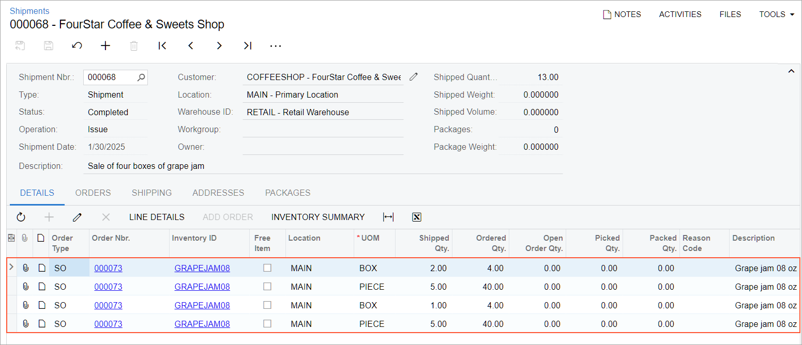
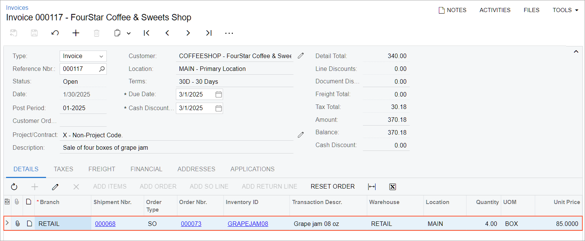

# Sales of Stock Items: To Allocate Stock with Multiple UOMs and Process a Sale {#_cc0c3ce3-6503-4d60-9847-af078b43ac2e .task}

In the following activity, you will allocate stock and process a sales order whose item has a sales UOM that differs from the UOM specified in the sales order line.

**Attention:** This activity is based on the *U100* dataset. If you are using another dataset or if any system settings have been changed in *U100*, these changes can affect the workflow of the activity and the results of the processing. To avoid issues, restore the *U100* dataset to its initial state.

## Story { .section}

Suppose that you are Regina Wiley, a sales manager of the SweetLife Fruits &amp; Jams company. On January 30, 2026, the Four Stars Coffee and Sweets Shop has ordered four boxes of grape jam in eight-ounce jars from SweetLife’s retail store. Each box has 10 jars.

When you allocated the jars for this sales order, you have noticed that only 25 jars \(two boxes and five jars\) are available in the retail warehouse. The other 15 jars are available in SweetLife’s wholesale warehouse. Because the company sells jams by boxes, you need to transfer the unavailable 15 jars \(one box and five jars\) from the wholesale warehouse to the retail warehouse and process the sale.

## Configuration Overview {#section_tz4_djx_cnb .section}

In the *U100* dataset, the following tasks have been performed to support this activity:

-   On the [Enable/Disable Features](CS_10_00_00.md) \(CS100000\) form, the following features have been enabled:
    -   *Inventory and Order Management*, which provides the standard functionality of inventory and order management
    -   *Inventory*, which gives you the ability to maintain stock items by using forms related to the inventory functionality and to create and process sales and purchase documents that include stock items
    -   *Multiple Warehouses*, which provides the ability to process transfers of items between warehouses
    -   *Multiple Units of Measure*, which provides the ability to use different units of measure as base, sales, and purchase units for item classes and stock items
-   On the [Warehouses](IN_20_40_00.md) \(IN204000\) form, the *WHOLESALE* and *RETAIL* warehouses have been created.
-   On the [Customers](AR_30_30_00.md) \(AR303000\) form, the *COFFEESHOP* customer has been created.
-   On the [Stock Items](IN_20_25_00.md) \(IN202500\) form, the *GRAPEJAM08* stock item has been created. For the item, the following UOMs have been specified on the **General** tab:
    -   **Base Unit**: *PIECE*
    -   **Sales Unit**: *PIECE*, for which the **Divisible** check box is cleared
    -   Additional UOM in the unit conversion table with the following settings to convert 10 pieces to one box: *BOX* as the **From Unit** with the *Multiply* operation, a conversion factor of 10, and *PIECE* as the **To Unit** \(10 pieces are converted to one box\)
-   On the [Order Types](SO_20_10_00.md) \(SO201000\) form, the *SO* and *TR* order types have been configured.
-   On the [Receipts](IN_30_10_00.md) \(IN301000\) form, a receipt dated 1/20/2026 has been created with 20 jars of the *GRAPEJAM08* item at a cost of $6.75 each.

## Process Overview { .section}

In this activity, you will do the following:

1.  On the [Sales Orders](SO_30_10_00.md) \(SO301000\) form, create a sales order.
2.  On the same form, allocate the stock items for the sales order in the retail and wholesale warehouses.
3.  On the same form, create a transfer order to transfer the missing items from the wholesale warehouse to the retail warehouse.
4.  Process the transfer order.
5.  On the [Purchase Receipts](PO_30_20_00.md) \(PO302000\) form, process the transfer receipt.
6.  On the [Sales Orders](SO_30_10_00.md) form, create and quickly process the sales order with the allocated items.
7.  On the [Shipments](SO_30_20_00.md) \(SO302000\) form, review the shipment, and on the [Invoices](SO_30_30_00.md) \(SO303000\) form, review the sales invoice.

## System Preparation { .section}

Before you start allocating stock items with multiple UOMs for a sales order and processing the sale, do the following:

1.  Launch the Acumatica ERP website with the *U100* dataset preloaded, and sign in as purchasing manager Regina Wiley by using the *wiley* username and the *123* password.
2.  In the info area at the upper-right corner of the top pane of the Acumatica ERP screen, make sure that the business date is set to *1/30/2026*. If a different date is displayed, click the Business Date menu button and select *1/30/2026* from the calendar. For simplicity, you'll create and process all documents in this activity using this business date.
3.  On the Company and Branch Selection menu in the top pane of the Acumatica ERP screen, select the *SweetLife Store* branch.

## Step 1: Creating a Sales Order { .section}

To create a sales order, do the following:

1.  On the [Sales Orders](SO_30_10_00.md) \(SO301000\) form, add a new record.
2.  In the Summary area, specify the following settings:
    -   **Order Type**: *SO*
    -   **Customer**: *COFFEESHOP*
    -   **Description**: `Sale of four boxes of grape jam`
3.  On the table toolbar of the **Details** tab, click **Add Row**.
4.  Specify the following settings in this row:
    -   **Branch**: *RETAIL* \(inserted automatically\)
    -   **Inventory ID**: *GRAPEJAM08*
    -   **Warehouse**: *RETAIL*
    -   **UOM**: *BOX*
    -   **Quantity**: `4`
5.  On the form toolbar, click **Save**.

## Step 2: Allocating the Items { .section}

To allocate the items for the sales order, do the following:

1.  While you are still viewing the sales order on the **Details** tab of the [Sales Orders](SO_30_10_00.md) \(SO301000\) form, click the *GRAPEJAM08* line, and on the table toolbar, click **Line Details**.
2.  In the **Line Details** dialog box, which opens, do the following:

    1.  In the only line, select the **Allocated** check box. The system splits the line into four lines.

        Notice that only two boxes and five items are available in the *RETAIL* warehouse. Because the quantity can be allocated only partially, the system has split the line. It has changed the quantity to *2* in the first line split and added a quantity of *5* in the second line split, a *1* in the third line split, and *5* in the fourth line split. For the third and fourth line splits, the **Allocated** check box is cleared.

    2.  In the third line, select the **Allocated** check box and specify *WHOLESALE* in the **Alloc. Warehouse** box.
    3.  In the fourth line, select the **Allocated** check box and specify *WHOLESALE* in the **Alloc. Warehouse** box.
    4.  Click **OK** to save your changes and close the dialog box.
    Notice that the warehouse in the line on the **Details** tab has not changed, but in the table footer, the **Allocated** quantity is now *4*.

3.  On the form toolbar, click **Save**.

## Step 3: Creating the Transfer Order { .section}

Now you will create the transfer order to transfer the allocated items from the wholesale warehouse to the retail warehouse. Do the following:

1.  While you are still viewing the sales order on the [Sales Orders](SO_30_10_00.md) \(SO301000\) form, click **Create Transfer Order** on the More menu.
2.  On the [Create Transfer Orders](SO_50_90_00.md) \(SO509000\) form, which opens, select the unlabeled check boxes in the lines with *SO Allocated* specified as the **Plan Type** and *GRAPEJAM08* specified as the **Inventory ID**. These lines are the transfer requests related to the line of the sales order that you have allocated in the wholesale warehouse. In both lines, make sure that *WHOLESALE* is specified as the **From Warehouse** and *RETAIL* is specified as the **To Warehouse**.
3.  On the form toolbar, click **Process** to process the transfer requests that you have selected. The system creates an order of the *TR* order type and opens it on the [Sales Orders](SO_30_10_00.md) form.
4.  In the **Description** box in the Summary area, type `Transferred grape jam for a sales order from COFFEESHOP`.
5.  On the form toolbar, click **Save**.

## Step 4: Processing the Transfer Order { .section}

To process the transfer order to completion, do the following:

1.  While you are still viewing the transfer order that you have created on the [Sales Orders](SO_30_10_00.md) \(SO301000\) form, on the form toolbar, click **Create Shipment**.
2.  In the **Specify Shipment Parameters** dialog box, which opens, make sure that today's date and the *WHOLESALE* warehouse are selected, and click **OK**. The system creates a shipment with the *Transfer* type and opens it on the [Shipments](SO_30_20_00.md) \(SO302000\) form.
3.  Review the Summary area of the shipment, and make sure that **Warehouse ID** is *WHOLESALE* and **To Warehouse** is *RETAIL*. Also, review both lines included in the shipment, and make sure that their details are correct.
4.  On the form toolbar, click **Confirm Shipment**. The shipment is assigned the *Confirmed* status.
5.  On the form toolbar, click **Update IN** to generate the inventory transfer transaction that issues the items from the source warehouse to the destination warehouse. The shipment is assigned the *Completed* status.

Now you can process the receipt of the items in the *RETAIL* warehouse.

## Step 5: Processing the Transfer Receipt { .section}

To process the transfer receipt, do the following:

1.  On the [Purchase Receipts](PO_30_20_00.md) \(PO302000\) form, add a new record.
2.  In the Summary area, specify the following settings:
    -   **Type**: *Transfer Receipt*
    -   **Warehouse**: *RETAIL*
3.  On the table toolbar of the **Details** tab, click **Add Transfer**. The **Add Transfer Order** dialog box opens. It shows the list of completed transfer orders with completed shipments whose items have not been received in the destination warehouse yet.
4.  In the dialog box, select the unlabeled check box for the transfer order you have processed earlier, and click **Add &amp; Close** to close the dialog box and return to the [Purchase Receipts](PO_30_20_00.md) form.
5.  On the **Details** tab, review the added lines with the *GRAPEJAM08* item.
6.  On the form toolbar, click **Release**.

## Step 6: Creating and Quickly Processing Sales Documents { .section}

Now you will use quick processing to create and process the sales documents related to the sales order you created in Step 1. Do the following:

1.  On the [Sales Orders](SO_30_10_00.md) \(SO301000\) form, open the sales order for *COFFEESHOP* that you have created earlier.
2.  On the More menu, click **Quick Process**.
3.  In the **Process Order** dialog box, which opens, do the following:
    1.  In the **Warehouse ID** box, make sure that *RETAIL* is selected.
    2.  In the **Shipment Date** section, make sure that *Today* is selected.
    3.  In the **Shipping** section, make sure that the following check boxes are selected:
        -   **Create Shipment**
        -   **Confirm Shipment**
        -   **Update IN**
    4.  In the **Invoicing** section, make sure that the **Prepare Invoice** check box is selected.
    5.  Select the **Release Invoice** check box.
    6.  Click **OK**.
    7.  After the system creates the shipment, issue, and invoice, close the **Processing Results** dialog box. Notice that the sales order now has the *Completed* status.

## Step 7: Reviewing the Shipment and the Sales Invoice { .section}

To review the shipment and the sales invoice for the sales order, do the following:

1.  While you are still viewing the sales order on the [Sales Orders](SO_30_10_00.md) \(SO301000\) form, go to the **Shipments** tab.
2.  Click the link in the **Document Nbr.** column of the only row.
3.  On the [Shipments](SO_30_20_00.md) \(SO302000\) form, which opens, notice that the system has added the four split lines that were specified in the **Line Details** dialog box of the sales order \(see the following screenshot\).

    

4.  Return to the sales order, and click the link in the **Invoice Nbr.** column.
5.  On the [Invoices](SO_30_30_00.md) \(SO303000\) form, which opens, notice that the system has summed the splits of the order line.

    

You have completed processing the sales order.

**Parent topic:**[Processing Sales of Stock Items](../UserGuide/OrderMgmt_Sale_of_Stock_Items_Mapref.md)

