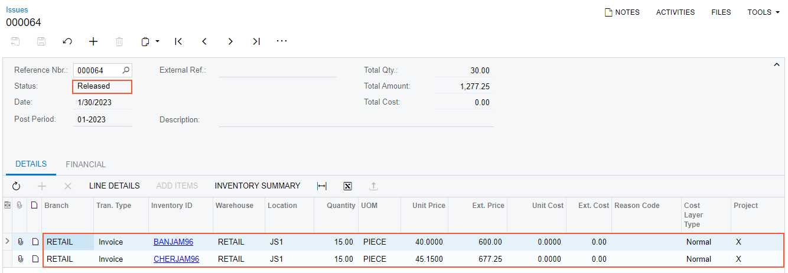

# Sales with Payments and Prepayments: To Process a Sales Order with a Payment {#_6f1ca645-2fe2-4e98-88be-205b4b84c436 .task}

The following activity will walk you through the processing of a sales order with a payment.

**Attention:** This activity is based on the *U100* dataset. If you are using another dataset or if any system settings have been changed in *U100*, these changes can affect the workflow of the activity and the results of the processing. To avoid issues, restore the *U100* dataset to its initial state.

## Story { .section}

Suppose the on January 30, 2026, the CoffeeShop customer has orders a large amount of banana and cherry jam for milkshakes. According to the credit terms of the CoffeeShop customer, a payment equal to the order amount must be made before you can ship the goods to the customer's location. The CoffeeShop company pays the required amount the same day as order has been made.

Acting as the sales manager of SweetLife Fruits &amp; Jams, you need to enter and process a sales order for CoffeeShop and record the payment made by the customer.

## Configuration Overview {#section_tz4_djx_cnb .section}

In the *U100* dataset, the following configuration tasks have been performed to prepare the system for this activity to be performed:

-   On the [Enable/Disable Features](CS_10_00_00.md) \(CS100000\) form, the *Inventory* feature, which provides the ability to create sales orders that include stock items, has been enabled.
-   On the [Order Types](SO_20_10_00.md) \(SO201000\) form, the predefined *SO* order type has been activated.
-   On the [Customers](AR_30_30_00.md) \(AR303000\) form, the *COFFEESHOP \(FourStar Coffee &amp; Sweets Shop\)* customer has been defined.
-   On the [Stock Items](IN_20_25_00.md) \(IN202500\) form, the *BANJAM96* and *CHERAM96* stock items have been defined.

## Process Overview { .section}

In the activity, to process a sales order with a payment, you will first create a sales order of the *SO* type on the [Sales Orders](SO_30_10_00.md) \(SO301000\) form and add items to be sold. Then you will create a payment on the **Payments** tab of the [Sales Orders](SO_30_10_00.md) form and release it on the [Payments and Applications](AR_30_20_00.md) \(AR302000\) form.

Then you will click **Create Shipment** on the form toolbar of the [Sales Orders](SO_30_10_00.md) form. The system will create the shipment and open it on the [Shipments](SO_30_20_00.md) \(SO302000\) form. You will release the shipment and click **Prepare Invoice** on the form toolbar. The system will create a sales invoice and open it on the [Invoices](SO_30_30_00.md) \(SO303000\) form. Then you will release the invoice.

## System Preparation { .section}

Do the following:

1.  Launch the Acumatica ERP website, and sign in to a company with the *U100* dataset preloaded. You should sign in as sales manager by using the *wiley* username and the *123* password.
2.  In the info area at the upper-right corner of the top pane of the Acumatica ERP screen, make sure that the business date is set to *1/30/2026*. If a different date is displayed, click the Business Date menu button and select *1/30/2026* from the calendar. For simplicity, you'll create and process all documents in this activity using this business date.
3.  On the Company and Branch Selection menu in the top pane of the Acumatica ERP screen, select the *SweetLife Store* branch.

## Step 1: Entering the Sales Order { .section}

To create the sales order for the FourStar Coffee &amp; Sweets Shop, do the following:

1.  Open the [Sales Orders](SO_30_10_00.md) \(SO301000\) form.

    **Tip:** To open the form for creating a new record, type the form ID in the Search box, and on the Search form, point at the form title and click **New** right of the title.

2.  On the form toolbar, click **Add New Record**.
3.  In the Summary area, specify the following settings:
    -   **Order Type**: *SO*
    -   **Customer**: *COFFEESHOP*
    -   **Description**: `Sale of banana and cherry jam`
4.  On the table toolbar of the **Details** tab, click **Add Row**.
5.  In the added row, specify the following settings:
    -   **Inventory ID**: *BANJAM96*
    -   **Warehouse**: *RETAIL* \(inserted automatically\)
    -   **Quantity**: `15`
6.  Click **Add Row** again.
7.  In the added row, specify the following settings:
    -   **Inventory ID**: *CHERJAM96*
    -   **Warehouse**: *RETAIL*
    -   **Quantity**: `15`
8.  On the form toolbar, click **Save**.

## Step 2: Creating and Releasing the Payment { .section}

Now you need to record the payment made by the *COFFEESHOP* customer. To perform this task, do the following while you are still viewing the sales order on the [Sales Orders](SO_30_10_00.md) \(SO301000\) form:

1.  On the table toolbar of the **Payments** tab, click **Create Payment**.
2.  In the **Create Payment** dialog box, which opens, make sure that *10200WH - Wholesale Checking* is specified in the **Cash Account** box.
3.  In the **Payment Amount** box, verify that the payment amount is *1390.61*.
4.  Click **OK** to close the dialog box.

    The system creates a payment and applies it to the sales order.

5.  In the only row on the **Payments** tab, click the link in the **Reference Nbr.** column.

    The system opens the payment on the [Payments and Applications](AR_30_20_00.md) \(AR302000\) form in a new browser window.

6.  On the form toolbar, click **Remove Hold**, and then click **Release**.
7.  Close the browser window with the [Payments and Applications](AR_30_20_00.md) form and return to the sales order on the [Sales Orders](SO_30_10_00.md) form.

The payment has been created and released. Now you can process the shipment.

## Step 3: Creating the Shipment { .section}

While you are still viewing the sales order on the [Sales Orders](SO_30_10_00.md) \(SO301000\) form, process the shipment as follows:

1.  On the form toolbar, click **Create Shipment**.
2.  In the **Specify Shipment Parameters** dialog box, which opens, make sure the *1/30/2026* date and the *RETAIL* warehouse are selected, and click **OK**.

The system creates a shipment and opens it on the [Shipments](SO_30_20_00.md) \(SO302000\) form.

## Step 4: Confirming the Shipment { .section}

To confirm the shipment you have created, do the following, while you are still viewing the shipment on the [Shipments](SO_30_20_00.md) \(SO302000\) form:

1.  Review the lines on the **Details** tab. Make sure that both order lines have been included in the shipment and that the shipped quantity in both lines is equal to the ordered quantity.
2.  On the form toolbar, click **Confirm Shipment**.

The shipment is assigned the *Confirmed* status, and now you can prepare the invoice to bill the customer and increase the customer's debt in the system.

## Step 5: Processing the Invoice { .section}

To prepare and release the invoice related to the sales order and shipment, do the following:

1.  While you are still viewing the shipment on the [Shipments](SO_30_20_00.md) \(SO302000\) form, on the form toolbar, click **Prepare Invoice**. The system prepares the invoice and opens it on the [Invoices](SO_30_30_00.md) \(SO303000\) form.
2.  On this form, review the details of the prepared invoice. The invoice has two lines, as the sales order does. On the **Applications** tab, notice that the system has inserted the line with the payment, which you have created in Step 2.
3.  On the form toolbar, click **Release** to release the invoice.

    The invoice is assigned the *Closed* status and the value in the **Balance** box in the Summary area is *0*, which means that the invoice has been fully processed.

4.  Return to the [Sales Orders](SO_30_10_00.md) \(SO301000\) form, and open the sales order that you have processed.
5.  On the **Shipments** tab, in the only row, click the link in the **Inventory Ref. Nbr.** column to view the inventory issue that was generated when you released the invoice.
6.  On the [Issues](IN_30_20_00.md) \(IN302000\) form, which opens, review the details of the inventory issue, which is shown in the following screenshot. Make sure the issue has the *Released* status, which means that the issue has been released and the items' quantities in inventory have been decreased appropriately.

    

The processing of the sales order with a payment is now complete.

**Parent topic:**[Processing Sales with Payments and Prepayments](../UserGuide/OrderMgmt_Sales_Orders_with_Payments_and_Prepayments_Mapref.md)

