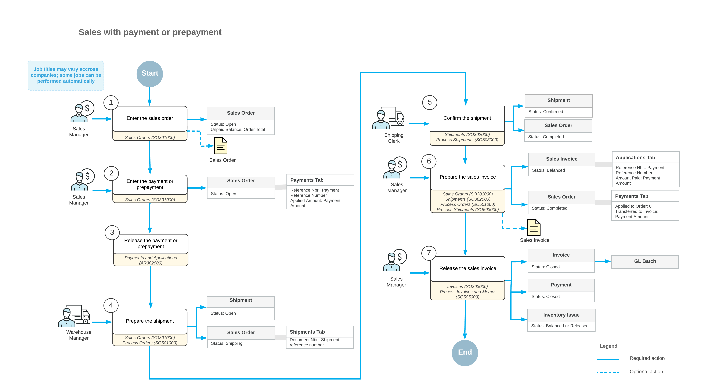

# Sales with Payments and Prepayments: General Information {#_d2970b19-b147-4020-9e53-9256ac842e7f .concept}

Companies need to keep track of the incoming funds that are paid for the sold items in order to accurately account for what has been paid and what needs to be paid. In some cases, these funds need to be paid before the items can be purchased or produced.

In Acumatica ERP, the you use payment and prepayment functionality to record the amount of funds that has already been paid for each sales order.

## Learning Objectives { .section}

In this chapter, you will learn how to do the following:

-   Create a sales order
-   Create a prepayment or payment for the sales order
-   Create a shipment for the sales order
-   Confirm the shipment
-   Create an invoice for a sales order
-   Process the invoice

## Applicable Scenarios { .section}

You create sales orders with payments and prepayments in the following cases:

-   When you sell goods that you produce or purchase only after you have received a payment, according to company policy
-   When you have a contract with a customer that requires a certain prepayment percent before the goods can be shipped

## Sales Orders with Payments and Prepayments { .section}

The standard processing of a sales order with a payment or prepayment typically involves entering a sales order, entering a payment or prepayment, processing a shipment of the items, and preparing the related invoice for the customer.

In Acumatica ERP, to begin processing a sale that requires the items to be shipped before billing occurs, you enter a sales order on the [Sales Orders](SO_30_10_00.md) \(SO301000\) form and add to the order the items the customer has requested.

When the customer pays the amount that is required before the sales order can be processed further, you create a prepayment document and apply it to the sales order.

Then you use the [Shipments](SO_30_20_00.md) \(SO302000\) form to prepare and confirm the shipment or shipments related to the sales order. When the shipment confirmation is complete, you need to bill the customer for the shipped items by preparing a sales invoice, which is a financial document in the system that contains links to the related shipments and sales orders. You can view the prepared sales invoice on the [Invoices](SO_30_30_00.md) \(SO303000\) form. If any payment is still required for the sales order, after the money is received, you create a payment and apply it to the sales invoice; then you can release the invoice. When the sales invoice is released, you can view it on the [Invoices and Memos](AR_30_10_00.md) \(AR301000\) form.

An AR invoice on the [Invoices and Memos](AR_30_10_00.md) form is a financial document that does not contain links to the applicable shipments and sales orders, as the sales invoice does. The AR invoice and sales invoice have the same reference number, which the system prints in the customer statement. On both the [Invoices](SO_30_30_00.md) form and the [Invoices and Memos](AR_30_10_00.md) form, you can view the link to the batch of the general ledger transactions that was generated when the invoice was released. For more information on processing AR invoices, see [Processing AR Invoices](Finance_ARInvoices_Mapref.md).

## Workflow of Processing a Sales Order with a Payment or Prepayment { .section}

For a sales orders with a payment or prepayment, the typical processing involves the actions and generated documents shown in the following diagram.

**Parent topic:**[Processing Sales with Payments and Prepayments](../UserGuide/OrderMgmt_Sales_Orders_with_Payments_and_Prepayments_Mapref.md)

