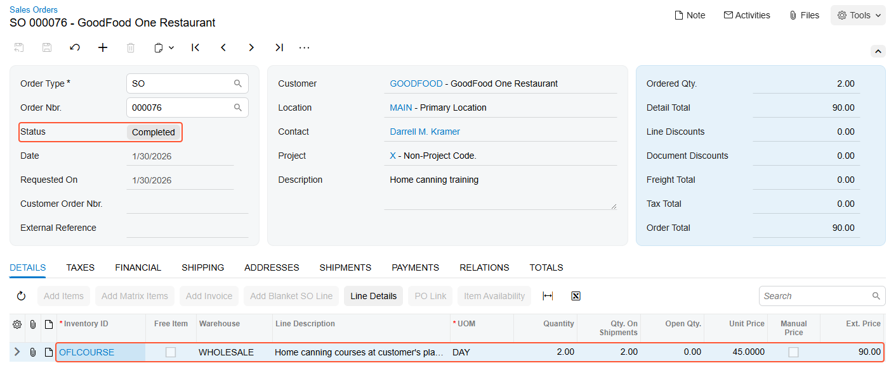

# Sales of Non-Stock Items with Shipping: Process Activity {#_ada11709-b2ca-4644-9f79-2c6c903d510c .task}

In this activity, you will prepare and process a sales order for non-stock items that need to be shipped to the customer's location.

**Attention:** This activity is based on the *U100* dataset. If you are using another dataset or if any system settings have been changed in *U100*, these changes can affect the workflow of the activity and the results of the processing. To avoid issues, restore the *U100* dataset to its initial state.

## Story { .section}

Suppose that the GoodFood One Restaurant customer has asked SweetLife Fruits &amp; Jams to conduct a two-day training course on home canning for the café's employees.

The materials to be used for the upcoming training on home canning \(which are included in the price of the training\) need to be delivered to the customer's location before the course is conducted. You, as a sales manager, need to reflect these details in the system by entering and processing the appropriate documents.

## Configuration Overview { .section}

In the *U100* dataset, the following tasks have been performed to support this activity:

-   On the [Enable/Disable Features](CS_10_00_00.md) \(CS100000\) form, the *Inventory* feature has been enabled.
-   On the [Order Types](SO_20_10_00.md) \(SO201000\) form, the *SO* order type has been configured and activated.
-   On the [Customers](AR_30_30_00.md) \(AR303000\) form, the *GOODFOOD \(GoodFood One Restaurant\)* customer has been created.
-   On the [Non-Stock Items](IN_20_20_00.md) \(IN202000\) form, the *OFLCOURSE \(Home canning courses at customer's place\)* non-stock item has been created, and the **Require Shipment** check box has been selected for this item on the **General** tab.

## Process Overview { .section}

In this activity, you will create a sales order on the [Sales Orders](SO_30_10_00.md) \(SO301000\) form, and then add a non-stock item to it. After that, you will create a related shipment document on the [Shipments](SO_30_20_00.md) \(SO302000\) form. On this form, you will check the settings that the system has specified automatically, and then confirm the shipment. After shipment confirmation, you will use the [Invoices](SO_30_30_00.md) \(SO303000\) form to prepare a sales invoice to the customer and release it.

## System Preparation { .section}

Before you start processing a sales order that includes non-stock items with shipping, you should do the following:

1.  Launch the Acumatica ERP website with the *U100* dataset preloaded and sign in to the system as a sales and purchasing manager by using the *norman* username and the *123* password.
2.  In the info area at the upper-right corner of the top pane of the Acumatica ERP screen, make sure that the business date is set to *1/30/2026*. If a different date is displayed, click the Business Date menu button and select *1/30/2026* from the calendar. For simplicity, you'll create and process all documents in this activity using this business date.

## Step 1: Creating a Sales Order { .section}

To create a sales order, do the following:

1.  On the [Sales Orders](SO_30_10_00.md) \(SO301000\) form, add a new record.
2.  In the Summary area, specify the following settings:
    -   **Order Type**: *SO*
    -   **Customer**: *GOODFOOD*
    -   **Description**: `Home canning training`
3.  On the **Details** tab, click **Add Row** on the table toolbar, and specify the following settings in the row:
    -   **Inventory ID**: *OFLCOURSE*
    -   **Warehouse**: *WHOLESALE*
    -   **Quantity**: `2`
    -   **Unit Price**: `45`
4.  On the form toolbar, click **Save**.

Now you need to create a shipment for the materials that need to be shipped in advance of the training.

## Step 2: Creating a Shipment { .section}

To create the shipment related to the sales order, do the following:

1.  While you are still viewing the sales order that you have created on the [Sales Orders](SO_30_10_00.md) \(SO301000\) form, on the form toolbar, click **Create Shipment**.
2.  In the **Specify Shipment Parameters** dialog box, which opens, make sure that make sure that the *1/30/2026* business date and the *WHOLESALE* warehouse are selected, and click **OK**.

The system closes the dialog box, creates a shipment and opens it on the [Shipments](SO_30_20_00.md) \(SO302000\) form.

## Step 3: Confirming the Shipment { .section}

To confirm the shipment, do the following:

1.  While you are still viewing the shipment on the [Shipments](SO_30_20_00.md) \(SO302000\) form, make sure that the order line with the non-stock item has been included in the shipment on the **Details** tab.
2.  On the form toolbar, click **Confirm Shipment**.

Notice that the shipment is assigned the *Confirmed* status. Now you can prepare the invoice to bill the customer and increase the customer's debt in the system.

## Step 4: Processing the Sales Invoice { .section}

To prepare and release a sales invoice related to the sales order \(and shipment\), do the following:

1.  While you are still viewing the shipment on the [Shipments](SO_30_20_00.md) \(SO302000\) form, on the form toolbar, click **Prepare Invoice**. The system prepares the invoice and opens it on the [Invoices](SO_30_30_00.md) \(SO303000\) form.
2.  On this form, review the details of the prepared invoice. The invoice has one line on the **Details** tab, as the initial sales order does. In the **Shipment Nbr.** and **Order Nbr.** columns of this tab, the system has inserted the reference numbers of the related shipment and sales order \(which you created in Steps 1 and 2 of this activity\); these numbers are also links that you can click to view the shipment and sales order on the appropriate forms.
3.  On the form toolbar, click **Release** to release the sales invoice. The invoice is assigned the *Open* status.
4.  On the **Details** tab, in the only row, click the link in the **Order Nbr.** column to view the associated sales order.
5.  On the [Sales Orders](SO_30_10_00.md) \(SO301000\) form, which opens, review the details of the sales order, as shown in the following screenshot. Notice that the sales order has the *Completed* status, which the system assigned on release of the sales invoice, and which means that the processing of the sale is completed.

    

**Parent topic:**[Processing Sales of Non-Stock Items with Shipping](../UserGuide/OrderMgmt_Sales_of_Non_Stock_Items_with_Shipping_Mapref.md)

