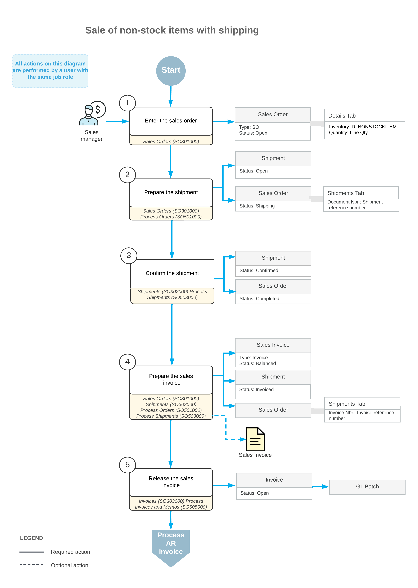

# Sales of Non-Stock Items with Shipping: General Information {#_90f14921-2a76-4a15-9fab-4eb180a08f51 .concept}

Non-stock items in Acumatica ERP, which are defined on the [Non-Stock Items](IN_20_20_00.md) \(IN202000\) form during implementation, are used to represent products that cannot be stocked in warehouses \(such as services or charges\) or physical entities whose quantities you do not need to track.

The following sections describe the sales process of non-stock items that are shipped to the customer.

## Learning Objectives { .section}

In this chapter, you will do the following:

-   Prepare a sales order for a sale of non-stock items with shipping
-   Prepare the shipment for the sales order
-   Prepare the invoice that corresponds to the sales order

## Applicable Scenario { .section}

You process a sales order with non-stock lines and then create a shipment if a customer buys some goods that are defined as non-stock items in the system, and the goods must be shipped to the customer's place.

## Sales of Non-Stock Items with Shipping { .section}

The standard sales process with order management software typically includes entering a sales order, processing a shipment of the items, and preparing the related sales invoice for the customer. In Acumatica ERP, to begin processing a sale that requires the items to be shipped before billing occurs, you enter a sales order of the *SO* type on the [Sales Orders](SO_30_10_00.md) \(SO301000\) form and add the requested non-stock items to the order.

Then you use the [Shipments](SO_30_20_00.md) \(SO302000\) form to prepare and confirm each shipment related to the sales order. When each shipment is confirmed, you need to bill the customer for the shipped items by preparing a sales invoice, which is a financial document in the system that contains links to the applicable shipments and sales orders. You can review the prepared sales invoice on the [Invoices](SO_30_30_00.md) \(SO303000\) form; then you can release it. When the sales invoice is released, the sales invoice becomes visible on the [Invoices and Memos](AR_30_10_00.md) \(AR301000\) form as an AR invoice.

An AR invoice on the [Invoices and Memos](AR_30_10_00.md) form is a financial document that does not contain links to the applicable sales orders, as the sales invoice does. The AR invoice and sales invoice have the same reference number, which the system prints in the customer statement. On both the [Invoices](SO_30_30_00.md) form and the [Invoices and Memos](AR_30_10_00.md) form, you can view the link to the batch of the general ledger transactions that was generated when the invoice was released. For more information on processing AR invoices, see [Processing AR Invoices](Finance_ARInvoices_Mapref.md).

## Workflow of Sales of Non-Stock Items with Shipping { .section}

If a sales order includes only non-stock items with shipment, the processing of the sales order involves the actions and generated documents shown in the following diagram.

**Parent topic:**[Processing Sales of Non-Stock Items with Shipping](../UserGuide/OrderMgmt_Sales_of_Non_Stock_Items_with_Shipping_Mapref.md)

