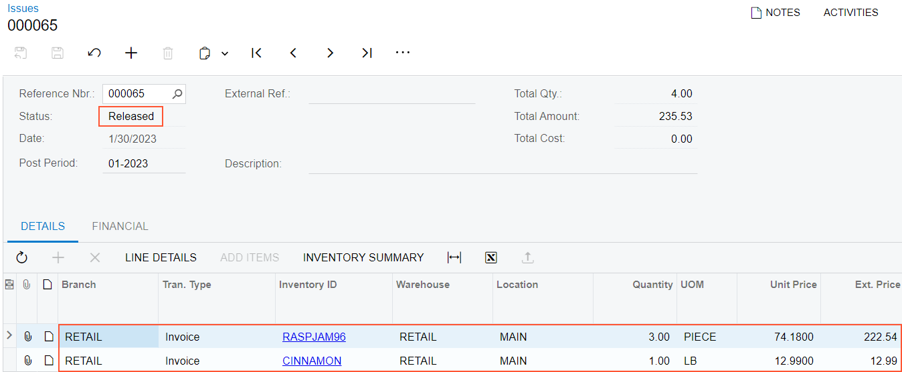

# Related Items in Sales Orders: To Sell a Cross-Sell Item {#_aad990f2-a964-48f1-b70d-15b42a6d82ee .task}

The following activity will walk you through the processing of a sales order with a cross-sell item.

**Attention:** This activity is based on the *U100* dataset. If you are using another dataset or if any system settings have been changed in *U100*, these changes can affect the workflow of the activity and the results of the processing. To avoid issues, restore the *U100* dataset to its initial state.

## Story { .section}

Suppose that the FourStar Coffee &amp; Sweets Shop customer orders three 96-ounce jars of raspberry jam from the SweetLife retail store. When the sales manager enters the sales order, she notices that the raspberry jam has cinnamon specified as a cross-sell item for the raspberry jam. The sales manager offers to add the cinnamon to the order, and the purchasing manager of FourStar Coffee &amp; Sweets Shop agrees to buy one pound of the spice.

Acting as the sales manager of SweetLife Fruits &amp; Jams, you need to enter and process the sales order for the original item and the cross-sell item.

## Configuration Overview {#section_tz4_djx_cnb .section}

In the *U100* dataset, the following configuration tasks have been performed to prepare the system for this activity to be performed:

-   On the [Enable/Disable Features](CS_10_00_00.md) \(CS100000\) form, the *Inventory* feature, which provides the ability to create sales orders that include stock items, has been enabled.
-   On the [Order Types](SO_20_10_00.md) \(SO201000\) form, the predefined *SO* order type has been activated.
-   On the [Customers](AR_30_30_00.md) \(AR303000\) form, the *COFFEESHOP \(FourStar Coffee &amp; Sweets Shop\)* customer has been defined.
-   On the [Stock Items](IN_20_25_00.md) \(IN202500\) form, the *RASPJAM96* and *CINNAMON* stock items have been defined.

## Process Overview {#section_yfn_1bc_dwb .section}

In this activity, to process a sales order with the original item and a cross-sell item, you will first create a sales order of the *SO* type on the [Sales Orders](SO_30_10_00.md) \(SO301000\) form and add a line with the original item to the sales order. You will then review the suggestions and add the cross-sell item.

Then you will save the sales order and click **Prepare Invoice** on the form toolbar. The system will create an sales invoice and open it on the [Invoices](SO_30_30_00.md) \(SO303000\) form. Finally, you will release the invoice.

## System Preparation { .section}

Do the following:

1.  Launch the Acumatica ERP website, and sign in to a company with the *U100* dataset preloaded. You should sign in as the sales manager by using the *wiley* username and the *123* password.
2.  In the info area at the upper-right corner of the top pane of the Acumatica ERP screen, make sure that the business date is set to *1/30/2026*. If a different date is displayed, click the Business Date menu button and select *1/30/2026* from the calendar. For simplicity, you'll create and process all documents in this activity using this business date.
3.  On the company and branch selection menu, on the top pane of the Acumatica ERP screen, select the *SweetLife Store* branch.

## Step 1: Entering the Sales Order { .section}

To create the sales order for FourStar Coffee &amp; Sweets Shop, do the following:

1.  Open the [Sales Orders](SO_30_10_00.md) \(SO301000\) form.

    **Tip:** To open the form for creating a new record, type the form ID in the Search box, and on the Search form, point at the form title and click **New** right of the title.

2.  On the form toolbar, click **New Record**.
3.  Specify the following settings in the Summary area:
    -   **Order Type**: *SO*
    -   **Customer**: *COFFEESHOP*
    -   **Description**: *Sale of raspberry jam*
4.  On the table toolbar, click **Add Row**.
5.  In the added row, specify the following settings:
    -   **Inventory ID**: *RASPJAM96*
    -   **Warehouse**: *RETAIL*
    -   **Quantity**: *3*
6.  On the form toolbar, click **Save**.

Notice that on the table toolbar, the system displays a warning message that this item has a cross-sell item.

## Step 2: Adding the Cross-Sell Item { .section}

In this step, you need to add the cross-sell item to the sales order. While you are still viewing the sales order that you have created on the [Sales Orders](SO_30_10_00.md) \(SO301000\) form, do the following:

1.  In the only line on the **Details** tab, click the button in the **Related Items** column.
2.  In the **Add Related Items** dialog box, which opens, select the unlabeled check box in the line with the *RETAIL* value in the **Warehouse** column on the **Cross-Sell Items** tab.
3.  Click **Add and Close**.

    The system closes the dialog box and adds the line with the *CINNAMON* item to the sales order.

4.  In the line with the *CINNAMON* item, specify the following settings:
    -   **Quantity**: *1*
    -   **Unit Price**: *12.99*
5.  On the form toolbar, click **Save**.

## Step 3: Creating the Shipment { .section}

While you are still viewing the sales order on the [Sales Orders](SO_30_10_00.md) \(SO301000\) form, process the shipment for it as follows:

1.  On the form toolbar, click **Create Shipment**.
2.  In the **Specify Shipment Parameters** dialog box, which opens, make sure the *1/30/2026* date and the *RETAIL* warehouse are selected, and click **OK**.

The system creates a shipment and opens it on the [Shipments](SO_30_20_00.md) \(SO302000\) form.

## Step 4: Confirming the Shipment { .section}

To confirm the shipment you have created, do the following, while you are still viewing the shipment on the [Shipments](SO_30_20_00.md) \(SO302000\) form:

1.  Review the lines on the **Details** tab. Make sure that both order lines have been included in the shipment and that the shipped quantity in both lines is equal to the ordered quantity.
2.  On the form toolbar, click **Confirm Shipment**.

The shipment is assigned the *Confirmed* status, and now you can prepare the invoice to bill the customer and increase the customer's debt in the system.

## Step 5: Processing the Invoice { .section}

To prepare and release the invoice related to the sales order and shipment, do the following:

1.  While you are still viewing the shipment on the [Shipments](SO_30_20_00.md) \(SO302000\) form, on the form toolbar, click **Prepare Invoice**. The system creates the invoice and opens it on the [Invoices](SO_30_30_00.md) \(SO303000\) form.
2.  On this form, review the details of the prepared invoice. The invoice has two lines, as the initial sales order does. In the **Shipment Nbr.** and **Order Nbr.** columns of the **Details** tab, notice that the system has inserted the reference numbers of the related shipment and sales order, which are links you can click to open these documents.
3.  On the form toolbar, click **Release** to release the invoice.
4.  Return to the [Sales Orders](SO_30_10_00.md) \(SO301000\) form, and open the sales order that you have processed.
5.  On the **Shipments** tab, in the only row, click the link in the **Inventory Ref. Nbr.** column to view the inventory issue that was generated when you released the invoice.
6.  On the [Issues](IN_30_20_00.md) \(IN302000\) form, which opens, review the details of the inventory issue, which is shown in the following screenshot. Make sure the issue has the *Released* status, which means that the issue has been released and the items' quantities in inventory have been decreased appropriately.

    

The processing of the sales order is now complete.

**Parent topic:**[Processing Sales of Related Items](../UserGuide/OrderMgmt_Sales_of_Related_Items_Mapref.md)

