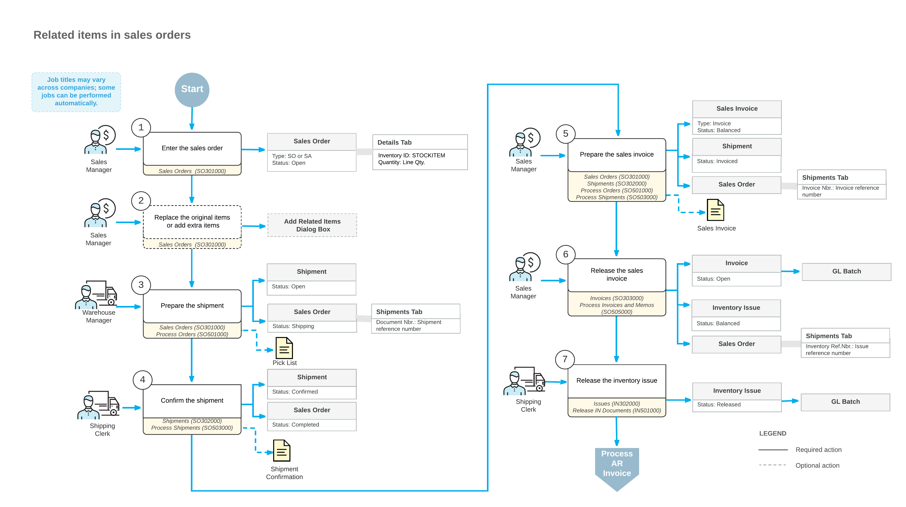

# Related Items in Sales Orders: General Information {#_4a45a020-0a84-4339-b3ba-6c641d0ba2a9 .concept}

In Acumatica ERP, if the *Related Items* or *Retail Commerce* feature is enabled on the [Enable/Disable Features](CS_10_00_00.md#) \(CS100000\) form, you can use the functionality of related items to increase the value of sales and improve customer satisfaction. You can specify cross-sell, up-sell, and substitute items in the settings of any stock or non-stock item. Defining related items simplifies item selection when an employee enters a sales order in the following scenarios:

-   An additional item would add value.
-   The customer may benefit from a higher-quality item.
-   The original item is sold out and should be replaced.

## Learning Objectives { .section}

In this chapter, you will learn how to do the following:

-   In the settings of an original item, specify items related to the original item
-   Add cross-sell items to a sales order
-   Replace original items in a sales order with up-sell and substitute items

## Applicable Scenarios { .section}

You may want to sell related items in the following cases:

-   You want to increase the value of a sale by giving users the ability to replace the original item with a higher-cost item.
-   You want to increase the value of a sale by making it easy to add useful related items to the sales order.
-   The original item is sold out, and you want to give users the ability to suggest an item with similar characteristics.

## Types of Item Relations { .section}

In Acumatica ERP, you specify related items for a stock or non-stock item on the **Related Items** tab of the [Stock Items](IN_20_25_00.md) \(IN202500\) or [Non-Stock Items](IN_20_20_00.md) \(IN202000\) form, respectively. For each item that is related to the item selected on the form, you add a row in which you specify the ID of the item and the type of the relation, among other settings.

In the **Relation** column, you select one of the following relation types for each related item:

-   *Cross-Sell*: This related item can be sold along with the original item to increase the value of a sale. For example, you can specify apple jam as a cross-sell item for apples.
-   *Up-Sell*: This related item can be sold instead of the original item to increase the value of a sale. For example, you can specify a jar of jam of a higher volume as an up-sell item for a jar of jam.
-   *Substitute*: This related item can be sold instead of the original item if the original item is out of stock so that a sale can still occur. For example, you can specify three 32-ounce jars of jam as a substitute item for one 96-ounce jar of jam if the 96-ounce jars of jam are out of stock.
-   *Other*: This item is related to the original item in some other regard.

## Entry of a Sales Order with Related Items {#section_g5b_3wt_2sb .section}

To enter a sale and obtain information about related items, you create a sales order on the [Sales Orders](SO_30_10_00.md) \(SO301000\) form, specify the customer and the description of the order \(among any other order settings\), and add the original items on the **Details** tab. If an original item in a line has any related items, the system shows one of the following buttons in the **Related Items** column:

-   : There is at least one item with the *Cross-Sell* or *Other* type of relation that is marked as required for the original item. That is, the **Required** check box is selected for a line with such a related item on the **Related Items** tab of the [Stock Items](IN_20_25_00.md) \(IN202500\) or [Non-Stock Items](IN_20_20_00.md) \(IN202000\) form. When this button appears, you can create a shipment and process the sales order to completion even if the original item has not been replaced and no extra items have been added to the sales order.
-   : There are related items of any relation type for the original item, and the substitution or cross-selling is not mandatory. That is, the **Required** check box is not selected for all lines with related items on the **Related Items** tab of the [Stock Items](IN_20_25_00.md) or [Non-Stock Items](IN_20_20_00.md) form. When this button appears, you can process the sales order to completion without replacing the original item.
-   : There are substitute items for the original item, and the substitution is mandatory. That is, the **Required** check box is selected for at least one line with the *Substitute* type selected in the **Relation** column on the **Related Items** tab of the [Stock Items](IN_20_25_00.md) or [Non-Stock Items](IN_20_20_00.md) form. When this button appears, you cannot create a shipment until the original item has been replaced with a substitute item.

You click the button in the **Related Items** column and review the list of related items in the **Add Related Items** dialog box, which opens. This dialog box can have up to five tabs: four for the types of items related to the original item, and one for items with all types of relations displayed together. If the customer's approval is required \(that is, if the **Customer Approval Not Needed** check box is cleared\), you request the approval. If the customer agrees to replace the original item or buy an additional item, you select the unlabeled check box in the line with the related item on the appropriate tab of the dialog box and click **Add and Close**. You repeat these actions for each line with an original item for which the **Related Items** column contains a button indicating that related items exist for this original item.

## Processing of a Sales Order with Related Items {#section_h5b_3wt_2sb .section}

When you are done editing the list of items on the **Details** tab of the [Sales Orders](SO_30_10_00.md) \(SO301000\) form, you save the sales order and then click **Create Shipment** on the form toolbar. The system opens the shipment on the [Shipments](SO_30_20_00.md) \(SO302000\) form. When the sold items are shipped to the customer's destination, you release the shipment on the same form.

Once the shipment has been released, you bill the customer for the shipped items by preparing the sales invoice, which contains links to the related shipments and sales orders. While you are still viewing the shipment, you click **Prepare Invoice** on the form toolbar. The system creates the sales invoice and opens it on the [Invoices](SO_30_30_00.md) \(SO303000\) form. You review the sales invoice and then release it. When the sales invoice is released, the system automatically generates a corresponding inventory issue on the [Issues](IN_30_20_00.md) \(IN302000\) form for the shipped items; the issue has the same date and posting period as the invoice does. When the sales invoice is released, it becomes visible on the [Invoices and Memos](AR_30_10_00.md) \(AR301000\) form as an AR invoice.

An AR invoice on the [Invoices and Memos](AR_30_10_00.md) form is a financial document that does not contain links to the applicable sales orders, as the sales invoice does. The AR invoice and sales invoice have the same reference number, which the system prints in the customer statement. On both the [Invoices](SO_30_30_00.md) form and the [Invoices and Memos](AR_30_10_00.md) form, you can view the link to the batch of the general ledger transactions that was generated when the invoice was released. For more information on processing AR invoices, see [Processing AR Invoices](Finance_ARInvoices_Mapref.md).

## Workflow of Sales that May Include Related Items {#section_vv2_1y4_y4b .section}

For sales that may include related items, the typical process involves the actions and generated documents shown in the following diagram.

**Parent topic:**[Processing Sales of Related Items](../UserGuide/OrderMgmt_Sales_of_Related_Items_Mapref.md)

