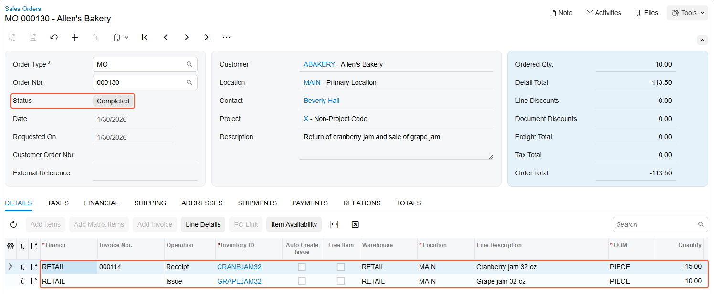

# Sales with Returns: Process Activity {#_be1c4c94-cdc1-4385-92db-1ad22b3018b8 .task}

The following activity demonstrates how to process to completion a sale with a return in the same order.

**Attention:** This activity is based on the *U100* dataset. If you are using another dataset or if any system settings have been changed in *U100*, these changes can affect the workflow of the activity and the results of the processing. To avoid issues, restore the *U100* dataset to its initial state.

## Story { .section}

Suppose that you are Regina Wiley, a sales manager at the SweetLife Fruits &amp; Jams company. On January 29, 2026, a representative of the Allen's Bakery customer came to the SweetLife's store and bought 30 jars of peach jam and 15 jars of cranberry jam. The next day, the representative came to the store again to return the 15 jars of cranberry jam because these jars were leaking. While returning the cranberry jam, the customer decided to also buy 10 jars of grape jam.

Because the representative has come to the counter to perform both the sale and the return, you want to simplify the process by using a mixed order. SweetLife owes some money to Allen's Bakery because the total amount of the purchased items is less than the amount to be returned for the received items. After you create the order, you need to process the customer refund as well. Acting as the sales manager, you need to process the sale and the return of the jam.

## Configuration Overview {#section_tz4_djx_cnb .section}

In the *U100* dataset, the following tasks have been performed to support this activity:

-   On the [Enable/Disable Features](CS_10_00_00.md) \(CS100000\) form, the following features have been enabled:
    -   *Inventory and Order Management*, which provides the standard functionality of inventory and order management
    -   *Inventory*, which gives you the ability to maintain stock items by using forms related to the inventory functionality and to create and process sales and purchase documents that include stock items
-   On the [Sales Orders Preferences](SO_10_10_00.md) \(SO101000\) form, the **Automatically Release IN Documents** check box has been selected.
-   On the [Order Types](SO_20_10_00.md) \(SO201000\), the *MO* order type, which has the *Mixed Order* automation behavior, has been activated.
-   On the [Customers](AR_30_30_00.md) \(AR303000\) form, the *ABAKERY* \(Allen's Bakery\) customer has been created.
-   On the [Stock Items](IN_20_25_00.md) \(IN202500\) form, the *PEACHJAM32*, *CRANBJAM32*, and *GRAPEJAM32* items have been created.
-   The following sales documents, for which you will process a return, have been created:
    -   On the [Sales Orders](SO_30_10_00.md) \(SO301000\) form, a sales order for the *ABAKERY* customer has been created. \(The order has 30 units of the *PEACHJAM32* stock item and 15 units of the *CRANBJAM32* stock item, and is dated 1/29/2026.\)
    -   On the [Payments and Applications](AR_30_20_00.md) \(AR302000\) form, a payment dated 1/29/2026 and linked to the sales order has been created and released.
    -   On the [Invoices](SO_30_30_00.md) \(SO303000\) form, a sales invoice that is related to the sales order has been created and released.

## Process Overview { .section}

In this activity, you will create an order of the *MO* type on the [Sales Orders](SO_30_10_00.md) \(SO301000\) form. You will add the returned stock item from the released sales invoice and a new stock item for sale. You will create a customer refund related to this order. You will release the customer refund on the [Payments and Applications](AR_30_20_00.md) \(AR302000\) form. On the [Sales Orders](SO_30_10_00.md) form, you will initiate the creation of the credit memo linked to the mixed order; finally, you will release the credit memo on the [Invoices](SO_30_30_00.md) \(SO303000\) form.

## System Preparation { .section}

Before you start processing sales with returns in the same order, do the following:

1.  Launch the Acumatica ERP website with the *U100* dataset preloaded, and sign in as sales manager Regina Wiley by using the *wiley* username and the *123* password.
2.  In the info area at the upper-right corner of the top pane of the Acumatica ERP screen, make sure that the business date is set to *1/30/2026*. If a different date is displayed, click the Business Date menu button and select *1/30/2026* from the calendar. For simplicity, you'll create and process all documents in this activity using this business date.
3.  On the Company and Branch Selection menu in the top pane of the Acumatica ERP screen, select the *SweetLife Store* branch.

## Step 1: Creating a Mixed Order { .section}

To create the mixed order for Allen's Bakery, do the following:

1.  On the [Sales Orders](SO_30_10_00.md) \(SO301000\) form, add a new record.
2.  In the Summary area, specify the following settings:
    -   **Order Type**: *MO*
    -   **Customer**: *ABAKERY*
    -   **Date**: *1/30/2026*
    -   **Description**: `Return of cranberry jam and sale of grape jam`
3.  On the table toolbar of the **Details** tab, click **Add Invoice** to begin adding the line for the returned item.
4.  In the **Add Invoice Details** dialog box, which opens, do the following:
    1.  In the **AR Doc. Type** box, make sure that *Invoice* is selected.
    2.  In the **Inventory ID** box, select *CRANBJAM32*.

        The table shows the order line with the selected item. Notice that in the line, the **Available for Return** quantity is *15* and the **Qty. to Return** is *0*. Also notice that the order number is shown in the **Order Nbr.** column and the number of the related invoice is shown in the **AR Doc. Nbr.** column. These numbers are also links that you can click to open the document in a pop-up window.

    3.  In the table, select the unlabeled check box for the line with the *CRANBJAM32* item.

        Notice that the **Qty. to Return** is now the same as the **Available for Return** quantity, which is *15*. You could change the **Qty. to Return** if fewer units of the item were being returned.

    4.  Click **Add &amp; Close** to close the dialog box.

        In the line on the **Details** tab of the form, notice that the number of the original invoice has been inserted in the **Invoice Nbr.** column, *Receipt* has been inserted in the **Operation** column, and *-15* has been inserted in the **Quantity** column \(the original line quantity was *15*\).

5.  On the table toolbar of the **Details** tab, click **Add Row** to manually add the line for the item to be sold.
6.  Specify the following settings in this row:
    -   **Branch**: *RETAIL*
    -   **Inventory ID**: *GRAPEJAM32*
    -   **Warehouse**: *RETAIL*
    -   **Location**: *MAIN*
    -   **Quantity**: `10`
7.  On the form toolbar, click **Save**.

You have created the mixed order. Because the order balance is negative \(notice that **Order Total** in the Summary area is *-113.50*\), you need to process a customer refund for this order, which you will do in the next step.

## Step 2: Processing a Customer Refund for the Mixed Order { .section}

To create a customer refund for the mixed order, do the following:

1.  While you are still viewing the *Return of cranberry jam and sale of grape jam* order on the [Sales Orders](SO_30_10_00.md) \(SO301000\) form, on the table toolbar of the **Payments** tab, click **Create Refund**.
2.  In the dialog box, which opens, do the following:
    1.  In the **Refund Amount** box, make sure that the amount is the same as the **Unrefunded Balance** amount on the **Payments** tab.
    2.  In the **Payment Method** box, select *CASH*.
    3.  In the **Cash Account** box, select *10100ST - SweetStore Petty Cash*.
    4.  Click **Create** to close the dialog box.
3.  On the **Payments** tab, in the **Reference Nbr.** column, click the link to open the customer refund on the [Payments and Applications](AR_30_20_00.md) \(AR302000\) form in a pop-up window.
4.  On the form toolbar, click **Remove Hold**.
5.  Click **Release**. Notice that the released customer refund is assigned the *Open* status.
6.  Close the [Payments and Applications](AR_30_20_00.md) form.
7.  Refresh the webpage for the [Sales Orders](SO_30_10_00.md) form, to which you return.

## Step 3: Processing a Credit Memo for the Mixed Order { .section}

To process a credit memo for the mixed order, do the following:

1.  While you are still viewing the *Return of cranberry jam and sale of grape jam* order on the [Sales Orders](SO_30_10_00.md) \(SO301000\) form, on the form toolbar, click **Prepare Invoice**.
2.  On the [Invoices](SO_30_30_00.md) \(SO303000\) form, which opens with the *Credit Memo* type selected for the document, review the detail lines of the credit memo.
3.  On the form toolbar, click **Release**. The credit memo is assigned the *Closed* status.
4.  On the [Sales Orders](SO_30_10_00.md) form, return to the mixed order that you created earlier. Notice that the order now has the *Completed* status, as shown in the following screenshot.

    

You have processed a sale with a return in the same order on the [Sales Orders](SO_30_10_00.md) form.

**Parent topic:**[Processing Sales with Returns](../UserGuide/OrderMgmt_Sales_with_Returns_Mapref.md)

