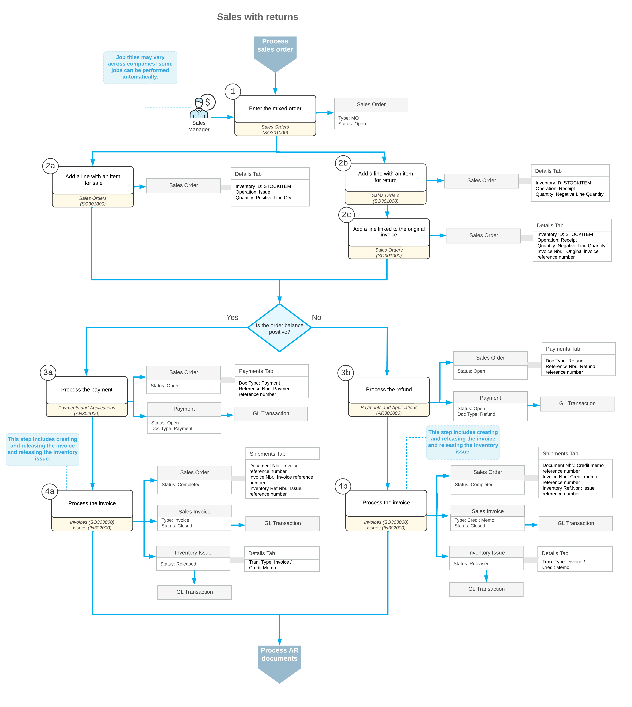

# Sales with Returns: General Information {#_df1aa823-16a8-4aa2-b53a-13fa781fdea4 .concept}

In Acumatica ERP, you can create a mixed order to process both a sale and a return in the same order on the [Sales Orders](SO_30_10_00.md) \(SO301000\) form.

## Learning Objectives { .section}

In this chapter, you will do the following:

-   Become familiar with the general settings and workflow of a mixed order
-   Create a mixed order
-   Process a sale with a return in a mixed order and the related documents

## Applicable Scenario { .section}

You may need to perform a sale and a return through a mixed order if all or most of the following are true for your company:

-   Your company sells many products at a big store, with employees processing many orders per day through counter sales.
-   Some customers need to buy and return products or services \(or replace the returned products\) at the same time.
-   The new items or items for replacement can have higher or lower prices.
-   The order balance may be positive or negative.

Because you perform these sales and returns at a counter, you process no shipments. You also need to process AR documents.

## Processing of a Sale with a Return { .section}

This section describes the general workflow of a sale with a return in the same order; for simplicity, a single item is returned and a single item is sold in this workflow.

To process the sale of a stock item and the return of a stock item in the same mixed order, you perform the following general steps:

1.  You create a mixed order \(that is, an order of the *MO* type\) on the [Sales Orders](SO_30_10_00.md) \(SO301000\) form.
2.  On the **Details** tab, you add lines by doing any of the following:
    -   You add a line with the item for sale and specify a positive quantity. Because the line has a positive quantity, the system inserts the *Issue* operation for the line.
    -   You add the stock item to be returned without linking it to the original invoice, which you may need to do if the original invoice cannot be found or if a customer is returning a part of a kit. To do this, you click **Add Items** on the table toolbar of the **Details** tab; in the **Inventory Lookup** dialog box, which opens, you add the needed lines and click **Add &amp; Close**. Then you specify a negative quantity for these lines in the **Quantity** column. In the order line, because you have specified a negative quantity, the system inserts *Receipt* in the **Operation** column instead of the default setting of *Issue*.
    -   You add the stock item to be returned and include a link to the original sales invoice \(that is, the sales invoice for which the return is being performed\). To do this, you click **Add Invoice** on the table toolbar; in the **Add Invoice Details** dialog box, which opens, you select the line of the invoice and click **Add &amp; Close**. The system adds the selected lines to the order with the quantity specified in the **Qty. to Return** column. In the order line, the system inserts the *Receipt* operation in the **Operation** column and a negative quantity in the **Quantity** column.

        **Tip:**

        To specify the quantity to be returned in the **Add Invoice Details** dialog box, you first check the **Available for Return** column, which shows the maximum quantity of the item that can be returned, considering any already-returned quantities of the item from the AR document. Then you can do either or both of the following:

        -   Select the unlabeled check box for the line, which causes the system to automatically set the **Qty. to Return** to be the same as the **Available for Return** quantity. You can specify another quantity.
        -   Manually specify the **Qty. to Return**, which causes the system to automatically select the unlabeled check box in the line.
3.  Depending on the order balance \(**Order Total**\), you do either of the following:
    1.  You process a payment. If the **Order Total** is positive, you click **Create Payment** on the table toolbar of the **Payments** tab of the [Sales Orders](SO_30_10_00.md) form. In the **Create Payment** dialog box, you specify the needed settings and click the appropriate button to create the payment. You then release the payment on the [Payments and Applications](AR_30_20_00.md) \(AR302000\) form.
    2.  You process a refund. If the **Order Total** is negative, you click **Create Refund** on the table toolbar of the **Payments** tab of the [Sales Orders](SO_30_10_00.md) form. In the **Create Refund** dialog box, you specify the needed settings and click **Refund** to create the refund. You then release the refund on the [Payments and Applications](AR_30_20_00.md) form.
4.  You prepare a credit memo or sales invoice for the mixed order by clicking **Prepare Invoice** on the [Sales Orders](SO_30_10_00.md) form, which results in either of the following:

    -   If the **Order Total** of the mixed order is negative, the system generates an invoice of the *Credit Memo* type.
    -   If the **Order Total** of the mixed order is positive, the system generates a sales invoice of the *Invoice* type.
    When you release the document on the [Invoices](SO_30_30_00.md) \(SO303000\) form, the mixed order is assigned the *Completed* status. The system automatically generates and releases inventory issues with the *Credit Memo* transaction type and the *Invoice* transaction type on the [Issues](IN_30_20_00.md) \(IN302000\) form. On release of each inventory issue, a batch of GL transactions is generated. The inventory is updated.

    When the sales invoice or credit memo is released and assigned the *Closed* status, you can view this invoice or credit memo as an AR invoice or AR credit memo, respectively, on the [Invoices and Memos](AR_30_10_00.md) \(AR301000\) form.

## Workflow of Processing a Sale with a Return {#section_vv2_1y4_y4b .section}

For a sale with a return in the same order, the typical process involves the actions and generated documents shown in the following diagram.

**Parent topic:**[Processing Sales with Returns](../UserGuide/OrderMgmt_Sales_with_Returns_Mapref.md)

