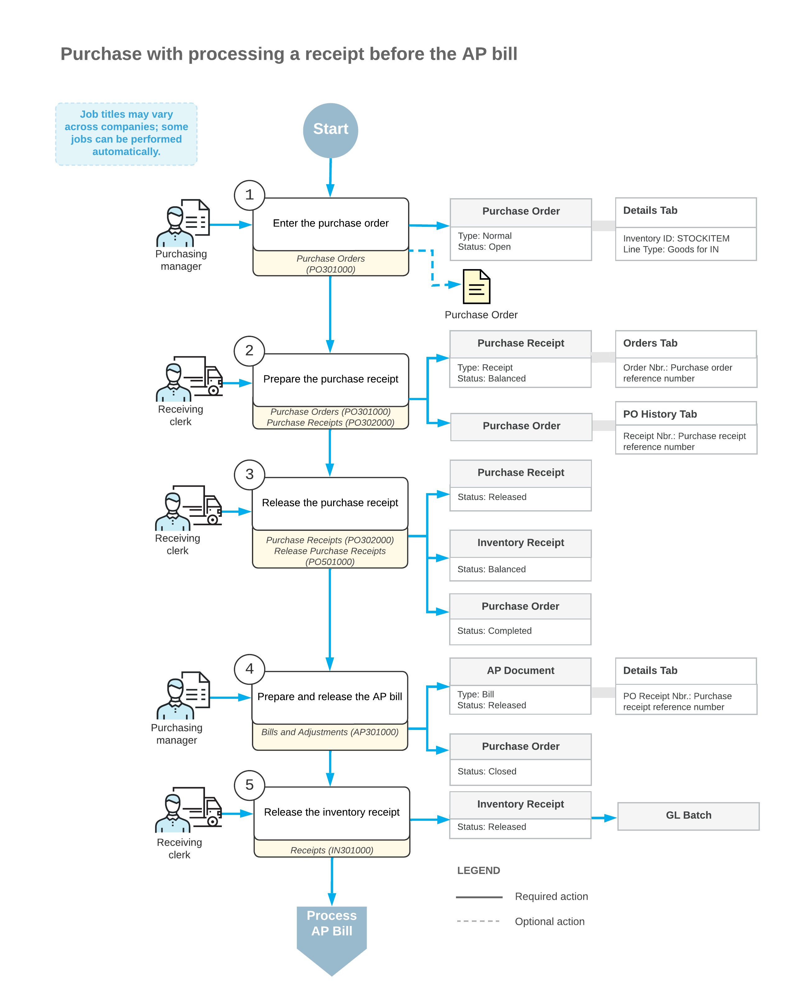

# Purchases of Stock Items: General Information {#_884c10ea-eb7c-4afd-87f1-7105bb0f374c .concept}

In Acumatica ERP, you can process purchases of stock items: purchases in which the bills are generated after the ordered goods and services have been received into inventory from the vendors.

## Learning Objectives { .section}

In this chapter, you will do the following:

-   Create a purchase order with stock items
-   Prepare a purchase receipt for an existing purchase order
-   Release a purchase receipt
-   Enter the accounts payable bill for the receipt
-   Process the purchase order and the related inventory documents and accounts payable documents

## Applicable Scenario { .section}

You process a purchase order if you need to record a purchase of stock items with item quantities updated in inventory and to prepare a bill for the purchased goods to the vendor of the goods. Your purchase process includes entering a purchase order, processing the purchase receipt when the purchased items are received to inventory, and preparing a bill to the vendor.

## Process of Purchasing of Stock Items { .section}

A purchase process typically includes entering a purchase order, processing the purchase receipt when the purchased items are received to inventory, and preparing a bill to the vendor. In general, the [Purchase Orders](PO_30_10_00.md) \(PO301000\) form is the starting point for creating a purchase order. In Acumatica ERP, for processing purchases of inventory items, purchase orders of the *Normal* type are used.

In a new purchase order created on the [Purchase Orders](PO_30_10_00.md) form, you should first select the vendor. Then on the **Details** tab, you list the stock items to be purchased from the vendor. You can add stock items by clicking the **Add Items** button on the table toolbar of the **Details** tab and selecting from only the vendor's items or from the entire list of stock items. Once the purchased items have been received to inventory, you need to create a purchase receipt \(or multiple partial receipts\). When a purchase receipt is released, the system automatically generates a corresponding inventory receipt, with the date and posting period of the purchase receipt. On release of the inventory receipt, the system updates the inventory on hand with the quantity and cost of the received goods and generates a batch of GL transactions to update account balances in the general ledger. If all the lines in the purchase order have been received in full, the system assigns the purchase order the *Completed* status. Then you need to create a bill to increase the vendor's balance in the system with amount to be paid for received goods. If all the lines in the purchase order have been billed in full, the system assigns the purchase order the *Closed* status. For more information on the rules that affect line closing and completion, see [Stock Item Lines in Purchase Orders](PO__con_Purchase_of_Stock.md).

## Workflow of Purchasing Stock Items { .section}

The following diagram represents the general workflow of the processing of a purchase order in Acumatica ERP, in which a purchase receipt is processed before the bill is generated.

**Parent topic:**[Processing Purchases of Stock Items](../UserGuide/OrderMgmt_Standard_Inventory_Purchase_Mapref.md)

