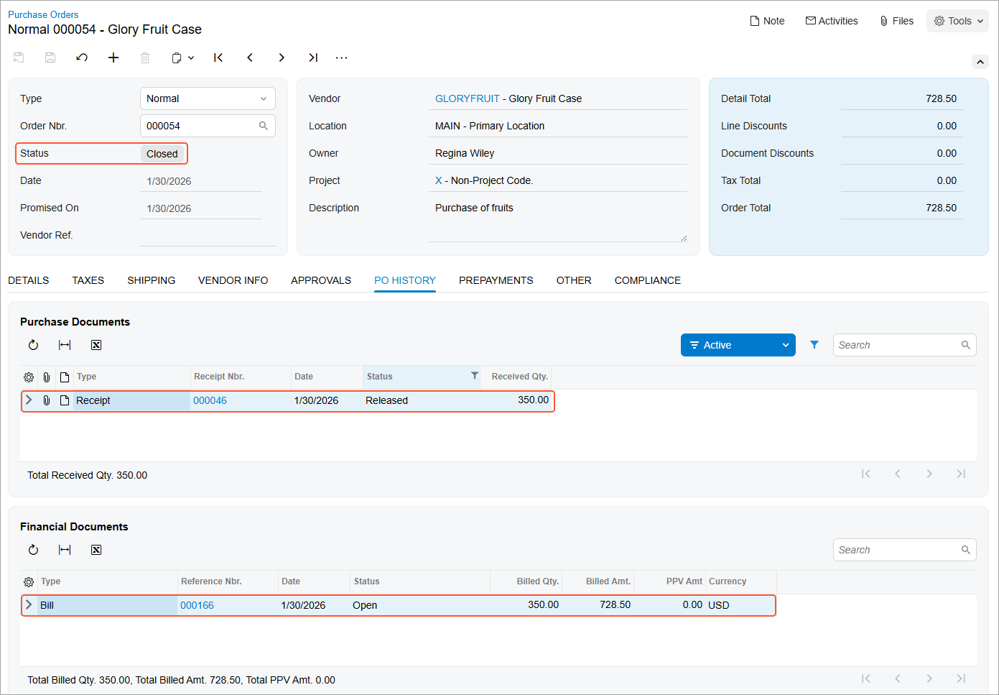

# Purchases of Stock Items: Process Activity {#_b561401a-41f5-423b-87bb-ec15118282d5 .task}

The following activity demonstrates how to prepare and process to completion a purchase order with items received to inventory before the vendor is billed.

**Attention:** This activity is based on the *U100* dataset. If you are using another dataset or if any system settings have been changed in *U100*, these changes can affect the workflow of the activity and the results of the processing. To avoid issues, restore the *U100* dataset to its initial state.

## Story { .section}

Suppose that you are Regina Wiley, a purchasing manager in the SweetLife Fruits &amp; Jams company. On January 30, 2026, you are purchasing the following fruits from the Glory Fruit Case vendor: 100 pounds of apples, 200 pounds of oranges, and 50 pounds of lemons. The purchased fruits are to be delivered to the main office's warehouse. As the purchasing manager, you need to enter and process a purchase order, process a purchase receipt, and create a bill that should be paid to the vendor for the received fruits.

## Configuration Overview { .section}

In the *U100* dataset, for the purposes of this activity, the following tasks have been performed:

-   On the [Enable/Disable Features](CS_10_00_00.md) \(CS100000\) form, the following features have been enabled:
    -   *Inventory and Order Management*, which provides the standard functionality of inventory and order management
    -   *Inventory*, which gives you the ability to maintain stock items by using forms related to the inventory functionality and to create and process sales and purchase documents that include stock items
-   On the [Vendors](AP_30_30_00.md) \(AP303000\) form, the *GLORYFRUIT \(Glory Fruit Case\)* vendor has been configured.
-   On the [Stock Items](IN_20_25_00.md) \(IN202500\) form, the *APPLES*, *LEMONS*, and *ORANGES* stock items have been created.

## Process Overview { .section}

In the process of purchasing stock items, you create a purchase order on the [Purchase Orders](PO_30_10_00.md) \(PO301000\) form and add the purchased items to it. When the items have been received, on the [Purchase Receipts](PO_30_20_00.md) \(PO302000\) form, you create a purchase receipt for the ordered items. On release of the purchase receipt, the system automatically generates an inventory receipt to reflect the receipt of the items in inventory. Then on the [Bills and Adjustments](AP_30_10_00.md) \(AP301000\) form, you create an accounts payable bill to the vendor.

## System Preparation { .section}

Before you start creating and processing a purchase order to completion, you should do the following:

1.  Launch the Acumatica ERP website with the *U100* dataset preloaded and sign in to the system as purchasing manager Regina Wiley by using the *wiley* username and the *123* password.
2.  In the info area, in the upper-right corner of the top pane of the Acumatica ERP screen, make sure that the business date in your system is set to *1/30/2026*. If a different date is displayed, click the Business Date menu button, and select *1/30/2026* from the calendar. For simplicity, in this activity, you will create and process all documents in the system on this business date.
3.  On the Company and Branch Selection menu, in the top pane of the Acumatica ERP screen, make sure the *SweetLife Head Office and Wholesale Center* branch is selected.

## Step 1: Reviewing the Quantity of Items in the Warehouse { .section}

To review the quantity of items in the *WHOLESALE* warehouse, you should do the following:

1.  Open the [Inventory Valuation](IN_61_55_00.md) \(IN615500\) report form.
2.  On the **Report Parameters** tab, specify the following settings:
    1.  **Company/Branch**: *HEADOFFICE - SweetLife Head Office and Wholesale Center*
    2.  **Warehouse**: *WHOLESALE*
    3.  **Report Format**: *Summary*

        Leave other settings unchanged.

3.  On the form toolbar of the report form, click **Run Report**. The print form of the report opens. Review the report.
4.  Memorize or write down the quantity of items with the following inventory IDs:

    -   *APPLES*
    -   *LEMONS*
    -   *ORANGES*
    In Step 3, you will compare the original quantity of these items with the resulting quantity.

## Step 2: Creating a Purchase Order { .section}

To create a purchase order, do the following:

1.  On the [Purchase Orders](PO_30_10_00.md) \(PO301000\) form, add a new record.

    **Tip:** To open the form for creating a new record, type the form ID in the Search box, and on the Search form, point at the form title and click **New** right of the title.

2.  In the Summary area, specify the following settings:
    -   **Type**: *Normal*
    -   **Vendor**: *GLORYFRUIT*
    -   **Date**: *1/30/2026*
    -   **Promised On**: *1/30/2026*
    -   **Description**: `Purchase of fruits`
3.  On the **Details** tab, on the table toolbar, click **Add Row** and specify the following settings in the added row:
    -   **Branch**: *HEADOFFICE*
    -   **Inventory ID**: *APPLES*
    -   **Warehouse**: *WHOLESALE*
    -   **Order Qty.**: `100`
    -   **Unit Cost**: `2.29`
4.  On the table toolbar, click **Add Row** and specify the following settings in the second row:
    -   **Branch**: *HEADOFFICE*
    -   **Inventory ID**: *LEMONS*
    -   **Warehouse**: *WHOLESALE*
    -   **Order Qty.**: `50`
    -   **Unit Cost**: `2.59`
5.  On the table toolbar, click **Add Row** and specify the following settings in the third row:
    -   **Branch**: *HEADOFFICE*
    -   **Inventory ID**: *ORANGES*
    -   **Warehouse**: *WHOLESALE*
    -   **Order Qty.**: `200`
    -   **Unit Cost**: `1.85`
6.  On the form toolbar, click **Save**.
7.  On the form toolbar, click **Remove Hold**. Now you can continue processing the purchase order, which has the *Open* status.

## Step 3: Processing the Purchase Receipt { .section}

To create a purchase receipt for the purchase order, do the following:

1.  While you are still viewing the *Purchase of fruits* purchase order on the [Purchase Orders](PO_30_10_00.md) \(PO301000\) form, on the form toolbar, click **Enter PO Receipt**. The system prepares the purchase receipt for the selected purchase order and opens it on the [Purchase Receipts](PO_30_20_00.md) \(PO302000\) form.
2.  On the form toolbar, click **Save**.

    Review the details of the prepared purchase receipt. Make sure that the **Create Bill** check box is cleared in the Summary area. \(In the next step, you will prepare the bill manually.\)

3.  On the form toolbar, click **Release**. Wait for the system to complete the operation.
4.  On the **Other** tab, click the **IN Ref. Nbr.** link. The inventory receipt opens on the [Receipts](IN_30_10_00.md) \(IN301000\) form in a pop-up window. Review the details of the generated inventory receipt. Make sure the inventory receipt has the *Released* status. Close the inventory receipt.
5.  Open the [Inventory Valuation](IN_61_55_00.md) \(IN615500\) report form.
6.  On the **Report Parameters** tab, specify the following settings:

    -   **Company/Branch**: *HEADOFFICE - SweetLife Head Office and Wholesale Center*
    -   **Warehouse**: *WHOLESALE*
    -   **Report Format**: *Summary*
    Leave the default settings for the other parameters.

7.  On the form toolbar of the report form, click **Run Report**. The print form of the report opens. Review the report. Make sure that the report reflects the receipt \(to the warehouse\) of the purchased items and their availability.

## Step 4: Processing the AP Bill { .section}

To process the AP bill to the *GLORYFRUIT* vendor, do the following:

1.  Open the purchase receipt that you have processed earlier in this activity on the [Purchase Receipts](PO_30_20_00.md) \(PO302000\) form.
2.  On the form toolbar, click **Enter AP Bill**. The system generates an accounts payable bill to the vendor of the goods and shows the created document on the [Bills and Adjustments](AP_30_10_00.md) \(AP301000\) form.
3.  On the form toolbar, click **Save**.
4.  Click **Remove Hold**, which gives you the ability to release the bill.
5.  Click **Release**.
6.  Return to the purchase order to the *GLORYFRUIT* vendor on the [Purchase Orders](PO_30_10_00.md) \(PO301000\) form, and review its details. Notice that the order now has a status of *Closed*, as shown in the following screenshot. On the **PO History** tab, notice that the information about the purchase receipt and accounts payable bill that were prepared for the order is displayed. According to this information, the purchased items have been received to inventory and billed in full, so the purchasing process is completed.

    

## Activity Recap { .section}

In this activity, we have illustrated how the purchasing manager has done the following:

1.  Reviewed the remaining quantity of the specific items in the warehouse
2.  Created a purchase order for the items
3.  Created and processed a purchase receipt for the purchased items
4.  Run an inventory valuation report to make sure that the purchased items have been received to the warehouse
5.  Created and processed an AP bill to the vendor that provides the goods

**Parent topic:**[Processing Purchases of Stock Items](../UserGuide/OrderMgmt_Standard_Inventory_Purchase_Mapref.md)

