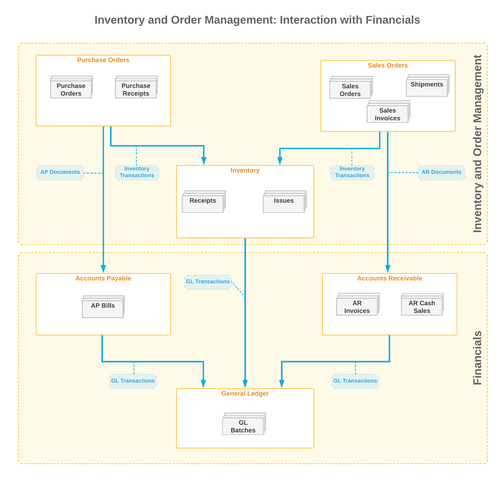

# Reviewing the Interaction of Inventory and Order Management with Financials {#_9b62fd6d-4451-4847-8b05-d505caa8c4c6 .concept}

To support financial accounting processes, maintain data consistency during the sales and purchase operations, and track items' costs, the inventory and order management is tightly integrated with financials. The system also provides instant access to accurate inventory allocation information and notifies the user if the item quantity specified in an order is not available.

The following diagram illustrates the general workflow of sales and purchase processes performed in Acumatica ERP, the documents that are produced, and the interaction between inventory, order management, and financials during the order fulfillment processes.

The purchase process \(shown in the diagram above\) consists of the following steps:

1.  A user creates a purchase order. A purchase order itself does not produce general ledger transactions.
2.  A user creates a purchase receipt for a purchase order to record the receipt of items to inventory. On release of a purchase receipt, an inventory receipt is created to increase the item quantity in the inventory.
3.  On release of the purchase receipt, an AP bill is created to adjust the vendor's balance in the system.
4.  On release of the inventory receipt and AP bill, the batches of transactions are generated and posted to the general ledger to update the account balances.

The sales process \(shown in the diagram above\) consists of the following steps:

1.  A user creates a sales order. A sales order itself does not produce general ledger transactions.
2.  A user creates a shipment document to record the shipping of the items to the customer.
3.  A user creates a sales invoice to adjust the customer's balance in the system. On release of the sales invoice, an inventory issue is created to decrease the item quantity in the inventory.
4.  On release of the inventory issue and sales invoice, the batches of transactions are generated and posted to the general ledger to update the account balances.

